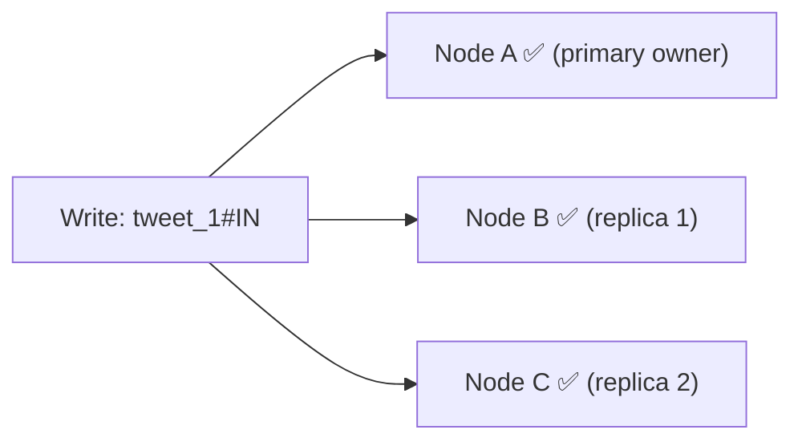

# Replication and Consistency in Cassandra

Cassandra doesn't store data on just one node. Every row is replicated across multiple nodes — so that if a node goes down, the data isn't lost. But replication introduces a question: when a write arrives, how many nodes need to confirm it before Cassandra says "done" to the client?

---

## Replication Factor

The **Replication Factor (RF)** controls how many copies of each row exist in the cluster. RF=3 means every row is stored on 3 different nodes.



The coordinator writes to all three nodes. But it doesn't have to wait for all three to respond — that's controlled by the **consistency level**.

---

## Consistency Levels

The consistency level is set per-operation and controls how many replicas must acknowledge a read or write before the operation is considered successful.

```
ONE     → 1 replica must respond
QUORUM  → majority must respond  (RF=3 → 2 nodes)
ALL     → every replica must respond
```

**ONE** is the fastest but weakest guarantee. The write returns as soon as one node confirms. The other two nodes will receive it eventually — but if you read immediately from a different node, that node might not have the update yet. Stale reads are possible.

**ALL** is the strongest but most fragile. Every replica must respond. If even one node is down or slow, the operation fails or times out. Maximum consistency, minimum availability.

**QUORUM** is the sweet spot for most production systems. The majority of replicas must respond — fast enough to tolerate a slow or down node, strong enough to guarantee consistency when paired correctly with reads.

> [!info] QUORUM with RF=3
> RF=3 means 3 replicas. QUORUM = majority = 2. So 2 out of 3 nodes must acknowledge the write. If one node is slow or unreachable, the write still succeeds. The cluster tolerates one node failure without losing write availability.

---

## The R + W > N formula — strong consistency through overlap

Here's the insight that makes Cassandra's consistency model elegant. If you write to W nodes and read from R nodes, and W + R > N (total replicas), then at least one node must overlap between the write set and the read set.

That overlapping node always has the latest data — so the read is always fresh.

```
RF = 3 (N = 3)
Write with QUORUM: W = 2 nodes confirmed
Read  with QUORUM: R = 2 nodes contacted

W + R = 4 > N = 3  ✅  → guaranteed overlap → strong consistency
```

The overlap is guaranteed by the pigeonhole principle. You wrote to 2 out of 3 nodes. You're reading from 2 out of 3 nodes. You cannot pick 2 nodes for reading without hitting at least 1 node that was in the write set.

```
Nodes:      A    B    C
Write set:  ✅   ✅   ✗
Read set:   ✗    ✅   ✅
                  │
                  B is the overlap → has the latest write
```

> [!important] R + W > N = strong consistency
> This is the formula. When it holds, at least one node in the read set always has the latest write. Without this overlap, you might read from nodes that haven't received the write yet.

---

## What happens when W + R ≤ N

If you write with ONE and read with ONE — W=1, R=1, N=3 — then W+R=2, which is not > 3. No guaranteed overlap. You might write to Node A and read from Node B, which hasn't received the update yet.

```
Write → Node A ✅
Read  → Node B ✗  (hasn't received the write yet)
→ stale read returned
```

This is **eventual consistency** — Node B will catch up, but there's a window where reads can return outdated data. For Twitter analytics and IoT sensor data, this is usually acceptable. For a bank balance, it is not.

> [!tip] Interview framing
> "Cassandra's consistency is tunable per-operation. For write-heavy analytics data where a brief inconsistency window is acceptable, I'd use ONE for writes for maximum throughput. For reads that must be current — like a user's account state — I'd use QUORUM on both read and write to guarantee overlap. The formula is R + W > N."

---

## Consistency vs Availability trade-off

```
ONE    → high availability, eventual consistency
QUORUM → balanced (tolerates 1 node failure with RF=3)
ALL    → strong consistency, low availability (any node failure = failure)
```

This is the same CAP / PACELC trade-off we've seen before — just made explicit and configurable at query time in Cassandra. Most systems mix levels: QUORUM for critical reads, ONE for high-volume analytical writes.

> [!danger] Don't assume Cassandra is always eventually consistent
> A common interview mistake is saying "Cassandra is an AP system so it's always eventually consistent." Cassandra is tunable. With QUORUM+QUORUM and R+W>N, it gives strong consistency. The CAP label depends entirely on which consistency level you configure.
