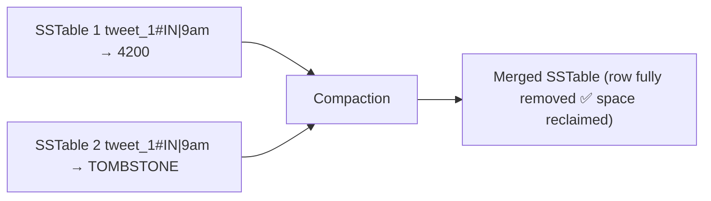

# Tombstones — How Deletes Work in Cassandra

Cassandra's write path is built entirely around appends. Every write lands in the CommitLog and MemTable, flushes to an immutable SSTable, and is never modified in place. This is what gives Cassandra its write throughput. But it creates a problem: **how do you delete a row if you can't modify the file it lives in?**

---

## The problem — immutable SSTables can't be edited

In SQL, a delete physically removes the row from the table. Space is reclaimed immediately.

In Cassandra, SSTables are immutable — once written to disk, they are sealed. No process is allowed to open an SSTable file and remove bytes from the middle. That's the design contract that keeps all writes sequential. Violating it would mean random I/O, which is exactly what Cassandra was built to avoid.

So if you can't edit the file, the only option is to write something new that says "this row no longer exists."

---

## Tombstones — a delete is just another write

When you delete a row in Cassandra, it writes a special marker called a **tombstone** into the MemTable, which eventually flushes to an SSTable like any other write:

```
SSTable 1:  tweet_1#IN | 9am → impressions: 4200   ← original write
SSTable 2:  tweet_1#IN | 9am → TOMBSTONE            ← delete marker
```

The tombstone carries a timestamp. When a read comes in for that key, Cassandra sees both entries across the two SSTables, compares timestamps, and the tombstone — being newer — wins. The read returns nothing to the client. The row is **logically deleted**.

But the original bytes in SSTable 1 are still physically on disk. The space has not been reclaimed yet. Think of it exactly like a soft delete in a SQL system — the row is invisible to queries, but it still occupies disk space until something cleans it up.

> [!info] What is a tombstone?
> A tombstone is a special write that marks a row, column, or partition as deleted. It carries a timestamp and is stored in SSTables just like any other entry. It tells readers: "ignore anything older than this marker for this key."

---

## Compaction reclaims the space

The actual disk space is only freed during **compaction**. When two SSTables are merged, Cassandra sees the original value and the tombstone for the same key. They cancel each other out — neither entry makes it into the merged SSTable:



Before compaction runs, tombstones accumulate. Reads have to scan past them to find live data. After compaction, both the original value and the tombstone are gone — the key no longer exists anywhere on disk.

> [!important] Deletes in Cassandra have a two-phase lifecycle
> Phase 1 — tombstone written: row is logically gone, but bytes still on disk.
> Phase 2 — compaction runs: tombstone and original value both erased, disk space freed.
> The gap between these two phases can be seconds or hours depending on compaction configuration.

---

## The tombstone accumulation trap

If deletes are frequent but compaction doesn't run often enough, tombstones pile up across many SSTables. Reads now have to scan through large numbers of tombstones to find the handful of live rows. This is one of the most common performance problems in Cassandra clusters.

```
SSTable 1:  sensor_42 | 01am → TOMBSTONE
SSTable 2:  sensor_42 | 02am → TOMBSTONE
SSTable 3:  sensor_42 | 03am → TOMBSTONE
...
SSTable 50: sensor_42 | 10am → temperature: 72   ← the one live row
```

A read for sensor_42 has to wade through 49 tombstones before it finds data. At scale, this becomes a serious latency problem.

> [!danger] Tombstone accumulation
> Heavy delete patterns without properly tuned compaction degrade read performance significantly. Reads must scan tombstones even though they contribute no data. This is a known operational trap in Cassandra — high tombstone counts are one of the first things to check when Cassandra reads slow down unexpectedly.

---

## TTL — automatic tombstones

Cassandra supports **TTL (Time To Live)** on any write. You specify how long a row should live, and when that time expires, Cassandra automatically generates a tombstone for it:

```
INSERT INTO sensor_readings (sensor_id, ts, temp)
VALUES ('sensor_42', now(), 72)
USING TTL 86400;   -- expires after 24 hours
```

After 24 hours, Cassandra writes a tombstone for that row automatically. The application never has to run explicit deletes. Compaction eventually cleans up both the original value and the tombstone.

This pattern is extremely common in IoT and time-series systems — you want to keep the last N hours of data and automatically expire everything older. TTL handles the delete lifecycle without any application-level cleanup logic.

> [!tip] TTL is the standard pattern for expiring time-series data
> Rather than running batch deletes on old sensor readings or analytics events, set a TTL at write time. Cassandra manages the tombstone lifecycle. The application stays simple; the database handles expiry.
