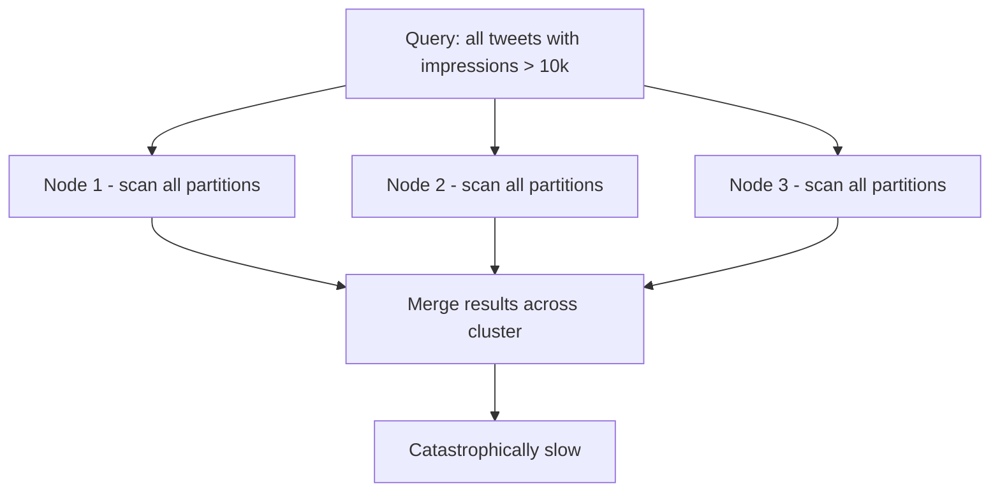
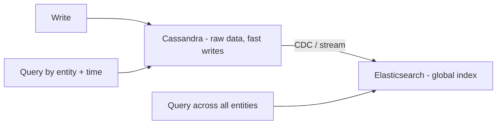

# When To Use Column-Family Stores

Knowing what Cassandra is good at is half the answer. Knowing exactly when it fails — and being able to articulate that clearly — is what separates a strong interview answer from a weak one.

---

## The golden rule

Column-family stores are fast when you know your row key at query time. Everything flows from this.

Because data is sorted and partitioned by row key, Cassandra can go directly to the right section of disk when it knows the key. The query becomes a sequential scan of a contiguous block of rows. Fast, predictable, scalable.

> [!info] The golden rule
> Use a column-family store when the majority of your queries are scoped to a **known entity + time range**. You always start with a specific thing — a tweet, a user, a sensor, a driver — and then filter by time within it.

The pattern looks like this in practice:

```
✅  "Give me tweet_1's impressions for the last 24 hours"
    → known entity (tweet_1) + time range → sequential scan

✅  "Give me driver_99's GPS locations for the last 1 hour"
    → known entity (driver_99) + time range → sequential scan

✅  "Give me sensor_42's temperature readings for the last 30 minutes"
    → known entity (sensor_42) + time range → sequential scan
```

All three are the same shape: start with a specific entity, scan across time within it. This is the pattern column-family stores were built for.

---

## The three use cases where Cassandra dominates

**1. Time-series data**

IoT sensors, GPS tracking, financial tick data, server metrics — any system where one entity generates a continuous stream of events over time. The row key encodes the entity, the timestamp is part of the key, and range queries over time become sequential scans.

**2. Write-heavy event logs**

Chat message history, audit logs, analytics events — systems that write constantly and read occasionally, usually by a known entity. Cassandra's LSM tree absorbs write bursts that would overwhelm SQL.

**3. Analytics at massive scale**

Twitter impressions, YouTube view counts, ad click tracking — billions of writes per day scoped to known entities. SQL cannot absorb this write volume without aggressive sharding. Cassandra handles it natively.

---

## Where Cassandra fails — the full table scan problem

The moment you don't know your row key, Cassandra becomes a liability.

```
❌  "Give me all tweets with impressions > 10,000"
    → no known entity — must scan every tweet across every row

❌  "Give me all drivers currently in Mumbai"
    → no known entity — must scan every driver's location

❌  "Give me all tweets with impressions > 10,000 in the past hour"
    → the time filter narrows rows per entity, but you still scan every entity
```

That last one is the common interview trap.**Adding a time range doesn't help if you still don't have a specific entity to start from** The time filter reduces how many rows you read *per entity*, but you still have to visit every entity. At billions of rows across millions of entities, this is catastrophically slow.

This is called a **full table scan** — and in a distributed Cassandra cluster, it means querying every node, reading every partition, across the entire dataset.



> [!danger] No global index
> Cassandra has no global secondary index that spans the whole cluster efficiently. The row key is the only fast access path. Everything else is a full scan.

---

## The hybrid pattern — Cassandra + Elasticsearch

When you need both fast writes *and* cross-entity queries, the answer is not to force Cassandra to do something it can't — it's to pair it with a tool that can.



Cassandra stores the raw data and handles the high-volume writes. Elasticsearch maintains a global index and handles cross-entity searches. Each tool does what it's good at.

This pattern appears in real systems:
- **Twitter** — Cassandra for per-user tweet storage, Elasticsearch for search across all tweets
- **Netflix** — Cassandra for per-user viewing history, Elasticsearch for content search
- **Datadog** — Cassandra for per-host metric storage, separate index for cross-host alerting

---

## When to avoid Cassandra entirely

```
❌  You need joins across entities        → SQL
❌  You need multi-row transactions       → SQL or NewSQL
❌  You need flexible nested documents    → Document store (MongoDB)
❌  Your queries don't have a known entity at query time → SQL or Elasticsearch
❌  Your write volume is under ~5k/sec and data is relational → SQL handles it fine
```

> [!tip] Interview framing
> "I'd reach for Cassandra when the system is write-heavy, data is time-series, and queries always start from a known entity. The moment I need to query across all entities without a known partition key, I'd pair it with Elasticsearch for global search, or reconsider whether Cassandra is the right primary store."
