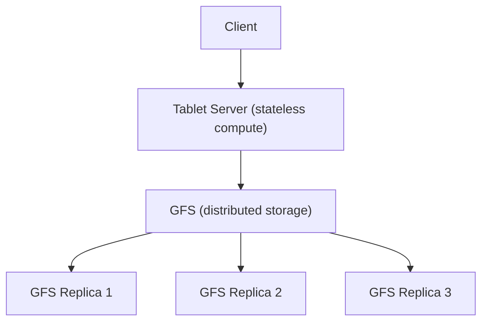
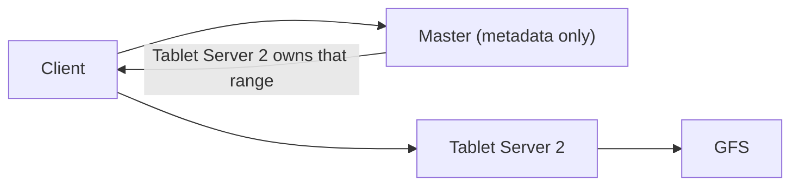

> [!abstract] Bigtable is Google's wide-column store, published as a research paper in 2006. It directly inspired Cassandra (data model) and HBase (open-source equivalent).

## Tablets — the unit of data

Bigtable stores rows sorted by row key, exactly like Cassandra. But instead of assigning hash ranges to nodes via consistent hashing, Bigtable divides the row space into contiguous ranges called **tablets**.

A tablet is simply a chunk of consecutive rows:

```
Tablet 1 → rows aaaa to mmmm
Tablet 2 → rows mmmm to ssss
Tablet 3 → rows ssss to zzzz
```

Each tablet is the unit of assignment — the master decides which tablet server is responsible for serving each tablet. When a tablet gets too large, it splits into two smaller tablets automatically.

> [!info] What is a tablet?
> A tablet is a contiguous range of rows in Bigtable. It is the equivalent of a partition range in Cassandra. The master assigns tablets to tablet servers, and a tablet server can own many tablets at once.

---

## Tablet servers — stateless compute

A **tablet server** is the machine that handles reads and writes for its assigned tablets. Clients talk directly to tablet servers for all data operations — the tablet server processes the request, reads or writes the relevant data, and responds.

The critical thing about tablet servers is that they are **stateless**. They do not store data on their local disks. All the actual data — the SSTables, the write-ahead logs — lives on **GFS** (Google File System), a separate distributed storage layer.



The tablet server is pure compute — it owns no data. GFS owns the data and handles its own internal replication.

> [!important] Tablet servers are stateless
> A tablet server can die at any moment and no data is lost. The data lives on GFS, not on the tablet server's local disk. This is the disaggregated storage pattern — compute and storage are completely separated.

---

## The master — metadata only

There is one **master node** in a Bigtable cluster. Its job is narrow but critical: it tracks which tablet server is responsible for which tablet. This is the metadata map that clients need before they can route a request to the right place.

The master does not handle any reads or writes. Data never flows through it. Its only role is to answer "which tablet server owns this row range?" and to assign tablets to servers when servers join, leave, or fail.



Because the master holds mutable state — the tablet assignment map — it is a single point of failure for availability. If the master dies, clients cannot look up tablet locations. Google addresses this by storing the master's state in **Chubby**, a distributed lock service, so the master can recover quickly on restart without losing its assignment map.

> [!danger] The master is a SPOF for availability
> If the master is down, clients cannot find which tablet server to talk to. Reads and writes stall until the master recovers. Google mitigates this with Chubby-backed fast recovery, but the architectural single point of failure remains — unlike Cassandra's fully masterless design.

---

## GFS — why the extra layer?

The natural question is: why not just have tablet servers store data on local disks, like Cassandra does? The answer is operational simplicity at Google's scale.

At Google, thousands of machines die every week. With local disk storage, every tablet server death means:
1. Detect the failure
2. Find another server with capacity
3. Copy all the dead server's data from its replicas to the new server
4. Bring the new server up

The data copying step is the expensive part — it takes time, burns network bandwidth, and delays recovery. At thousands of failures per week, this cost adds up enormously.

With GFS, a tablet server dying means:
1. Detect the failure
2. Master reassigns the tablet to any available tablet server
3. That server opens the existing GFS files — they're already there, no copying needed

Recovery goes from minutes to seconds. The data never moves. GFS handles its own internal replication transparently — tablet servers treat it like a regular filesystem and never think about replication at all.

> [!info] Disaggregated storage
> Separating compute (tablet servers) from storage (GFS) means node failures never require data migration. The storage layer outlives any individual compute node. This pattern — now called disaggregated storage — is used in modern cloud databases like Amazon Aurora, Google Spanner, and Azure Cosmos DB.

---

## What happens when a tablet server dies

```
Tablet Server 2 dies
        │
        ↓
Master detects failure (via Chubby / heartbeat timeout)
        │
        ↓
Master reassigns Tablet 2 to Tablet Server 4
        │
        ↓
Tablet Server 4 opens Tablet 2's files on GFS
        │
        ↓
Reads and writes resume — zero data loss, recovery in seconds
```

Compare this to Cassandra, where a node death means the cluster must serve reads from the remaining replicas (RF-1 copies) until the dead node is replaced and data is streamed back to the new node — a process that can take hours on a large cluster.
