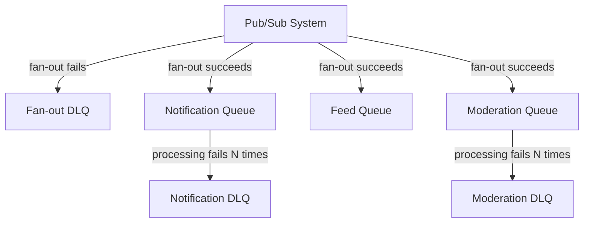

> [!info] A Dead Letter Queue (DLQ) is where messages go when they've failed too many times and the queue gives up retrying. Instead of retrying forever or dropping the message, the queue moves it to a safe holding area — out of the main queue's way — where engineers can inspect it and decide what to do.

---

## The problem

At-least-once delivery means the queue retries on failure. But what if the consumer keeps crashing on the same message every single time?

```
Message delivered → consumer crashes → redelivered
                 → consumer crashes → redelivered
                 → consumer crashes → redelivered
                 ... forever
```

The queue is now stuck. It keeps redelivering a message nobody can process, wasting resources, and blocking everything behind it.

You need a way to say: after N failures, stop retrying and move this message somewhere safe.

---

## How it works

The queue tracks the failure count — not the consumer. The consumer doesn't report failure. It just never sends an ACK. Silence = failure from the queue's perspective.

Every time the visibility timeout expires without an ACK, the queue increments a retry counter on that message.

```
Message picked up → no ACK within 30s → attempt_count: 1
Redelivered       → no ACK within 30s → attempt_count: 2
Redelivered       → no ACK within 30s → attempt_count: 3
Redelivered       → no ACK within 30s → attempt_count: 4
Redelivered       → no ACK within 30s → attempt_count: 5
attempt_count hits 5 → queue moves message to DLQ automatically
```

The main queue is now clean. The bad message sits in the DLQ untouched until an engineer looks at it.

---

## Why does a message keep failing?

**Poison pill** — the message itself is malformed or corrupt. Bad JSON, missing required field, unexpected data type. The consumer crashes every time it tries to parse it. No amount of retrying fixes it — the data is just wrong.

**Consumer bug** — a code bug that crashes on one specific input. Every other message processes fine, but this particular message hits an edge case every single time.

Both require human intervention. The DLQ gives engineers the time to investigate without pressure — the message isn't going anywhere, and it's not blocking the main queue.

---

## What engineers do with DLQ messages

Three options depending on the cause:

**1. Fix the data, replay the message** — if it was a poison pill, correct the payload and push it back onto the main queue.

**2. Fix the bug, replay the DLQ** — deploy a fix for the consumer bug, then drain the DLQ back onto the main queue. All the previously failed messages get reprocessed correctly.

**3. Discard** — if the message is genuinely unprocessable and unrecoverable (e.g., refers to a deleted resource), delete it with a note in the incident log.

> [!important] The DLQ's job is not to retry — it's to **isolate** bad messages so they don't poison the main queue, and give engineers a safe place to inspect them without time pressure.

---

## DLQ in a pub/sub setup — two failure points

In a task queue, there's one DLQ. In pub/sub, there are two separate failure points, and each has its own DLQ.

### Failure point 1: Fan-out fails

The pub/sub system tries to copy the message into a subscriber's internal queue — but that queue is down, full, or unreachable. The message never even reaches a worker.

```
photo_posted_123 published
→ Copied to Notification queue ✓
→ Copied to Feed queue ✓
→ Moderation queue is down → pub/sub retries → keeps failing
→ After N retries → goes to pub/sub level DLQ
```

This is a delivery failure at the pub/sub level. The pub/sub system has its own DLQ for this case.

### Failure point 2: Processing fails

The message made it into the subscriber's queue, but the worker keeps crashing on it.

```
photo_posted_123 in each subscriber's queue:
→ Notification queue  → fails 5 times → moved to Notification's DLQ
→ Feed queue          → processed fine ✓
→ Moderation queue    → fails 5 times → moved to Moderation's DLQ
```

Each subscriber's queue tracks its own failure count and has its own DLQ independently.

### The two layers



A fan-out DLQ filling up means a subscriber's queue is unhealthy — infrastructure problem. A processing DLQ filling up means there's a poison pill or consumer bug — code or data problem. Both need separate alerts.

---

> [!tip] **Interview framing:** "I'd configure a DLQ with a max retry count of 5. Any message that fails repeatedly gets moved there automatically. We'd alert on DLQ depth — if messages start accumulating, an engineer gets paged. Once the bug is fixed, we replay the DLQ back onto the main queue. This keeps the main queue healthy and gives us full visibility into failures without losing any messages."
