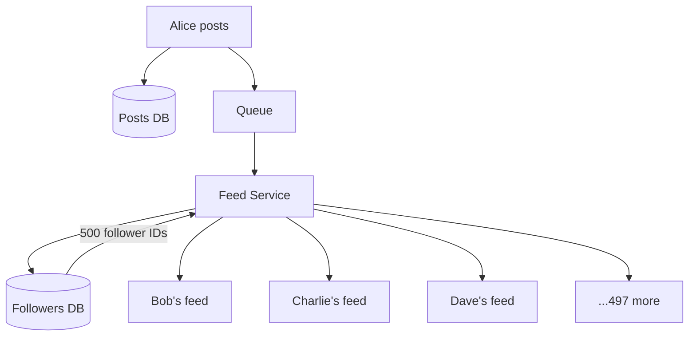

> [!info] Fan-out on write means when a user posts, you immediately push that post into all their followers' feeds in the background. There's a small window where the fan-out is still in progress — but once it completes, reads are instant because the work was already done at write time.


## The problem

A user posts a photo. 500 followers need to see it in their feed. You have two choices:

1. Push the post into all 500 feeds right now, at post time — reads are instant later
2. Do nothing now, compute each follower's feed when they open the app — reads are slow later

Fan-out on write is option 1. You pay the cost at write time so every read is O(1).

The term "fan-out" just means spreading one thing out to many. One post fans out to 500 feed entries — like a fan spreading open from a single point.

---

## Why async — never block the poster

Even with 500 followers, you never do feed updates synchronously during the user's post request. Alice doesn't care whether Bob's feed is updated — she just wants her post to go live. Making her wait for 500 DB inserts is terrible.

```
User hits Post
→ Save post to DB: { post_id: 789, user_id: Alice }
→ Drop one message in queue: { event: "post_created", post_id: 789, user_id: Alice }
→ Return "Posted!" to Alice in ~200ms ✓

Queue holds the message.
Feed Service picks it up in the background.
```

One message into the queue. The fan-out happens inside the Feed Service — not in Alice's request path.

---

## The full fan-out flow



**Step 1 — Feed Service picks up the message**
```
{ event: "post_created", post_id: 789, user_id: Alice }
```

**Step 2 — Fetch Alice's followers**
```sql
SELECT follower_id FROM followers WHERE following_id = 'Alice'
→ [Bob, Charlie, Dave ... 500 total]
```

**Step 3 — Insert into every follower's feed**

500 individual inserts would be slow — one round trip per insert. Instead, batch them:
```sql
INSERT INTO feeds (user_id, post_id) VALUES
  (Bob, 789), (Charlie, 789), (Dave, 789) ...
-- 50 rows per batch, 10 batches total for 500 followers
```

Batching 50 at a time means 10 DB round trips instead of 500. Same result, 50x fewer network calls.

**Step 4 — ACK the queue**
```
Feed Service sends ACK → message deleted from queue
```

**Step 5 — Bob opens Instagram**
```sql
SELECT post_id FROM feeds WHERE user_id = 'Bob' ORDER BY created_at DESC LIMIT 20
→ post_id 789 is already there ← instant, pre-computed
```

---

## The crash problem — and the fix

Feed Service crashes after 250 inserts. The message never got ACKed. Visibility timeout expires, message reappears, Feed Service picks it up again and re-runs all 500 inserts. The first 250 followers get duplicate feed entries.

**Fix: DB-level idempotency**

Put a unique constraint on `(user_id, post_id)` in the feeds table. Use `ON CONFLICT DO NOTHING` on every insert.

```sql
INSERT INTO feeds (user_id, post_id) VALUES (Bob, 789)
ON CONFLICT (user_id, post_id) DO NOTHING
```

Now redelivery is completely harmless:

```
First delivery  → inserts rows 1–250 → crashes
Second delivery → tries all 500 again
                → rows 1–250 already exist → skipped silently
                → rows 251–500 inserted fresh
                → done correctly, zero duplicates
```

> [!important] DB-level idempotency via unique constraint is the most reliable approach — enforced at the storage layer, not in application code. An application-level "check then insert" has a race condition window between the check and the insert. The DB constraint has no such gap.

---

> [!tip] **Interview framing:** "For normal users I'd use fan-out on write — drop a post_created event into a queue, the Feed Service fetches the follower list and writes to each follower's feed in batched inserts asynchronously. Inserts are idempotent via a unique constraint on (user_id, post_id) so retries are safe. Reads are O(1) — the feed is pre-computed. Fan-out on write breaks down for celebrities — that's where fan-out on read comes in."
