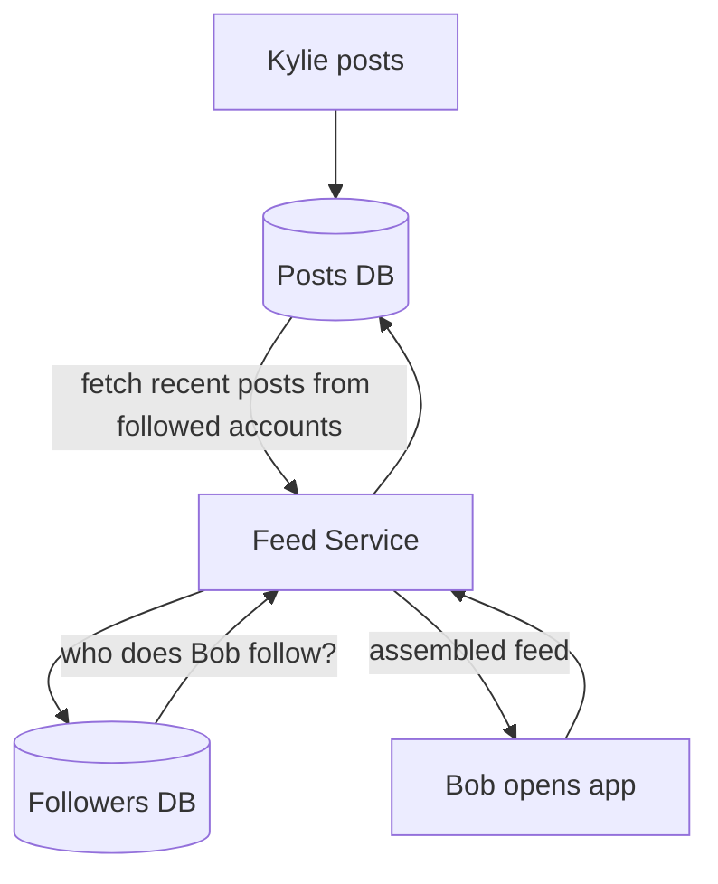
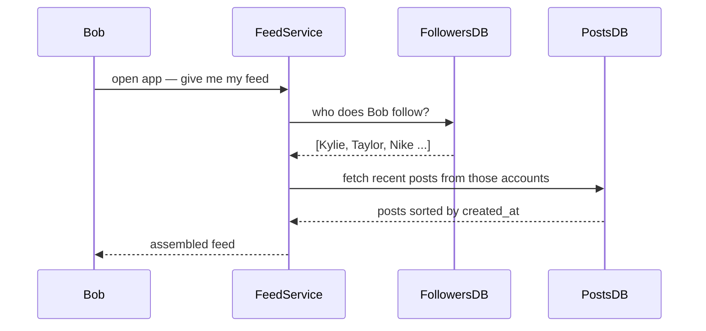
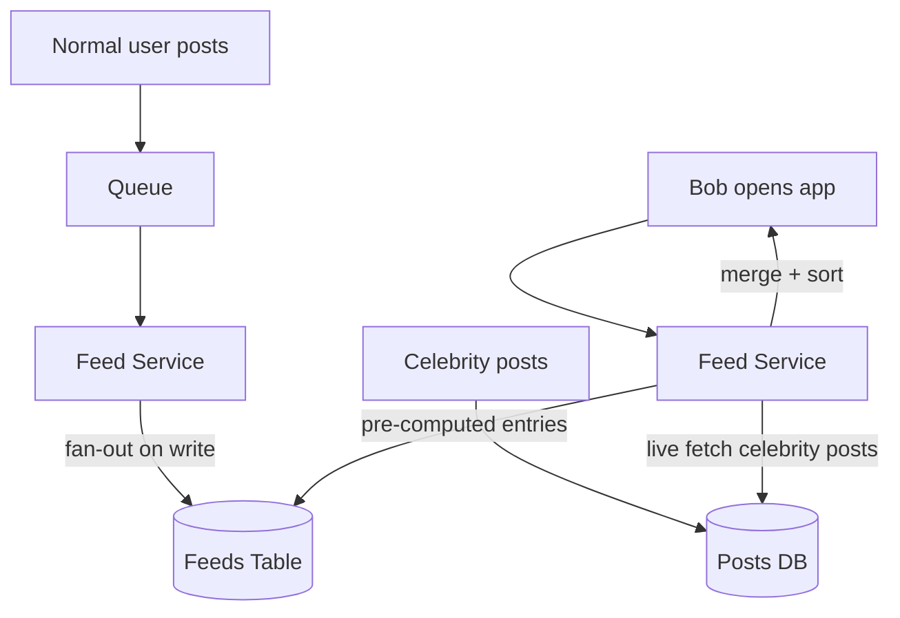
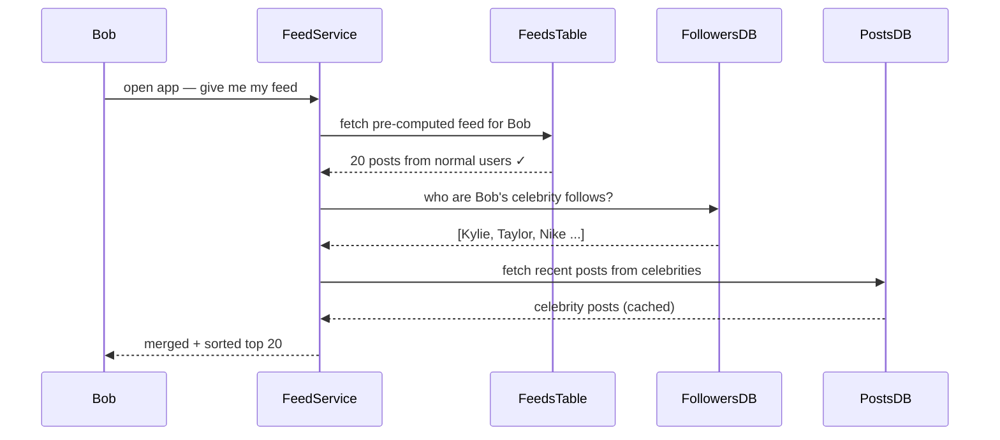

> [!info] Fan-out on read means you do nothing at post time. When a follower opens the app, you fetch the posts live at that moment. No pre-computation, no upfront writes — the feed is assembled on demand.

## Why fan-out on write breaks for celebrities

Kylie Jenner has 400 million followers on Instagram. She posts a photo.

Fan-out on write would mean:
```
400 million DB inserts triggered instantly
→ DB gets hammered with a write spike
→ Other users' requests slow down or fail
→ System destabilised by one celebrity post
```

This is completely unacceptable. You can't let one user's post bring down your infrastructure.

---

## The fan-out on read approach

Do nothing at post time. Just save the post to the DB.



```
Kylie posts photo
→ Save post to DB: { post_id: 999, user_id: Kylie, created_at: now }
→ Return "Posted!" to Kylie   ← done, zero fan-out work
```

When a follower opens Instagram:

```
Bob opens app
→ Feed Service: "give me Bob's feed"
→ Step 1: SELECT following_id FROM followers WHERE follower_id = Bob
          → returns [Kylie, Taylor Swift, Nike, ... everyone Bob follows]
→ Step 2: SELECT * FROM posts WHERE user_id IN (Kylie, Taylor, Nike, ...)
          ORDER BY created_at DESC LIMIT 20
→ Assemble feed from results
→ Return to Bob
```



The feed is computed live every time Bob opens the app. No pre-computed feed table needed.

---

## The trade-off

Fan-out on read shifts the cost from write time to read time.

```
Fan-out on write:
→ Post time: expensive (N inserts)
→ Read time: cheap (one indexed lookup on feeds table)

Fan-out on read:
→ Post time: cheap (just save the post)
→ Read time: expensive (fetch following list + fetch posts from N accounts + sort + merge)
```

For a celebrity with 400 million followers, the write cost at post time is unbearable. But the read cost is also a concern — Bob follows 500 people, fetching posts from 500 accounts and merging them on every feed load is slow.

The fix for read cost is caching — cache the assembled feed for each user for a short window (30 seconds to a few minutes). Most users don't need a perfectly real-time feed.

---

## The hybrid approach — what Instagram and Twitter actually do

Neither pure fan-out on write nor pure fan-out on read works at scale. The real answer is a hybrid:



```
Normal user posts (< ~10,000 followers)
→ Fan-out on write
→ Feed Service updates all followers' feeds async via queue
→ Fast reads, bounded write cost

Celebrity posts (> ~10,000 followers, verified accounts)
→ Fan-out on read
→ Just save the post, no fan-out
→ When follower opens app, fetch celebrity posts live and merge with pre-computed feed
```

The feed assembly for a regular user is:
```
Pre-computed feed entries (from fan-out on write for normal accounts followed)
+
Live fetched posts (from celebrity accounts followed, fan-out on read)
→ Merge and sort by timestamp
→ Return to user
```

This keeps write costs bounded for celebrities while keeping read costs low for normal users.

---

## Full end-to-end read flow (hybrid)

Bob follows 480 normal users and 20 celebrities.

```
Bob opens Instagram
→ Feed Service:
  Step 1: Fetch Bob's pre-computed feed from feeds table
          SELECT post_id FROM feeds WHERE user_id = Bob ORDER BY created_at DESC LIMIT 20
          → 20 posts from normal users, already sitting there

  Step 2: Fetch Bob's celebrity following list
          SELECT following_id FROM followers WHERE follower_id = Bob AND is_celebrity = true
          → [Kylie, Taylor, Nike, ...]

  Step 3: Fetch recent posts from celebrities
          SELECT * FROM posts WHERE user_id IN (Kylie, Taylor, Nike)
          ORDER BY created_at DESC LIMIT 20
          → recent celebrity posts fetched live

  Step 4: Merge both sets, sort by created_at, return top 20
```

The result feels instant to Bob because Step 1 is a fast pre-computed lookup, and Steps 2-4 hit cached data for celebrity posts.

---

## How the two sets get merged — chronological sort

After fetching both sets, Feed Service merges them and sorts by `created_at`. Kylie's post gets no special treatment — it slots into wherever it belongs based on when she posted.

```
Pre-computed feed (normal users):     Live fetched (celebrities):
Dave    10:00                         Kylie   09:50
Charlie 09:45
Bob     09:30

Merged and sorted:
1. Dave    10:00
2. Kylie   09:50  ← slides into position 2 based on timestamp
3. Charlie 09:45
4. Bob     09:30
```

If Kylie posted most recently, she's at the top. If she posted 3 days ago, she's buried under everything newer.

---

## Chronological vs ranked feed

The merge above is a **chronological feed** — posts ordered purely by time. Simple, predictable, what Twitter used to do.

Instagram doesn't do pure chronological anymore. They use a **ranking algorithm** — every candidate post gets scored by an ML model based on:

```
Recency              → how recently was it posted?
Relationship         → how often do you interact with this account?
Interest             → do you usually engage with this type of content?
Post type            → video vs photo vs reel
Engagement signals   → how many likes/comments in the first 30 minutes?
```

The feed you see isn't "most recent 20 posts." It's "the 20 posts the model thinks you're most likely to engage with."

> [!important] Feed ranking is a separate layer on top of the architecture. The hybrid fan-out system produces a pool of candidate posts. A ranking model then scores and reorders them. In a system design interview, describe the architecture first (fan-out on write + fan-out on read hybrid), then mention ranking as an optional layer on top if asked how Instagram decides what to show.



---

## When to use fan-out on read

- Accounts with very high follower counts (celebrities, brands, verified accounts)
- Systems where write cost at post time must be kept near zero
- When you can afford slightly higher read latency (offset by caching)

> [!tip] **Interview framing:** "For celebrity accounts I'd use fan-out on read — at 10 million followers, fan-out on write causes a massive DB write spike on every post. Instead I save the post and fetch it live at read time, merging with the pre-computed feed for normal accounts. I'd cache the assembled feed per user for 30-60 seconds to keep read latency acceptable."

> [!important] The threshold between fan-out on write and fan-out on read is typically around 10,000 followers — but this is a tunable config, not a hard rule. In an interview, mention the threshold exists and that it's configurable based on observed write pressure.
