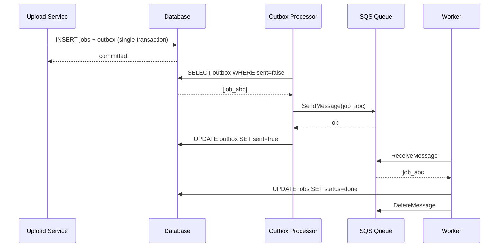

> [!info] SQS is a queue for processing jobs, not a long-term archive. Messages exist only for the configured retention period — up to 14 days — then they expire forever. Once deleted after a worker ACKs, or once the retention window passes, the message is gone and cannot be replayed.

---

## Retention behavior

Every SQS message has a clock ticking from the moment it's sent. If no worker processes it within the retention window, SQS deletes it automatically.

```
Message sent at T0
Retention = 4 days (default)

If unprocessed by T0 + 4 days → message expires and is deleted
```

The maximum you can configure is **14 days**. There is no option to keep messages indefinitely.

This is fine for task queues — the whole point is to process jobs quickly. A transcoding job that sits unprocessed for 14 days has clearly gone wrong.

---

## SQS has no replay

Once a message is deleted — either by a worker ACKing it, or by expiry — it is gone. There is no way to say "reprocess all messages from last Tuesday."

This matters when something goes wrong:

```
Bug discovered in transcoding worker on Day 10
→ want to reprocess all videos from the last 7 days
→ all those messages were deleted after the workers ACKed them
→ the queue has nothing to replay
```

If you only sent jobs into SQS and nowhere else, you have no way to redo the work.

---

## The fix — Transactional Outbox Pattern

The naive fix is to write to both SQS and a DB at the same time. But that's a dual write:

```
Upload Service:
1. SendMessage to SQS   ← succeeds
2. INSERT into jobs DB  ← fails

Result: job runs, no permanent record. Can't replay.

Or:
1. INSERT into jobs DB  ← succeeds
2. SendMessage to SQS   ← fails

Result: record exists, job never runs. Stuck forever.
```

Two separate writes can never be atomic. One can always fail without the other.

The correct approach is the **Transactional Outbox Pattern** — write to the DB only, in a single transaction, and let a separate process enqueue into SQS from that record.

```
Step 1 — Upload Service writes ONE atomic DB transaction:
┌─────────────────────────────────────────┐
│  BEGIN TRANSACTION                      │
│  INSERT INTO jobs (job_id, video_id,    │
│    status = 'pending')                  │
│  INSERT INTO outbox (job_id,            │
│    event = 'transcode_requested',       │
│    sent = false)                        │
│  COMMIT                                 │
└─────────────────────────────────────────┘

Either both rows exist, or neither does. No partial state.

Step 2 — Outbox processor runs continuously:
SELECT * FROM outbox WHERE sent = false
→ SendMessage to SQS (job_id in body)
→ UPDATE outbox SET sent = true

Step 3 — Worker picks up from SQS → transcodes → updates job status
```



Now the DB is the single source of truth. SQS is just the delivery mechanism.

When you need to reprocess:
1. Query the `jobs` table for jobs from the affected time window
2. Re-insert them into the outbox with `sent = false`
3. Outbox processor picks them up and re-enqueues into SQS
4. Workers process again — safely, because consumers are idempotent

---

> [!important] SQS retention is for buffering, not history. It guarantees the message survives long enough to be processed. It does not guarantee you can go back and replay old messages after they've been consumed.

> [!danger] Don't rely on the DLQ for replay either. The DLQ holds messages that *failed* processing — it is not an archive. Once you fix the bug and replay the DLQ, it drains. It does not preserve the full history of what was ever sent.

---

> [!tip] **Interview framing:** "SQS retention maxes out at 14 days and there's no replay once a message is deleted. For anything that needs historical reprocessing — like re-running a bug fix over last week's jobs — I'd persist the raw jobs to a durable store alongside the queue. The queue handles real-time processing; the durable store is the source of truth for replays."
