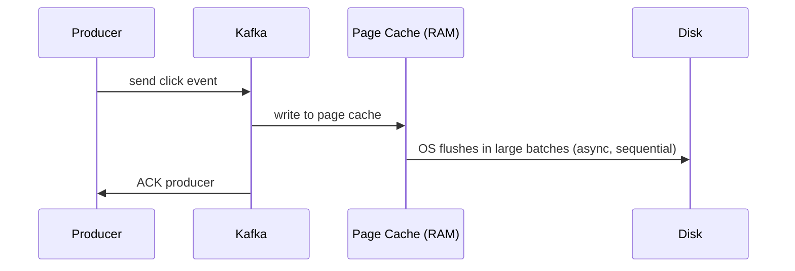
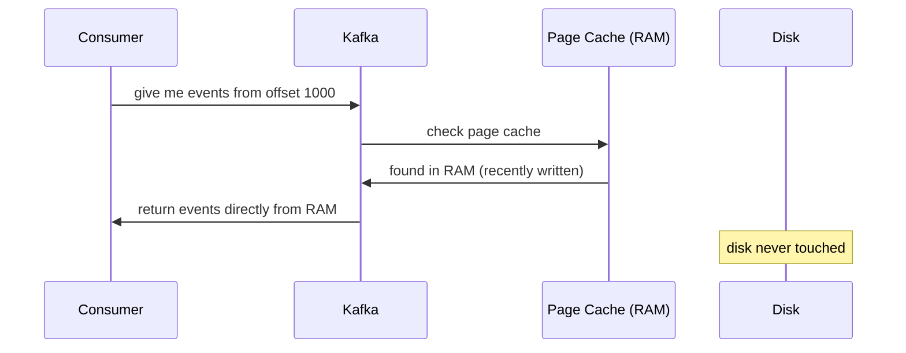
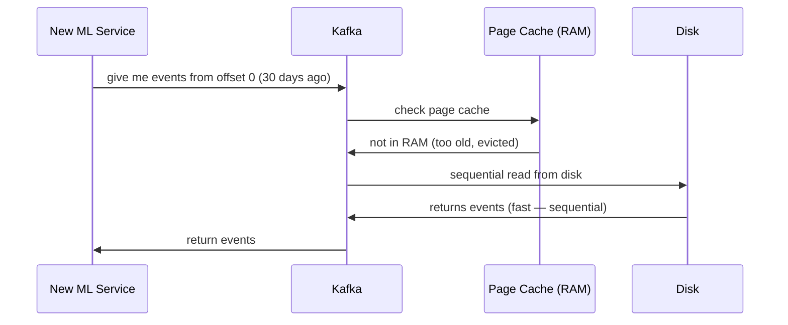

> [!info] Kafka stores everything on disk — yet handles millions of events per second. This seems contradictory until you understand two things: sequential writes are as fast as memory writes, and the OS page cache means recent reads never touch disk at all.

---

## "Disk is slow" — the wrong mental model

When people say disk is slow, they mean **random writes** — where the disk head has to physically seek to different locations to write scattered data. That's slow.

```
Random write:
Disk head at position 1000 → seek to position 50000 → write
                           → seek to position 3000  → write
                           → seek to position 80000 → write
Each seek = milliseconds of latency
~100–200 MB/sec throughput on HDD
```

Kafka never does this. It only ever **appends to the end of a file** — the disk head never moves backward.

```
Sequential write:
Disk head at position 1000 → write → position 1001
                           → write → position 1002
                           → write → position 1003
No seeking. Ever.
~600–700 MB/sec on HDD, 3–4 GB/sec on SSD
```

This is the same reason LSM trees in Cassandra are fast for writes — always sequential, never random. Sequential disk I/O approaches RAM speeds on modern hardware.

---

## But does the OS actually write blocks sequentially?

Here's a fair objection: just because Kafka appends to the end of a file doesn't mean the OS will lay those blocks out sequentially on the physical disk. The filesystem might scatter those blocks due to fragmentation — the application has no control over that.

This is true. And Kafka doesn't fight it.

Instead, Kafka relies on the **OS page cache**. When Kafka appends a message, it doesn't write directly to disk at all. It writes to the page cache — which is RAM managed by the OS. The OS accumulates writes in memory and then flushes them to disk in large sequential batches when it decides to.

Because the OS is flushing large contiguous chunks rather than tiny individual writes, the physical block layout on disk ends up mostly sequential. And for recent data — which is what most consumers are reading — the message is still in the page cache, so the disk is never touched at all.

When Kafka appends a new event:



The write is acknowledged after hitting the page cache — not after hitting disk. This makes writes feel like memory writes to Kafka.

---

## The full read flow

**Case 1 — Consumer reading recent events (common case)**



Recent events are almost always in the page cache because they were just written there. A consumer reading in real-time is effectively reading from RAM.

**Case 2 — Consumer replaying old events**



Old events not in page cache are read sequentially from disk — still fast because Kafka never needs to seek.

---

## Why this matters at scale

```
100,000 events/sec written to Kafka
→ All land in page cache first (RAM write speed)
→ OS flushes sequentially to disk in background
→ Consumers reading recent events → served from RAM
→ Consumers replaying history → served by sequential disk read
→ No random I/O anywhere in the system
```

## But page cache is async — isn't that non-durable?

Yes. If Kafka writes to page cache and the machine crashes before the OS flushes to disk, those messages are lost. That's a real risk.

Kafka solves this not by forcing every write to disk with fsync — which would kill throughput — but through **replication**.

When a producer sends a message, Kafka writes it to the page cache on the leader broker and simultaneously replicates it to 2 other brokers. Each replica also holds the message in its page cache.

```
Producer → Broker 1 (page cache) ← leader
         → Broker 2 (page cache) ← replica
         → Broker 3 (page cache) ← replica

Producer gets ACK only after all in-sync replicas have the message
```

For the message to be lost, all 3 brokers would have to crash at the exact same moment before any of them flushed to disk. That's astronomically unlikely.

So the durability model is: **async to disk, but synchronous across replicas**. The write is not durable on a single machine's disk — it's durable because it lives in RAM on multiple independent machines simultaneously.

---

> [!important] Kafka deliberately avoids managing its own cache. It relies entirely on the OS page cache — which is already highly optimised and shared across processes. This keeps Kafka's own memory footprint small and lets the OS do what it's best at.

> [!tip] **Interview framing:** "Kafka is disk-based but fast because it only ever does sequential writes — appending to the end of a log file. The OS page cache means recent reads are served from RAM. Old reads are sequential disk reads. There's no random I/O anywhere, which is why it sustains millions of events per second on commodity hardware."
