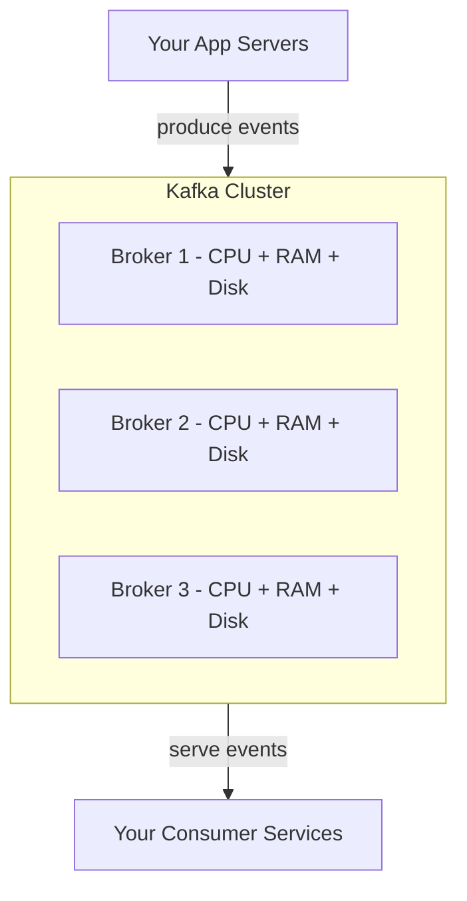
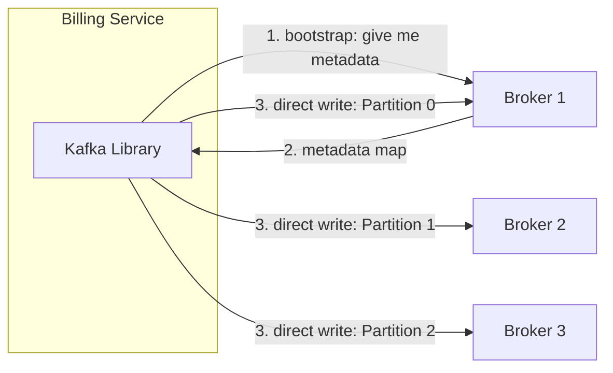

> [!info] A broker is a dedicated Kafka server — a machine whose entire job is to store partitions and serve reads and writes. You never run one broker in production. You run a cluster of brokers so load, storage, and fault tolerance are distributed.

---

## What a broker is

A broker is just a machine running the Kafka process. It has its own CPU, RAM, and disk. It stores some of the topic's partitions on that disk and serves producer writes and consumer reads for those partitions.

Think of it exactly like a database server — dedicated infrastructure, completely separate from your application servers. Your app server handles user requests and business logic. The broker just stores and serves the event log.



---

## Why a cluster — not one broker

One broker has three hard limits:

- One disk can only store so much — 30 days of 100k events/sec is petabytes
- One machine can only handle so many writes per second
- One machine going down = all topics go down

A cluster of brokers solves all three. Partitions are distributed across brokers, so storage and write load are shared. And because each partition has replicas on other brokers, a single broker failure doesn't take down the cluster.

```
Single broker:
→ ~10TB disk limit
→ ~500MB/sec write throughput
→ Single point of failure

3-broker cluster:
→ ~30TB combined storage
→ ~1.5GB/sec combined write throughput
→ Survives 1 broker failure without data loss
```

---

## HDD vs SSD for Kafka brokers

Because Kafka only ever does sequential I/O — appending to logs, reading forward — even cheap spinning disks give excellent throughput. There's no random seeking, so the weakness of HDDs never applies.

```
HDD (spinning disk):
→ $20–30 per TB
→ ~600–700 MB/sec sequential throughput
→ Perfect for Kafka — no random seeks ever
→ Used by LinkedIn, Uber, most large-scale deployments

SSD:
→ $200–300 per TB
→ Lower latency
→ Better for latency-sensitive workloads
→ Mostly overkill for Kafka
```

This is what makes Kafka economical at massive scale. You can store petabytes of event history on cheap spinning disks without sacrificing throughput.

---

## How clients connect — no load balancer

In most systems you put a load balancer in front of your servers. The client talks to the LB, the LB routes to a server. At Google scale that becomes the bottleneck.

At 100,000 events/sec with 5 consumer services each reading every event: that's 500,000 messages/sec flowing through one machine. At 1KB per message, that's ~4 Gigabits/sec — the LB's network card saturates before you've even accounted for replication traffic between brokers.

Kafka eliminates the middleman with a **smart client** model. The Kafka SDK that ships with every producer and consumer handles routing itself.

Here's how it works:

1. When your service starts, the Kafka library connects to any broker and asks: "Where are the partitions for `ad_clicks`?"
2. The broker returns a metadata map: Partition 0 is on Broker 1, Partition 1 is on Broker 2, Partition 2 is on Broker 3.
3. The library caches this map and opens direct connections to the relevant brokers — no middleman involved.



Every producer and every consumer does this independently. The routing intelligence lives in the client library, not in any central server. This is why Kafka scales to millions of events per second — there is no single machine that all traffic must pass through.

> [!important] The metadata map is cached by the client. If a broker goes down and a partition leader changes, the client gets a "not leader" error, refreshes its metadata, and reconnects to the new leader automatically. No manual intervention needed.

> [!tip] **Interview framing:** "Kafka uses a smart client model — no load balancer. The client library fetches metadata on startup to learn which broker holds each partition leader, then connects directly. At 500k messages/sec, a central LB would be a network bottleneck. Distributing the routing logic to each client means the cluster scales linearly with the number of brokers."
