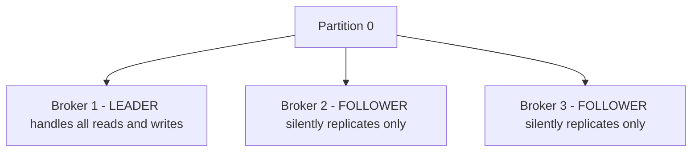
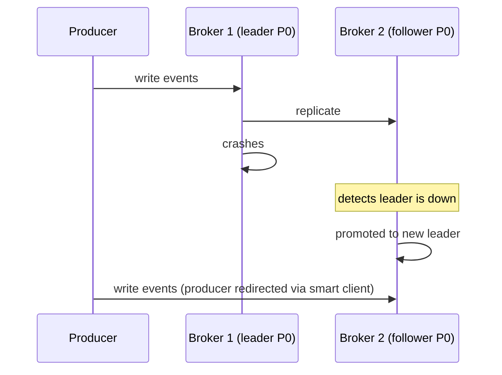

> [!info] Every Kafka partition has one leader and N-1 followers. The leader handles all reads and writes. Followers just replicate. If the leader dies, a follower gets promoted. The producer's acks setting controls the durability vs latency trade-off.

---

## The problem

Broker 1 stores Partition 0. Broker 1's disk dies. Partition 0 is gone — all events on it are lost, and no consumer can read from it. That's a complete failure.

The fix is replication — copy every partition to multiple brokers.

---

## Leader and followers

Each partition has exactly one **leader** and zero or more **followers** (replicas). The key thing to understand is that a follower is not a separate kind of machine — it is a regular broker, the same brokers in the cluster, just playing a different role for that partition.

Every broker in the cluster is simultaneously a leader for some partitions and a follower for others:

```
Broker 1: Leader for Partition 0  |  Follower for Partition 1  |  Follower for Partition 2

Broker 2: Leader for Partition 1  |  Follower for Partition 0  |  Follower for Partition 2

Broker 3: Leader for Partition 2  |  Follower for Partition 0  |  Follower for Partition 1
```

Broker 2 holds a full copy of Partition 0's data — but because it is not the leader for Partition 0, it will never serve reads for it. It is not a routing situation where Broker 2 receives the request and forwards it to Broker 1. The smart client already knows to go directly to Broker 1 for Partition 0. Broker 2 is never asked.

The follower's only job is to pull new messages from the leader and stay caught up — so it is ready to become the new leader immediately if the current leader dies.



---

## Why all reads go to the leader — not any replica that has the data

This feels wasteful. Three brokers hold identical data for Partition 0, but only one serves traffic. Why not let any replica serve reads?

The problem is consistency. Followers are always slightly behind the leader — they pull new messages in the background but there is always a small lag:

```
Leader writes offset 100
Follower A has replicated up to offset 98 (2 messages behind)

Consumer reads from Follower A → sees offset 98
Consumer reads from Leader     → sees offset 100

Same partition, two consumers, two different views of reality
```

That is a consistency violation. By forcing all reads to the leader, Kafka guarantees every consumer sees the same data in the same order, no matter which consumer instance they are.

> [!important] Kafka 2.4+ introduced rack-aware reads — consumers can optionally read from the nearest replica to reduce cross-datacenter latency. But this only works when the replica is fully caught up with the leader. It is opt-in and not the default.

---

## What happens when the leader dies



**Kafka's controller** (a special broker that manages cluster metadata) detects the failure and promotes one of the in-sync followers to leader. The smart client in each producer and consumer refreshes its metadata map and starts talking to the new leader. No manual intervention needed.

There is one side effect worth noting. With a normally balanced cluster, each broker leads one partition:

```
Broker 1: Leader for Partition 0
Broker 2: Leader for Partition 1
Broker 3: Leader for Partition 2
```

When Broker 1 dies, its partition leadership moves to one of the surviving brokers — say Broker 2:

```
Broker 1: DEAD
Broker 2: Leader for Partition 0 + Leader for Partition 1  ← double the load
Broker 3: Leader for Partition 2
```

Broker 2 is now handling reads and writes for two partitions instead of one — double the traffic — until Broker 1 recovers and Kafka rebalances, or a replacement broker is added. This is temporary but real. If each broker was already near capacity, a single failure can push a surviving broker over its limit. This is why running brokers with headroom, not at 100% utilisation, matters.

---

## The acks setting — durability vs latency

The producer controls when it considers a write "done" via the `acks` setting.

**acks=0 — fire and forget**
```
Producer sends event → doesn't wait for anything → moves on immediately
→ Fastest possible — no waiting
→ If the broker crashes before writing → event lost forever
→ Use for: metrics, logs where occasional loss is acceptable
```

**acks=1 — leader confirms**
```
Producer sends event
→ Leader writes to its log
→ Leader ACKs producer ← producer considers it done
→ Followers replicate in background

→ Fast — only one write in the critical path
→ Risk: leader crashes AFTER ACKing but BEFORE followers replicate
  → event is lost — producer was told it succeeded but no replica has it
→ Use for: moderate durability, can tolerate very rare loss
```

**acks=all — all in-sync replicas confirm**
```
Producer sends event
→ Leader writes to its log
→ Followers write to their logs
→ All confirm back to leader
→ Leader ACKs producer ← producer considers it done

→ Slowest — waits for multiple writes across the network
→ Strongest guarantee — survives any single broker failure
→ Use for: billing, payments, anything where loss is unacceptable
```

---

## Replication factor

The replication factor is how many total copies of a partition exist (leader + followers).

```
replication_factor = 1 → no replicas, broker failure = data loss
replication_factor = 2 → 1 leader + 1 follower, survives 1 failure
replication_factor = 3 → 1 leader + 2 followers, survives 2 failures
```

Standard production setting is **replication factor = 3**. You can survive 2 broker failures before losing data. Most systems only need to survive 1 failure at a time, so RF=3 gives a comfortable safety margin.

> [!important] Replication factor must be ≤ number of brokers. You can't have RF=3 with only 2 brokers — there aren't enough machines to place 3 copies on different machines.

> [!tip] **Interview framing:** "I'd set replication factor = 3 with acks=all for billing and fraud topics — no data loss acceptable. For analytics where approximate counts are fine, acks=1 for lower write latency. Same Kafka cluster, different durability settings per topic based on criticality. Followers never serve reads — all reads go to the partition leader to guarantee every consumer sees the same consistent view."
