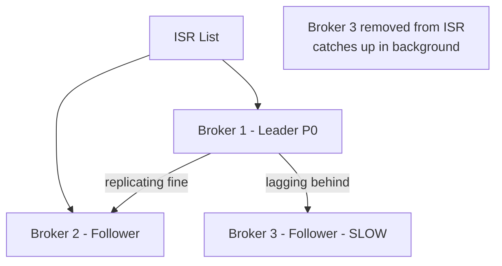
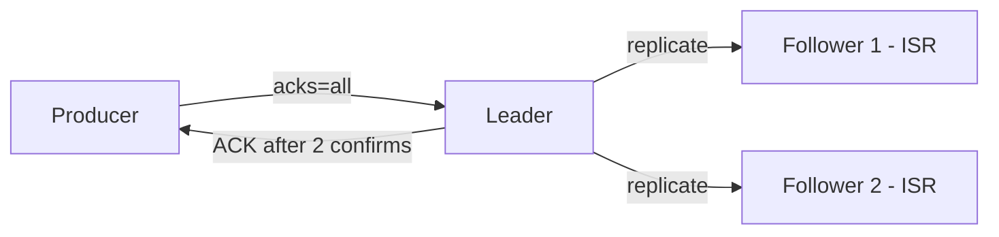

> [!info] ISR is a dynamic list of replicas that are caught up with the leader within a configurable time threshold. With acks=all, the leader only waits for ISR members — not all replicas. This prevents one slow broker from tanking write latency for everyone.

---

## The problem with acks=all

`acks=all` says wait for ALL replicas to confirm before ACKing the producer. With replication factor = 3, that means waiting for 3 disk writes across 3 brokers on 3 different machines.

What if one of those brokers is slow — overloaded, garbage collecting, network hiccup? Every single write now waits for the slowest broker. Your p99 write latency is determined by your worst broker at any given moment.

At 100,000 events/sec, one slow broker makes the entire system feel sluggish.

---

## What ISR is

ISR (In-Sync Replicas) is a dynamic list maintained by the leader. It contains only the replicas that are currently caught up with the leader within a time threshold (default: 10 seconds).



```
Broker 2 is keeping up → in ISR ✓
Broker 3 is lagging    → removed from ISR ✗ → catches up in background
```

With `acks=all`, the leader now waits only for ISR members — Broker 1 and Broker 2. Broker 3 is excluded until it catches up.

```
Before ISR removal:
Producer write → wait for Broker 1, 2, AND slow Broker 3 → high latency

After ISR removal:
Producer write → wait for Broker 1 and Broker 2 only → fast
Broker 3 → catches up quietly in the background
```

---

## The safety trade-off

Removing Broker 3 from ISR means if Broker 1 and Broker 2 both die simultaneously, the data that Broker 3 hasn't replicated yet is lost. You've reduced your failure tolerance by 1.

This is acceptable because:
1. Two brokers dying at the exact same time is rare
2. Broker 3 is still replicating — it's just slightly behind, not completely gone
3. The alternative (waiting for slow replicas) causes sustained high latency for every write

---

## min.insync.replicas — the safety floor

What if Broker 2 also falls behind? ISR shrinks to just the leader — Broker 1 alone. Now `acks=all` is effectively `acks=1` — only the leader confirms. If Broker 1 crashes, data is lost.

Kafka has a config to prevent this: `min.insync.replicas`.

```
min.insync.replicas = 2

ISR = [Broker 1, Broker 2, Broker 3] → writes accepted ✓
ISR = [Broker 1, Broker 2]           → writes accepted ✓ (meets minimum of 2)
ISR = [Broker 1 only]                → writes REJECTED ✗
                                     → producer gets NotEnoughReplicasException
                                     → Kafka prefers unavailability over data loss
```

When ISR shrinks below the minimum, Kafka stops accepting writes entirely. It chooses **consistency over availability** — a deliberate CAP theorem decision. Better to reject writes and alert the team than to silently accept writes that might be lost.

---

## The production config

The standard production setup for critical data:

```
replication.factor = 3
acks = all
min.insync.replicas = 2
```

This means:
- 3 copies of every partition (1 leader + 2 followers)
- Producer waits for all ISR members (at least 2) to confirm
- If ISR drops to 1, writes are rejected
- Can survive 1 broker failure with zero data loss
- Can survive 2 broker failures without losing the cluster (just reduced durability)



> [!important] `min.insync.replicas` only has effect when `acks=all`. With `acks=1`, the leader ACKs after its own write regardless — min.insync.replicas is ignored.

> [!danger] A common misconfiguration: setting `min.insync.replicas = 1` with `acks=all`. This means the leader alone is enough to satisfy `acks=all` — you get none of the durability benefits. Always set `min.insync.replicas = 2` for production critical topics.

> [!tip] **Interview framing:** "I'd use replication factor 3, acks=all, and min.insync.replicas=2. ISR ensures that a slow replica doesn't block writes — Kafka dynamically excludes lagging replicas. The min.insync.replicas floor ensures we never accidentally drop below safe durability. If ISR shrinks to 1, Kafka rejects writes — we'd rather page an engineer than silently lose billing data."
