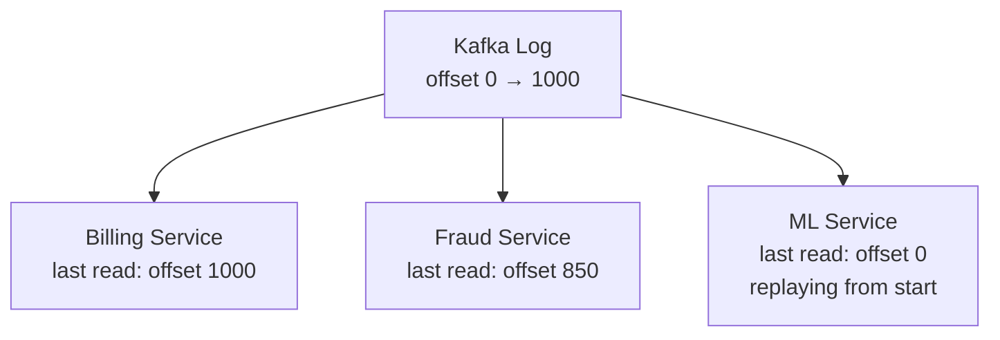

> [!info] Every message in Kafka has a number — its offset. This is its permanent position in the log. Consumers use offsets to track where they are and what to read next. Kafka doesn't track this for consumers — each consumer owns its own position.


## What an offset is

Kafka stores events as an ordered, numbered log. Every event gets assigned an offset when it's written — starting from 0, incrementing by 1 forever.

```
Offset 0   → click event at 10:00:00.001
Offset 1   → click event at 10:00:00.002
Offset 2   → click event at 10:00:00.003
Offset 3   → click event at 10:00:00.004
...
Offset 259,000,000,000 → click event right now
```

Offsets never change. They're permanent. Event at offset 1000 will always be at offset 1000 for the lifetime of the log.

---

## Each consumer tracks its own offset independently

This is the key difference from traditional queues. In a traditional queue, the queue tracks what's been delivered. In Kafka, **each consumer tracks its own position**.



```
Billing Service    → last committed: offset 1000 → next read: 1001

Fraud Service      → last committed: offset 850  → next read: 851

ML Service         → last committed: offset 0    → replaying from beginning
```

All three consume the same Kafka log. Each moves at its own pace. None of them affects the others. Kafka doesn't care — it just stores the log and serves reads.

---

## Why consumers control their own position — and what this enables

Because the consumer owns its offset, it can do things a traditional queue never allows:

**Replay from any point:**
```
ML Service wants last 30 days → set offset to 0 → replay entire history
```

**Skip ahead:**
```
New service doesn't need history → set offset to latest → only process new events
```

**Reprocess after a bug fix:**
```
Fraud Service had a bug → fix deployed → reset offset to 3 days ago → reprocess
```

None of this is possible with a traditional queue because messages are deleted after delivery. In Kafka, the log is always there — the consumer just moves its read pointer.

> [!important] Kafka is **pull-based** — consumers ask Kafka for events from their current offset. Kafka never pushes. This is what gives consumers full control over their pace and position.

> [!tip] **Interview framing:** "Because Kafka consumers track their own offsets, I can add a new consumer at any time and have it replay the full event history from day one. In a traditional queue, messages are gone once consumed — you can't do this. This is why Kafka is the right choice when you need multiple independent consumers or replay capability."
