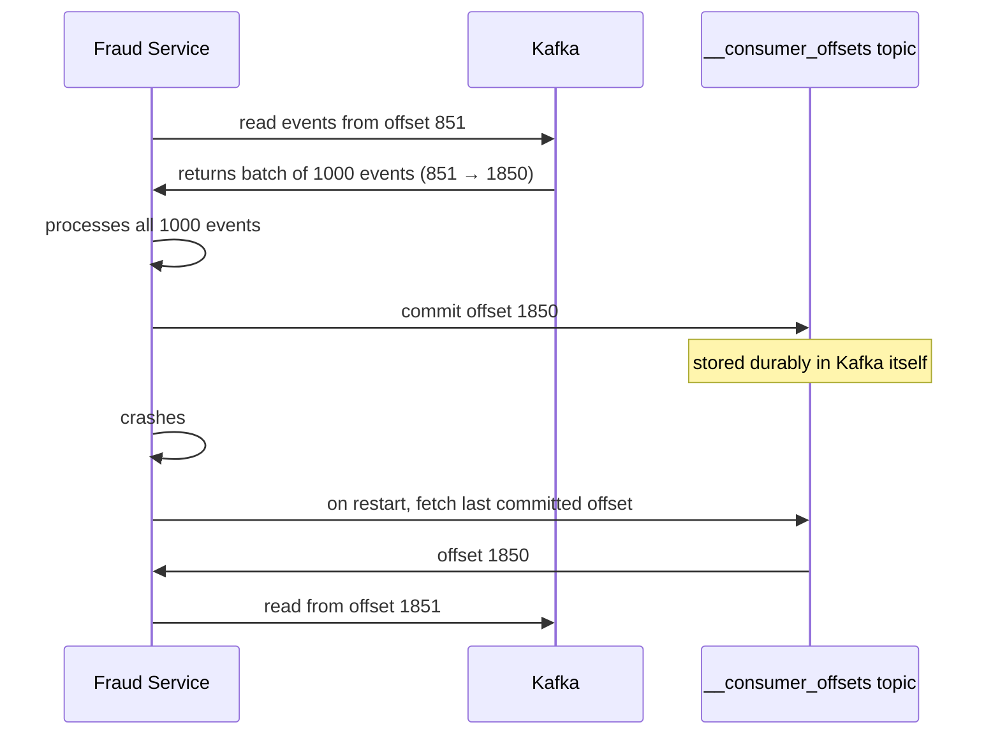

> [!info] Consumers track their own offsets — but where do they store them? In-memory isn't safe across crashes. Kafka solves this with an internal topic called __consumer_offsets, and consumers commit in batches to keep overhead negligible.

---

## The problem with in-memory offset tracking

A consumer tracks its current offset. Simple enough. But what if it stores that offset only in memory?

```
Fraud Service is at offset 850
Crashes
Restarts → offset is gone from memory
→ Starts from offset 0 → reprocesses 850 messages it already handled
OR
→ Starts from latest → skips 850 unprocessed messages it never got to
```

Both are wrong. You need the offset to survive crashes.

---

## The naive fix — store offset in Redis or a DB

Every team running a Kafka consumer would need to build their own offset persistence layer — a Redis key, a DB row, something. That's duplicated infrastructure across every team, each with their own bugs and edge cases.

---

## What Kafka actually does — __consumer_offsets

Kafka has a special internal topic called `__consumer_offsets`. It's just another Kafka topic — but Kafka manages it internally. Every consumer group commits its offsets here after processing.



On restart, the consumer asks Kafka "where was I?" — Kafka returns the last committed offset — consumer resumes from exactly where it left off.

---

## Batch commits — why the overhead is negligible

The consumer doesn't commit after every single message. It processes a batch of messages, then commits once.

```
Consumer reads batch: offsets 851 → 1850  (1000 messages)
Processes all 1000
Commits offset 1850 once
→ 1 commit per 1000 messages
```

Compare this to the actual event stream:

```
100,000 click events/sec written to Kafka
vs
~5 offset commits/sec per consumer (batched)
```

The offset commit overhead is less than 0.01% of total Kafka write traffic. It's negligible.

> [!important] Kafka centralising offset storage means every team gets crash-safe consumer position tracking for free, without building their own Redis/DB solution. One correct implementation, shared by everyone.

---

## Committing offsets is a write to Kafka

Worth noting — `__consumer_offsets` is a Kafka topic. Committing an offset is just appending a small message to that topic. Sequential write, fast, durable. Same guarantees as any other Kafka write.

> [!tip] **Interview framing:** "Kafka stores consumer offsets in its own internal `__consumer_offsets` topic. Consumers commit in batches — maybe once per 1000 events — so the overhead is negligible compared to the actual event throughput. On crash and restart, the consumer reads its last committed offset and resumes from there. No external state store needed."
