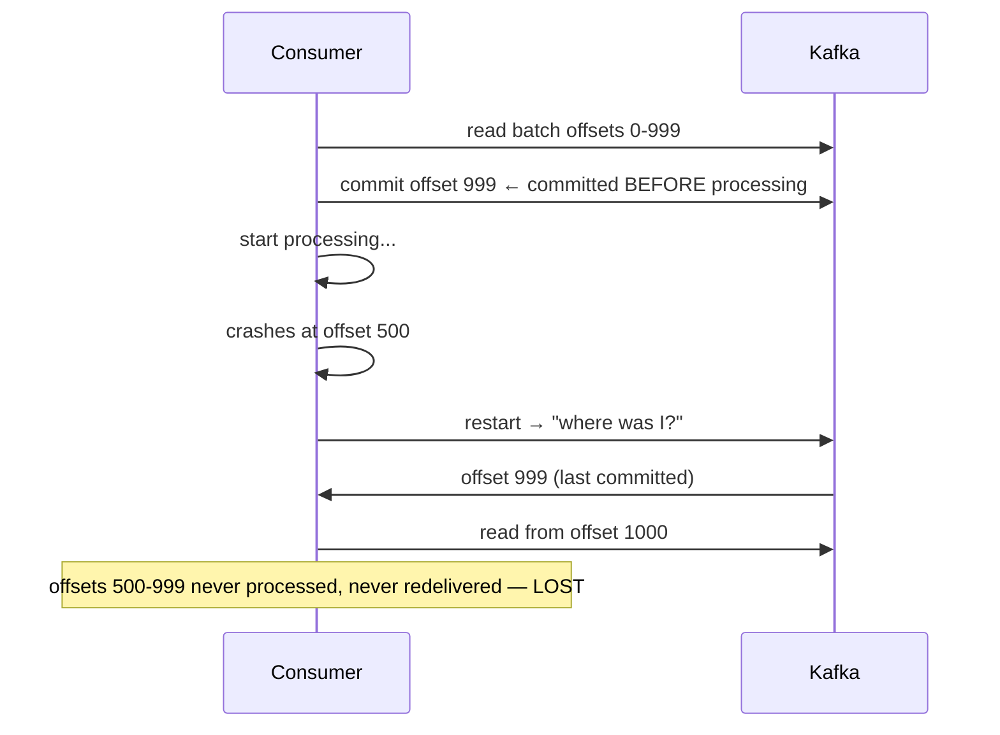
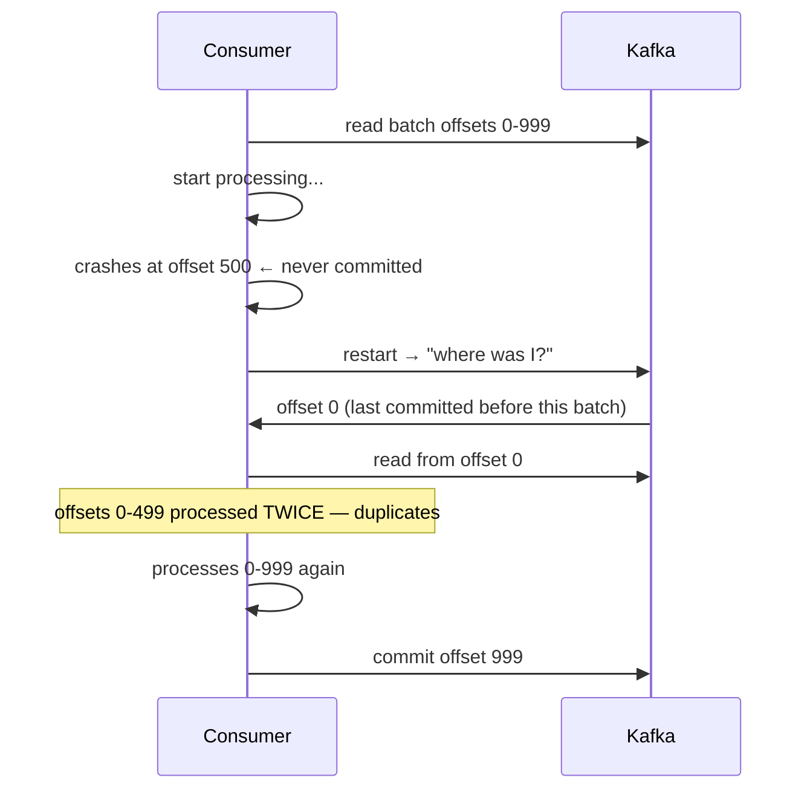

> [!info] When a consumer commits its offset determines what happens on crash and restart. Commit before processing = risk losing messages. Commit after processing = risk duplicates. There is no free lunch — pick your poison and design around it.

---

## The question

A consumer reads a batch of 1000 events (offsets 0–999). When should it commit offset 999 — before processing the batch or after?

---

## Commit before processing — At-Most-Once



**What happened:** the consumer told Kafka "I'm done up to 999" before actually being done. On restart, Kafka has no idea the crash happened — it thinks 0–999 were processed successfully.

Messages 500–999 are lost forever.

This is **at-most-once** — each message is processed zero or one times. Never duplicated, but can be lost.

**When to accept this:** metrics, analytics events, logs — where losing one click event out of a million is acceptable and duplicates would corrupt aggregations.

---

## Commit after processing — At-Least-Once



**What happened:** the consumer crashed before committing. On restart, Kafka correctly redelivers the entire batch. Offsets 0–499 were already processed in the previous run — they get processed again.

Messages 0–499 are duplicated.

This is **at-least-once** — each message is processed one or more times. Never lost, but can be duplicated.

**When to accept this:** almost everywhere. It's the Kafka default and the industry standard. The duplicate problem is handled at the consumer level.

---

## The fix for duplicates — idempotent consumer

Commit after processing (at-least-once) + make the consumer idempotent = effectively exactly-once behaviour, without the cost of true exactly-once infrastructure.

**Example — Billing Service counting clicks:**

```
First processing of offset 500 (click_id: abc123):
→ Check DB: has click_id abc123 been counted?
→ No → insert { click_id: abc123, advertiser: X, count: 1 }

Second processing of offset 500 (duplicate from retry):
→ Check DB: has click_id abc123 been counted?
→ Yes → skip, do nothing, ACK

Result: advertiser X charged exactly once
```

Or simpler — use a DB unique constraint:

```sql
INSERT INTO click_counts (click_id, advertiser_id, amount)
VALUES ('abc123', 'X', 0.05)
ON CONFLICT (click_id) DO NOTHING
```

Duplicate delivery hits the unique constraint and is silently skipped. No double charges.

---

## Summary

| When to commit | Delivery guarantee | Risk | Fix |
|---|---|---|---|
| Before processing | At-most-once | Message loss | Accept it for non-critical events |
| After processing | At-least-once | Duplicates | Idempotent consumer |

> [!important] The fix for duplicates lives in the **consumer**, not in Kafka. Kafka delivers at-least-once by default. Your consumer is responsible for handling duplicates safely. This is a consumer-side design decision, not a Kafka configuration.

> [!tip] **Interview framing:** "I'd commit offsets after processing — at-least-once delivery. To handle the duplicate risk, I'd make the consumer idempotent using a unique constraint on the event ID at the DB level. This gives effectively exactly-once semantics without the cost and complexity of Kafka's transactional API."

> [!danger] Never commit before processing unless you've explicitly accepted message loss as a trade-off and documented why. It's easy to do accidentally and very hard to debug when events silently disappear.
