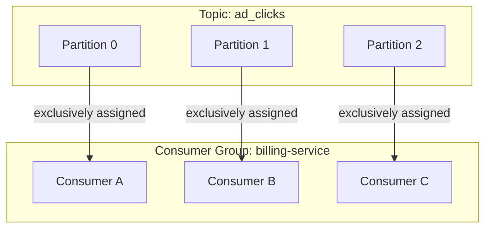
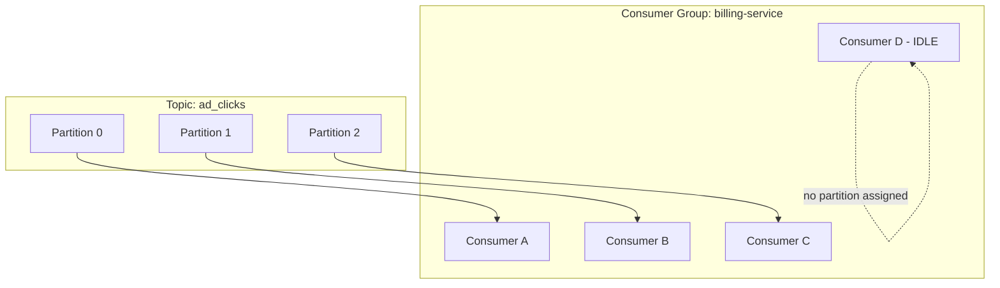
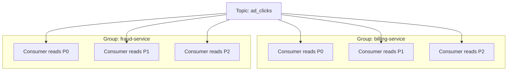

> [!info] A consumer group is a set of consumer instances that work together to consume a topic. Kafka assigns each partition to exactly one consumer in the group — no two consumers share a partition. This is how Kafka scales consumption without locking or coordination.

---

## The problem

Partition 0 is receiving 33,000 click events/sec. One consumer instance can only process 10,000 events/sec. You need to scale — add more consumer instances.

But if you just add more instances naively:

```
Consumer A reads Partition 0 from offset 500
Consumer B also reads Partition 0 from offset 500
→ Both process the same events
→ Every click gets billed twice
→ Advertiser charged double
```

You need coordination. Kafka's solution is elegant — no locking, no coordination logic in your code.

---

## The rule

> **One partition can only be assigned to exactly one consumer within a consumer group at a time.**

All instances of the same service form one consumer group. Kafka divides partitions among them automatically.



Consumer A owns all of Partition 0 — from offset 0 to infinity. It reads sequentially, one batch at a time. Consumer B and C never touch Partition 0 while Consumer A is alive.

---

## ACK vs partition ownership — two separate things

This is a common source of confusion.

**ACK** is about offset tracking — "I've processed up to offset 999, remember my position."

**Partition assignment** is about group membership — "I own Partition 0 as long as I'm in this group."

```
Consumer A owns Partition 0
→ reads offsets 0-999, ACKs offset 999   ← offset tracking
→ reads offsets 1000-1999, ACKs 1999     ← offset tracking
→ reads offsets 2000-2999, ACKs 2999     ← offset tracking
→ still owns Partition 0 ← partition assignment unchanged
```

ACK does not release the partition. Consumer A keeps Partition 0 until it crashes, shuts down, or times out.

---

## More consumers than partitions — idle consumers



Kafka cannot assign the same partition to two consumers in the same group. The 4th consumer sits idle — no partition, no work.

But it's not wasted — it's a **hot standby**. If Consumer A crashes, Kafka immediately assigns Partition 0 to Consumer D. It resumes from Consumer A's last committed offset with no manual intervention.

---

## Partition count = maximum parallelism

This is the key design implication:

```
3 partitions → max 3 active consumers in a group
10 partitions → max 10 active consumers in a group
```

If you need 10 consumer instances processing in parallel, you need at least 10 partitions. Extra consumers beyond partition count are idle standby.

> [!important] Partition count is set at topic creation and is hard to change later (increasing partitions breaks key-based ordering guarantees for existing messages). Plan your partition count upfront based on your expected consumer parallelism needs.

---

## Multiple consumer groups on the same topic

Different services form different consumer groups. **Each group gets its own independent view of the topic** — all messages, from the beginning.



Billing Service and Fraud Service each consume every message independently. They maintain separate offsets. One group's progress never affects the other. This is the pub/sub behaviour — but with consumer-controlled position and unlimited replay.

> [!tip] **Interview framing:** "Each downstream service — billing, fraud, recommendations — forms its own consumer group. They all read the same topic independently at their own pace. Within each group, partitions are divided among instances so each partition is processed by exactly one instance — no coordination, no locking needed. To scale a service's consumption throughput, I'd add more instances up to the partition count."
