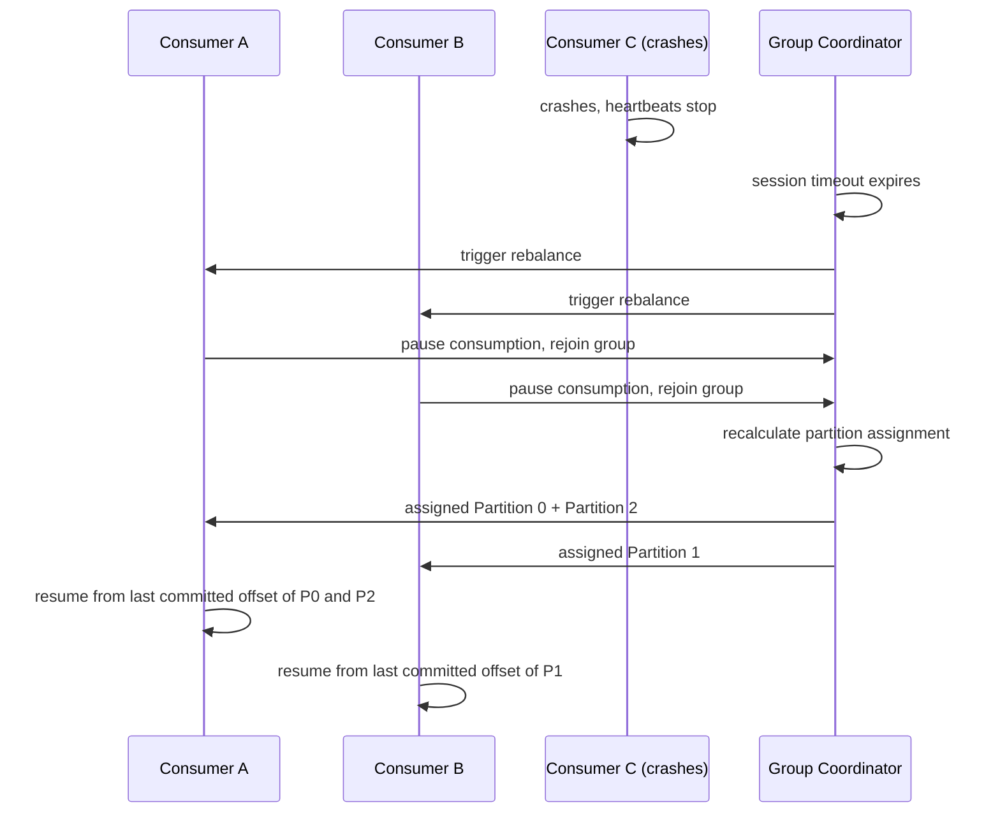

> [!info] Rebalancing is when Kafka redistributes partition assignments among consumers in a group. It happens automatically whenever the group membership changes — a consumer joins, leaves, or crashes. During a rebalance, all consumers in the group pause briefly.

---

## What triggers a rebalance

```
1. A new consumer instance joins the group   → partitions need to be redistributed
   
2. A consumer crashes or times out           → its partitions need to be reassigned
   
3. A consumer gracefully shuts down          → its partitions need to be reassigned
   
4. New partitions are added to the topic     → new partitions need to be assigned
```

All four cases trigger the same mechanism — Kafka stops all consumers in the group momentarily, recalculates the partition assignment, and redistributes.

---

## How Kafka detects a consumer is gone

Every consumer sends a **heartbeat** to Kafka's group coordinator (a designated broker) at regular intervals — default every 3 seconds.

```
Consumer A → heartbeat every 3 seconds → group coordinator
Consumer A crashes → heartbeats stop
Group coordinator waits session.timeout.ms (default 10 seconds)
→ No heartbeat received → Consumer A declared dead
→ Rebalance triggered
```

The `session.timeout.ms` is how long Kafka waits before declaring a consumer dead. Set it too low → false positives (a slow consumer gets kicked out). Set it too high → partitions sit unassigned for too long after a real crash.

---

## The rebalance process



Consumer A takes over Partition 2 (previously owned by Consumer C). It resumes from Consumer C's last committed offset — no messages are skipped, no messages are lost.

One consumer holding multiple partitions is completely normal. Consumer A now reads both Partition 0 and Partition 2 in the same `poll()` loop — the Kafka client library multiplexes them internally. Your application code just calls `poll()` and gets records from whichever partition has messages ready. You don't manage the two partitions separately.

The fundamental rule is asymmetric:

```
One partition → at most one consumer at a time (within a group)
One consumer  → can hold any number of partitions
```

The first half is what guarantees ordering — two consumers can never read the same partition simultaneously. The second half is how Kafka survives failures — dead consumers' partitions are absorbed by whoever is left.

This is also why having more partitions than consumers is normal and expected. 6 partitions, 3 consumers → each consumer holds 2 partitions from the start. The only case that wastes resources is the reverse: more consumers than partitions. The extra consumers sit completely idle — there are no partitions left to assign them.

---

## The stop-the-world problem

During a rebalance, **all consumers in the group pause**. Even consumers whose partition assignments aren't changing must stop, rejoin, and wait for the new assignment to be published.

```
3 consumers, Consumer C crashes
→ Consumer A pauses (even though its assignment won't change)
→ Consumer B pauses (even though its assignment won't change)
→ Rebalance runs → new assignments published
→ Consumer A resumes
→ Consumer B resumes
→ Total pause: hundreds of milliseconds to a few seconds
```

For 100,000 events/sec, a 2-second pause means 200,000 events queued up in Kafka waiting to be consumed. They'll be processed once consumers resume — but there's a latency spike.

---

## Rebalance and duplicate processing

When Consumer D takes over Partition 0 after Consumer A crashes, it resumes from Consumer A's **last committed offset**.

```
Consumer A was processing offset 850-999 when it crashed
Consumer A never committed (commit happens after processing)
→ last committed offset = 849

Consumer D resumes from offset 850
→ reprocesses 850-999 (Consumer A may have partially processed these)
→ duplicates possible
```

This is another reason why idempotent consumers matter — rebalances cause redelivery of the last uncommitted batch, so the consumer must handle duplicates safely.

---

## Scaling up — adding a new consumer

```
Before: 2 consumers, 4 partitions
Consumer A → P0, P1
Consumer B → P2, P3

New Consumer C joins → rebalance triggers
Consumer A → P0, P1      (lost one partition)
Consumer B → P2          (lost one partition)  
Consumer C → P3          (got one partition)

Hmm — uneven. Kafka's default assignor (range assignor) can be uneven.
With round-robin assignor:
Consumer A → P0, P3
Consumer B → P1
Consumer C → P2          (more even)
```

Kafka has pluggable partition assignment strategies. Round-robin is more balanced for equal-sized partitions. The default range assignor works better when consumers need contiguous partitions.

> [!important] Every time you scale your consumer service up or down, a rebalance happens. Design your consumers to handle the brief pause and the duplicate processing that follows gracefully.

> [!tip] **Interview framing:** "Rebalancing happens automatically when consumers join or leave. During a rebalance all consumers briefly pause — this is a known latency spike. I'd mitigate it by making consumers idempotent (rebalance causes redelivery of the last batch) and by using incremental cooperative rebalancing (Kafka 2.4+) which only reassigns the partitions that actually need to move, keeping other consumers running."
