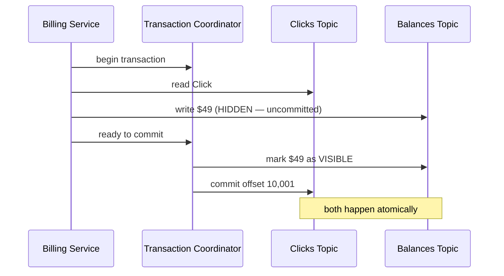

> [!info] "Exactly-Once" is the Holy Grail of distributed systems. It guarantees that even if a server crashes, a message is processed exactly once — no data lost, nothing duplicated. For a Billing Service, this is the difference between a happy advertiser and charging them twice.

---

## The nightmare: at-least-once is not enough

Your Billing Service pulls an ad-click from Kafka worth $1.00.

```
1. Read:   pull Click #10,001 from Clicks topic
2. Act:    deduct $1.00 → advertiser balance goes $50 → $49
3. CRASH:  power goes out before offset commit reaches Kafka
```

When the service restarts, Kafka has no idea the click was already processed — the offset was never committed, so Kafka's record still says "last processed = 10,000." It replays Click #10,001. You charge them another $1.00. The advertiser now has $48 instead of $49.

At 100,000 clicks/sec, if even 0.01% of crashes cause a duplicate charge, you've stolen thousands of dollars per hour.

This is the at-least-once problem — you guarantee no data is lost, but you can't guarantee it isn't processed twice.

---

## Step 1: Idempotent Producer — stop duplicates entering Kafka

The first problem is earlier in the pipeline. Before the Billing Service even sees the click, the ad server producing the click can create duplicates.

Imagine the network is slow. The producer sends Click #10,001, waits for an ACK, gets nothing back (timeout), and retries. Without any protection, Kafka stores the click twice — the original write succeeded, the retry is a duplicate.

Kafka's fix is a serial number on every message. When you enable `enable.idempotence=true`, Kafka gives every producer a **Producer ID (PID)** and every message gets a **Sequence Number** (1, 2, 3...).

```
Producer sends Click #10,001  →  PID: 42, Seq: 1001
Network times out
Producer retries             →  PID: 42, Seq: 1001  (same sequence number)

Broker receives retry:
  "I already stored Seq 1001 from PID 42 — this is a duplicate, ignoring."
```

The log stays clean. No matter how many retries happen due to network glitches, only one copy of each click makes it into Kafka.

> [!important] Idempotent producer only protects against producer-level duplicates — retries from the same producer instance. It does not protect against the consumer processing the same message twice after a crash.

---

## Step 2: Idempotent Consumer — stop duplicates being acted on

Now the Billing Service has a clean Kafka log, but it can still act on the same message twice if it crashes between processing and committing the offset.

The fix is to make your database "aware" of which clicks have already been processed. Instead of just subtracting money, you wrap everything in a single database transaction:

```
BEGIN TRANSACTION
  1. Check: is Click #10,001 already in Processed_Clicks table?
     → Yes → rollback, skip
     → No  → continue
  2. Deduct $1.00 from advertiser balance
  3. Insert Click #10,001 into Processed_Clicks table
COMMIT
```

Both the deduction and the "mark as done" happen atomically in one SQL transaction. The database either has both or neither.

```
Crash before commit → DB has neither → click replayed → check finds nothing → charge happens once
Crash after commit  → DB has both    → click replayed → check finds 10,001 → skipped
```

No broken in-between state. This is the **Idempotent Consumer** pattern — and for most production billing systems using a SQL database, this is the right answer. It's simple, reliable, and the overhead is minimal.

---

## Step 3: Kafka Transactions — when there is no external database

The idempotent consumer pattern requires a database to store the "already processed" list. But what if your entire pipeline is Kafka-only?

Some architectures have services that read from one Kafka topic and write results to another Kafka topic — no SQL database involved at all:

```
Billing Service:
  reads from:  Clicks topic   (Kafka)
  writes to:   Balances topic (Kafka)
  no external DB
```

Now you have two separate Kafka operations that must both happen or neither happen:

```
Operation 1: Write new balance "$49" to Balances topic
Operation 2: Commit offset 10,001 on Clicks topic
```

If Operation 1 succeeds but Operation 2 fails (crash), you've written the new balance AND Kafka will replay the click. Double charge.

If Operation 2 succeeds but Operation 1 fails — the offset moves forward but the balance was never updated. You lose the charge entirely.

You can't use the idempotent consumer pattern here because there's nowhere to store the "processed_clicks" list. You'd need to write it to another Kafka topic, and now you have the same two-operation atomicity problem with that topic. You're going in circles.

This is exactly what **Kafka Transactions** solves.

---

## How Kafka Transactions work — the "hidden until commit" mechanic

The core idea is borrowed from database write-ahead logging: writes are recorded to disk but kept invisible until the transaction commits. Either everything becomes visible at once, or nothing does.

**Step 1 — Register with the Transaction Coordinator**

There is a special broker in the cluster called the **Transaction Coordinator**. Before doing anything, the Billing Service registers: "I'm starting a transaction, my producer ID is billing-service-1."

```
Billing Service → Transaction Coordinator: "begin transaction, ID: billing-service-1"
Transaction Coordinator: "acknowledged, tracking this transaction"
```

**Step 2 — Do the writes, marked as uncommitted**

The Billing Service writes "$49" to the Balances topic. Kafka stores this write on disk immediately — but marks it as **uncommitted**. Any consumer reading the Balances topic will not see this write yet. It is invisible.

```
Balances topic:
  offset 5: $50  ← visible, committed
  offset 6: $49  ← on disk, but HIDDEN (transaction in progress)
```

**Step 3 — Signal commit**

Once both operations are ready, the Billing Service tells the Transaction Coordinator: "I'm done, commit everything."

The Transaction Coordinator then atomically:
- Marks the "$49" write on the Balances topic as **visible**
- Commits offset 10,001 on the Clicks topic

Both happen together. There is no moment where one is committed and the other isn't.



**What happens on crash — at any point**

```
Crash before "ready to commit":
  → hidden write stays hidden, gets discarded
  → offset stays at 10,000
  → on restart: Kafka replays Click #10,001
  → transaction runs again from scratch → correct result

Crash after Transaction Coordinator commits:
  → $49 already visible
  → offset already at 10,001
  → on restart: Click #10,001 not replayed
  → no duplicate
```

There is no in-between broken state. The Transaction Coordinator is the single point that decides commit-or-abort, and it does both offset commit and write visibility together.

---

## Which approach to use

```
Do you have an external database (SQL, Redis)?
  → Yes → use Idempotent Consumer (Step 2)
          simpler, lower overhead, battle-tested

  → No (Kafka-only pipeline)?
     → use Kafka Transactions (Step 3)
        heavier: extra network round-trips to Transaction Coordinator,
        hidden writes use extra storage until commit
```

For most production billing systems: **Idempotent Consumer** is the right answer. Kafka Transactions exist for stream-processing pipelines (like Kafka Streams) where the entire computation lives inside Kafka.

---

> [!important] Idempotent producer + idempotent consumer together give you exactly-once semantics for the common case. Kafka Transactions are the escape hatch when your pipeline has no external storage at all.

> [!tip] **Interview framing:** "For the ad-click billing pipeline, I'd use two layers. First, enable `enable.idempotence=true` on producers — this prevents duplicate clicks entering Kafka from network retries. Second, implement the idempotent consumer pattern in the Billing Service: wrap the deduction and the 'mark as processed' in a single SQL transaction with a unique constraint on click_id. If the service crashes and replays the click, the DB check catches it. I'd only reach for Kafka Transactions if the pipeline were Kafka-only with no external DB — they're heavier and add latency from the Transaction Coordinator round-trips."
