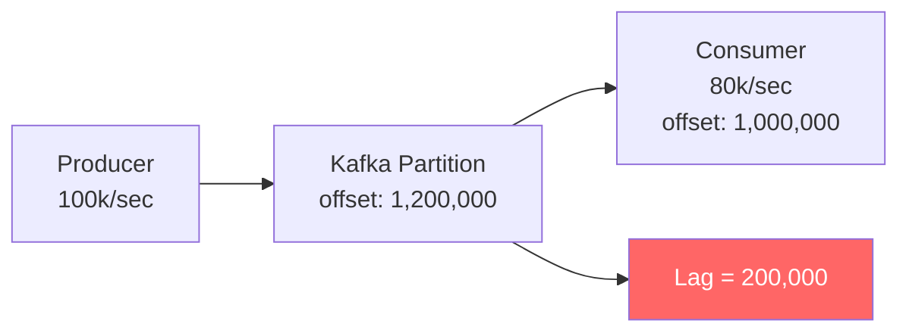

> [!info] Consumer lag is the gap between how fast messages are being produced and how fast they are being consumed. 
> It's measured as the difference between the latest offset in a partition and the consumer's current offset. Growing lag is the early warning signal that your consumers are falling behind — if you don't act, the queue fills up, latency explodes, and eventually messages start dropping.

Consumer lag is the gap between how fast messages are being produced and how fast they are being consumed.

```
Lag = Latest Offset in Partition - Consumer's Current Offset
```

If the producer writes to offset 100,000 and the consumer has only read up to offset 80,000, the lag is **20,000 messages**.

---

## Why Does Lag Happen?

The consumer is slower than the producer. This can happen because:
- Sudden traffic spike (e.g., ad click burst during a viral event)
- Consumer is doing expensive work (DB writes, API calls, ML inference)
- Consumer instance crashed and rebalancing is in progress
- Not enough consumer instances to keep up

---

## The Math

```
Producer rate:  100,000 clicks/sec
Consumer rate:   80,000 clicks/sec
Lag growth:      20,000 messages/sec

After 1 minute:  1,200,000 messages sitting unprocessed
After 1 hour:   72,000,000 messages
```

At some point Kafka's disk fills up and either:
- Old messages are dropped (retention policy kicks in)
- Kafka slows to a halt

---

## How Lag is Measured

Kafka exposes consumer lag as a metric per consumer group per partition:

```
kafka.consumer_group_lag{
  group="billing-service",
  topic="ad-clicks",
  partition="0"
} = 20000
```

Prometheus scrapes this metric. Grafana visualizes it. Alerts fire when lag crosses a threshold.

---

## Diagram



---

## Key Insight

Consumer lag is the **early warning signal** for backpressure. By the time Kafka disk fills up, it's already too late. You need to detect lag early and act before it compounds.

---

> [!tip] **Interview framing:** "The first thing I'd instrument is consumer lag per partition. If lag is growing monotonically, the consumer can't keep up and we need to either scale consumers, throttle producers, or shed load — in that order. Prometheus + Grafana with a lag threshold alert is the standard production setup."
