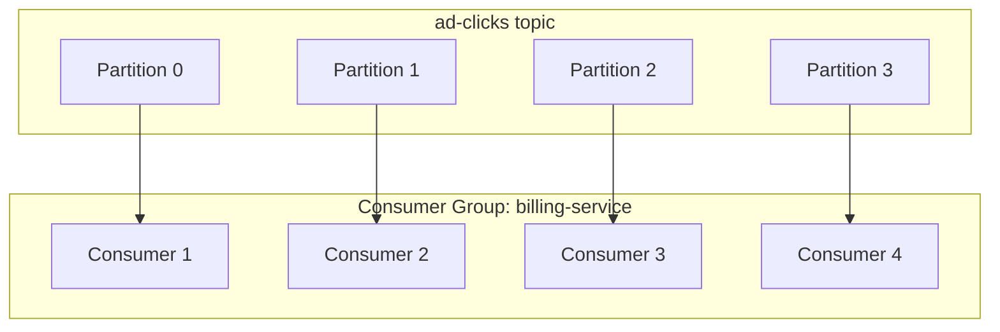

## First Line of Defense Against Lag

When consumer lag grows, the first thing you try is **scaling consumers horizontally**. More consumers = more parallel processing power.

---

## How Consumer Scaling Works in Kafka

Each partition can be consumed by exactly **one consumer per consumer group** at a time.

So if you have:
- 4 partitions
- 2 consumers → each consumer handles 2 partitions
- 4 consumers → each consumer handles 1 partition (max parallelism)
- 8 consumers → 4 consumers are idle (wasted)



---

## The Hard Limit: Partitions

You **cannot** have more active consumers than partitions. The partition count is the ceiling on parallelism.

This is why partition count matters at topic creation time — you can increase partitions later but it's operationally painful and breaks ordering guarantees.

---

## Increasing Partitions to Scale Further

If you're already at max consumers (1 per partition) and still lagging:

1. Increase partition count (e.g., 4 → 8)
2. Add more consumer instances (e.g., 4 → 8)
3. Kafka rebalances — each consumer now handles 1 of the new partitions

**Trade-off**: More partitions = more file handles on broker, more rebalancing overhead, ordering only guaranteed within a partition not across the topic.

---

## Auto-Scaling with Kubernetes HPA

In production, you don't manually scale. You wire Prometheus lag metrics into Kubernetes HPA (Horizontal Pod Autoscaler):

```
If consumer_group_lag > 500,000 for 30s
  → scale billing-service pods from 4 → 8
```

This is the standard production pattern. Lag detected → pods auto-scale → lag drains → pods scale back down.

---

## When Scaling Consumers Isn't Enough

Scaling consumers helps when:
- The bottleneck is **parallelism** (not enough consumers reading)

Scaling consumers does NOT help when:
- The bottleneck is **downstream** (e.g., DB can't handle more writes)
- You've already hit the **partition ceiling**
- The producer is simply too fast for any reasonable consumer count

In those cases, you need load shedding or producer throttling.

---

## Key Insight

> Partitions = max parallelism ceiling. Design your partition count at topic creation based on peak expected consumer count, not current load.
