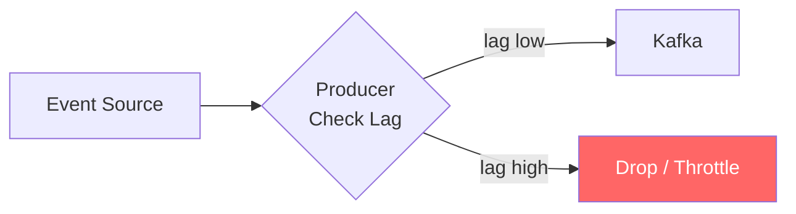

> [!info] Load shedding is the deliberate dropping of messages when the system cannot keep up. Instead of letting lag grow unboundedly and eventually crashing the system, you intentionally discard lower-priority work.
> The art is choosing *which* messages to drop (analytics events, not billing records) and *where* to drop them (at the producer, not at the consumer after wasting resources processing them).


## When is Load Shedding Acceptable?

The answer depends entirely on **what the message represents**:

| Message Type | Drop Acceptable? | Reason |
|---|---|---|
| Ad click / analytics event | Yes | 0.1% undercount is within acceptable margin |
| Billing payment | No | Wrong charge = legal/financial issue |
| User-visible action (order placed) | No | Inconsistency is fatal |
| Metrics / telemetry | Yes | Approximate data is fine |
| Audit log | No | Compliance requires completeness |

**Rule of thumb**: If losing the message causes data inconsistency or financial harm, never drop. If it causes approximate analytics then dropping is acceptable.

---

## Where to Shed Load

Three possible layers — each with different tradeoffs:

### 1. At the Producer (Best)

Producer detects high lag signal → stops producing or drops low-priority events before they even hit Kafka.

**Why this is best**: Fail fast at the source. Saves network bandwidth, Kafka disk space, and consumer CPU. Nothing wasted downstream.



### 2. At the Queue (Kafka Retention)

Kafka drops old messages when disk is full or retention period expires.

**Problem**: This is reactive, not proactive. By the time Kafka is dropping messages, you've already lost data you might have wanted to keep. Not a real load shedding strategy — it's a failure mode.

### 3. At the Consumer (Last Resort)

Consumer reads the message but intentionally skips processing based on age or priority.

```
if message_age > 5_minutes:
    skip()  # too old to be useful
    commit_offset()
```

**When to use**: When you can't control the producer (third-party) and Kafka already has a backlog. You process recent messages and skip stale ones.

---

## The Right Order of Defense

```
1. Scale consumers + partitions     ← first, always try this
   
2. Throttle producer                ← if scaling isn't enough
   
3. Shed load at producer            ← if throttling isn't enough
   
4. Shed load at consumer            ← last resort when backlog already exists
```

---

## Real Example: Ad Click Pipeline

```
Normal:   100k clicks/sec produced, 100k processed ✓
Spike:    500k clicks/sec during Super Bowl ad

Strategy:
- Scale consumers from 4 → 20 (handles 400k/sec)
- Remaining 100k/sec: producer sheds by sampling
  → keep 1 in 5 clicks from the spike
  → analytics slightly undercounts but billing is fine
  → system survives the spike without crashing
```

---

## Key Insight

> Load shedding is not failure — it's a deliberate design choice. The alternative (no shedding) means unbounded lag, full disk, and eventual total failure. Controlled data loss is better than uncontrolled system crash.
