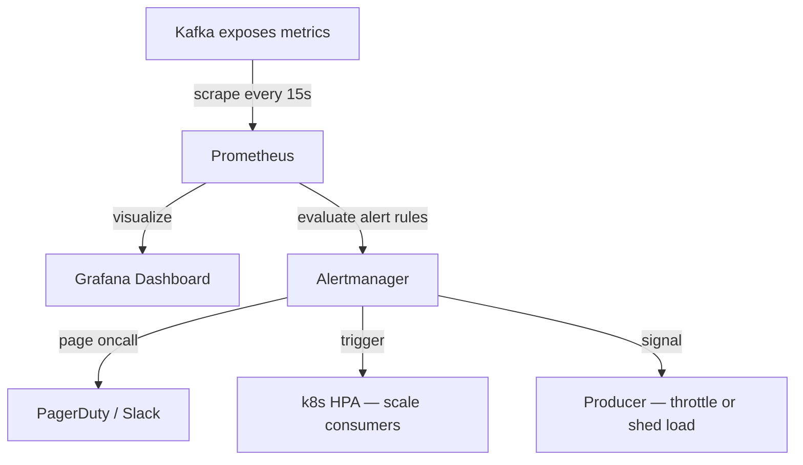
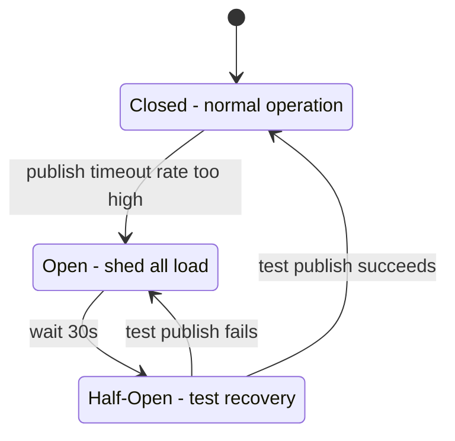

> [!info]  Backpressure in a Kafka-based system is an external pattern you build
> Kafka has no built-in mechanism to tell producers slow down. 
> It will accept messages until the disk is full.  — Prometheus scrapes lag metrics, Alertmanager fires when lag crosses a threshold, and that triggers auto-scaling consumers or throttling producers. None of it comes for free.


## The problem

Producers write faster than consumers can process. Lag builds up. Left unchecked, Kafka's disk fills and the cluster starts rejecting writes entirely — not gracefully, just hard failures.

Unlike SQS which can block a producer when the queue is full, Kafka never pushes back on its own. It has no feedback loop from broker to producer. You have to build one externally.

The signal you watch is **consumer lag** — how many messages are sitting in a partition that haven't been consumed yet. Lag of 0 means consumers are keeping up. Lag of 500,000 means consumers are 500,000 messages behind and falling further behind every second.

---

## The monitoring stack



**Prometheus** scrapes Kafka's consumer lag metrics every 15 seconds and stores them as time-series data. It also evaluates alert rules against that data continuously.

**Grafana** visualizes lag over time per consumer group and per partition. This is what oncall looks at to understand whether a lag spike is growing or draining.

**Alertmanager** receives fired alerts from Prometheus and routes them — either to a human (PagerDuty) or to an automated action (scale up consumers, flip a feature flag).

---

## Alert rule example

```yaml
- alert: KafkaConsumerLagHigh
  expr: kafka_consumer_group_lag{group="billing-service"} > 500000
  for: 30s
  labels:
    severity: warning
  annotations:
    summary: "Billing consumer lag too high — scaling up"
```

When this fires, the first response is automatic: Kubernetes HPA adds more consumer pods. If the lag keeps growing despite more consumers — the spike is too large to scale away — the next step is signaling the producer to slow down.

---

## Signaling the producer — two real patterns

### Pattern 1: Feature Flag

Alertmanager flips a feature flag in a config service when lag crosses a threshold:

```
lag > 500,000  →  ad_click_sampling_rate = 0.2  (send 20% of clicks)
lag drains     →  ad_click_sampling_rate = 1.0  (back to full speed)
```

The producer reads this flag on every publish. When it's set to 0.2, it randomly drops 80% of events before they even reach Kafka. The remaining 20% keeps the pipeline alive while consumers catch up.

This is the simplest and most controllable pattern. The trade-off is you're intentionally dropping data — acceptable for analytics clicks, not acceptable for billing.

### Pattern 2: Circuit Breaker

The producer wraps its Kafka publish call in a circuit breaker. When Kafka is backed up, publish calls start timing out. The circuit breaker tracks the error rate and opens when it crosses a threshold — at which point the producer sheds load entirely rather than queuing up failing requests.



The circuit breaker is reactive — it responds to Kafka's actual behaviour (timeouts) rather than an external lag metric. The downside is it only kicks in when things are already failing, not when lag is growing but publishes still succeed.

---

## Pattern 3: Kafka Producer Quotas — rate limiting, not backpressure

Kafka brokers let you set a hard byte-rate cap per producer:

```
kafka-configs.sh --alter \
  --add-config 'producer_byte_rate=1048576' \
  --entity-type clients \
  --entity-name ad-click-producer
```

The broker enforces this cap mechanically — the producer physically cannot exceed 1MB/sec regardless of what it tries to send.

> [!danger] This is not backpressure. It is rate limiting, and the distinction matters.

Backpressure is **dynamic** — it responds to actual downstream load. When lag is low, producers run at full speed. When lag grows, producers slow down. The throttle adjusts in real time.

A quota is **static** — a fixed ceiling set by an operator. It has no awareness of consumer lag at all.

```
Backpressure (Patterns 1 & 2):
  lag = 0        → producer runs at full speed
  lag = 500,000  → feature flag throttles producer to 20%
  lag drains     → flag resets, full speed again
  → responds to actual load

Quota (Pattern 3):
  lag = 0        → producer capped at 1MB/sec
  lag = 500,000  → producer still capped at 1MB/sec
  → static, completely unaware of downstream state
```

Quotas are useful for **multi-tenant fairness** — preventing one rogue producer from saturating the cluster and starving every other producer. That's a valid use case, but it has nothing to do with backpressure.

---

## End-to-end backpressure flow

```
1.  Producer sends 100k clicks/sec
2.  Consumer processes 80k/sec
3.  Lag grows at 20k/sec
4.  After ~25 seconds: lag crosses 500,000
5.  Prometheus alert fires
6.  k8s HPA scales consumers 4 → 8 pods
7.  Consumer now processes 160k/sec — lag starts draining
8.  If spike is too large to scale away:
      → Feature flag flips sampling_rate = 0.5
      → Producer sends 50k/sec
      → Consumers catch up
9.  Lag returns to 0
10. Flag resets to 1.0, consumers scale back to 4 pods
```

---

> [!important] Backpressure is not a Kafka feature — it is a system design pattern built around Kafka. You need the full stack: lag metrics, monitoring, alerting, auto-scaling, and producer-side throttling. None of it is automatic.

> [!tip] **Interview framing:** "Kafka has no native backpressure — it accepts writes until disk is full. I'd build an external signal: Prometheus scrapes consumer lag, Alertmanager fires when lag exceeds a threshold, and that triggers two responses in parallel — k8s HPA scales up consumer pods, and a feature flag tells the producer to sample down to 20% of events. If the pipeline were billing-critical where dropping events isn't acceptable, I'd skip the feature flag and only scale consumers — accepting higher lag rather than data loss."
