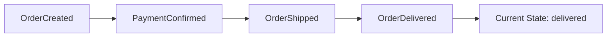
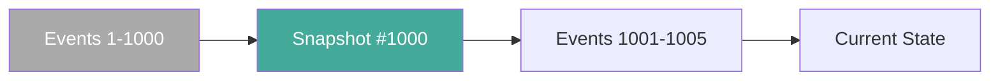

> [!info] Event sourcing 
> is a decision about how you store data. Instead of storing the current state of an entity and updating it in place, you store every event that ever happened to it. Current state is not stored — it's derived by replaying the events from the beginning.

---

## The problem with mutable state

In a normal system, you have an orders table. When an order ships, you update the `status` column to `"shipped"`. Simple. But now you've lost history.

```
orders table:
| order_id | status    | amount |
| 123      | shipped   | $49.99 |
```

Six months later: "We got a customer complaint. They say their order was cancelled and recharged without explanation. What happened to order 123?" You have no idea. The row shows `shipped`. There's no record of how it got there — no timestamps, no intermediate states, nothing. The database has been overwriting the past the entire time.

This is fine for most systems. But for payments, banking, or anything that needs a full audit trail, losing the history is unacceptable.

---

## What event sourcing does instead

Instead of one row per entity that gets updated, you have one row per event that ever happened to the entity. Only INSERTs, never UPDATEs.

```
order_events table:

| order_id | event            | data                       |ts  

| 123      | OrderCreated     | { user: u1, items: [...] }  | 10:00 |

| 123      | PaymentInitiated | { amount: $49.99 }          | 10:01 |

| 123      | PaymentConfirmed | { txn_id: txn_456 }         | 10:02 |

| 123      | OrderShipped     | { tracking: UPS123 }        | 10:05 |

| 123      | OrderDelivered   | {}                          | 10:30 |
```

Current state of order 123? Replay all 5 events in order. Start from nothing, apply each event, end up at the final state.



Now that customer complaint is easy to answer. You can see every state transition, with timestamps and the data that caused each one. Nothing is gone.

---

## What you gain

**Full audit trail** — every transition is recorded with timestamp and context. "When did payment happen?" — row 3, 10:02. "Did a bug skip a state?" — you can see if PaymentInitiated appeared without a PaymentConfirmed following it.

**Time travel** — reconstruct state at any past point in time. "What was the status of order 123 at 10:04?" — replay events up to that timestamp. You stop after `OrderShipped`. State at 10:04 = shipped.

**Bug detection and replay** — you deployed a bug that miscalculated refund amounts for 3 days. With mutable state, those rows are already wrong. With event sourcing, the raw events are untouched. Fix the bug, replay the events through the fixed logic, rebuild the correct state.

**Event streaming** — every new event can be published to Kafka or a similar system. Other services subscribe and react in real-time. The event store becomes the source of truth for the entire system's history.

---

## The replay performance problem

If order 123 has 10,000 events, replaying all 10,000 every time you need to derive current state is slow.

**Solution: snapshots**

Periodically compute and save the current state as a snapshot.

```
Snapshot at event #1000:
{ order_id: 123, status: shipped, address: ..., items: [...] }

Events #1001 → #1005:
[ DeliveryAttempted, DeliveryFailed, Redelivered... ]
```

To get current state:
1. Load the latest snapshot (cheap — one row)
2. Replay only events after the snapshot (5 events instead of 1005)



Snapshot frequency is typically every N events (100 or 1000) or on a time schedule.

---

## The complex query problem — why CQRS comes next

Event sourcing handles writes beautifully. But reads become painful.

"Show all orders in payment_pending for users in California, sorted by amount."

With event sourcing, there's no `status` column you can query. You'd have to replay every order's events for every user in California. Completely impractical at scale.

The solution is to maintain a separate read-optimized table that listens to events and keeps current state pre-computed. This is CQRS — covered in the next file.

---

## When to use event sourcing

Event sourcing is genuinely useful when:
- You need a full audit trail (financial systems, payments, banking)
- You need to reconstruct state at any past moment (compliance, debugging)
- State changes are meaningful business events, not just data mutations
- You want to feed downstream systems with a stream of events (order tracking, notifications)

It adds complexity you don't need when:
- The domain is simple CRUD with no history requirements
- Updates happen at high frequency (millions of events per entity — snapshots become mandatory)
- The team isn't familiar with the pattern (operational overhead is real)

> [!important] Event sourcing trades write simplicity (just append) for read complexity (must replay or maintain projections). The audit trail and time-travel capabilities are the payoff. Use it when history is a first-class requirement, not a nice-to-have.

> [!tip] **Interview framing:** "I'd use event sourcing for the payment and order state — every state transition is a meaningful event that compliance requires us to store. For the dashboard queries I'd project those events into a read-optimized table via CQRS so reads stay fast without replaying thousands of events."
