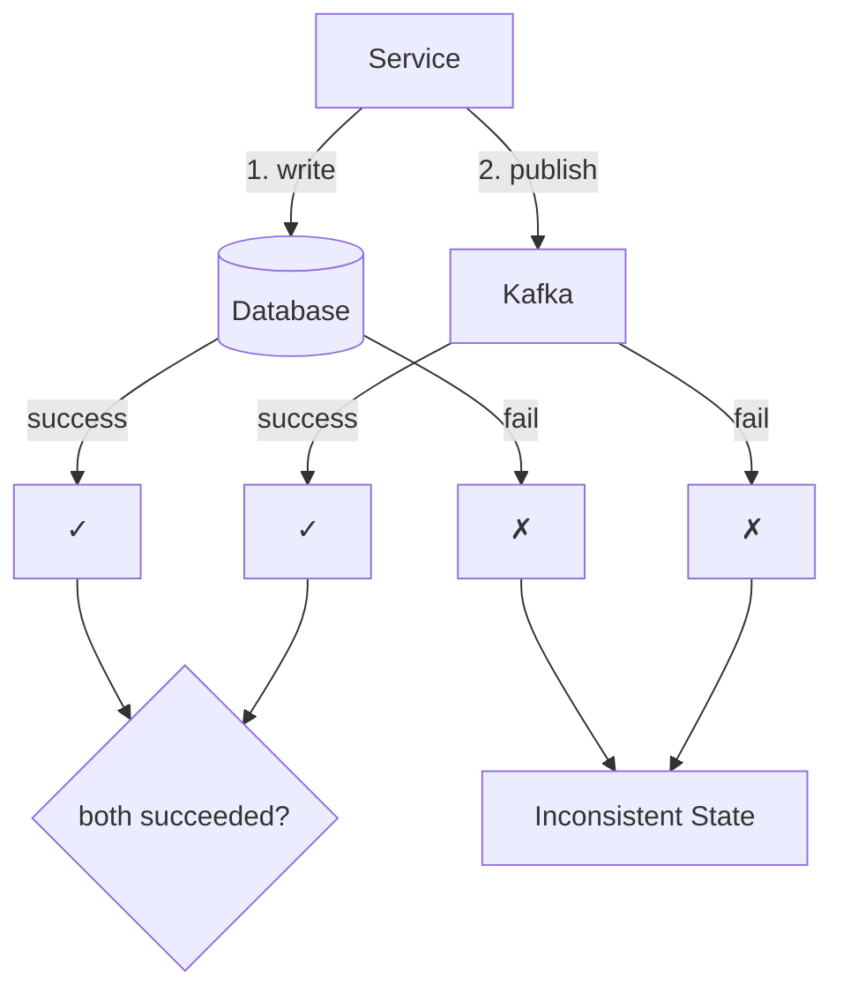

## The Dual Write Problem

When a service needs to write to a database AND publish an event to Kafka, it has to do two separate writes. This is called a **dual write**.

```
1. INSERT INTO orders (order_id, status) VALUES (123, 'created')
2. publish OrderCreated event to Kafka
```

These two operations are independent. Either one can fail independently of the other.

---

## Two Failure Scenarios

### Scenario 1: DB write succeeds, Kafka publish fails

```
INSERT INTO orders ✓
publish to Kafka ✗ (network blip, Kafka down)
```

Result:
- Order exists in DB
- No downstream service knows about it
- Inventory not reserved
- Confirmation email not sent
- Read model never updated

The order is a ghost — exists but invisible to the rest of the system.

### Scenario 2: Kafka publish succeeds, DB write fails

```
publish to Kafka ✓
INSERT INTO orders ✗ (DB timeout, constraint violation)
```

Result:
- Event is out in the world
- Downstream services start processing it
- But the order doesn't actually exist in DB
- Inventory reserved for a non-existent order

Both are **silent failures** — no exception propagates, the system thinks everything is fine.

---

## Why Not Wrap Both in a Transaction?

The obvious fix seems to be:

```sql
BEGIN TRANSACTION
  INSERT INTO orders ...
  publish to Kafka
COMMIT
```

This doesn't work. **Kafka is not a transactional resource that your DB knows about.**

### What is a Transactional Resource?

A transactional resource is something that can participate in a database transaction — meaning it can be atomically committed or rolled back together with other operations.

- PostgreSQL tables = transactional. Two table writes in one transaction either both commit or both rollback.
- Kafka = NOT transactional with your DB. It's a completely separate external system.

Your DB has no way to say "roll back the Kafka publish if my transaction fails." They have no shared transaction coordinator.

```
BEGIN TRANSACTION
  INSERT INTO orders ...     ← inside Postgres transaction
  publish to Kafka           ← outside Postgres transaction boundary
COMMIT                       ← if this fails, Kafka publish already happened
```

Even if you tried, the Kafka publish happens outside the DB transaction. The two cannot be made atomic across system boundaries.

---

## The Core Problem



No matter what order you do the two writes, there is always a window where one succeeded and the other hasn't happened yet. A crash in that window = inconsistency.

---

## Key Insight

> The dual write problem is unsolvable at the application layer with two independent systems. You need a fundamentally different approach — one that keeps both writes within the same transactional boundary. That's what the Outbox Pattern provides.
