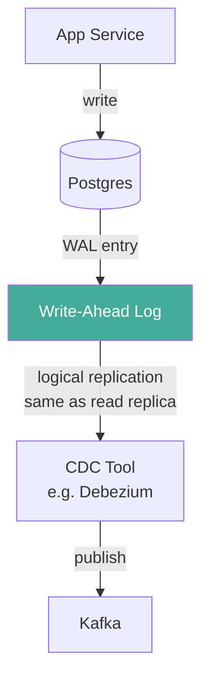

> [!info] Change Data Capture is a technique for capturing every INSERT, UPDATE, and DELETE that happens in a database and streaming those changes in real-time to other systems. 
> Instead of polling a table with "any new rows?", CDC subscribes to the database's transaction log (the WAL in Postgres) and receives changes as they happen — with millisecond latency and near-zero overhead on the database.


### Polling

You repeatedly ask the DB: "is there anything new?"

```
t=0s:  Poller: any new rows? → DB: no
t=5s:  Poller: any new rows? → DB: no
t=10s: Poller: any new rows? → DB: yes, 3 rows → publish
t=15s: Poller: any new rows? → DB: no
```

**Problems:**
- Wasted DB queries when nothing is new
- Up to N seconds latency (polling interval)
- DB load scales with polling frequency, not with actual data volume

### Tailing (CDC)

You subscribe once. The DB **pushes** changes to you as they happen.

```
t=10:00:00.001: row inserted → CDC receives it instantly → publish

t=10:00:05.234: row inserted → CDC receives it instantly → publish
(no unnecessary queries in between)
```

**Think of it like:**
- Polling = refreshing your email inbox every 5 seconds
- Tailing = push notification — email arrives, you're notified instantly

---

## The WAL — Write-Ahead Log

Every DB write in Postgres first gets written to the **WAL (Write-Ahead Log)** before being applied to the actual tables. This is how Postgres guarantees crash recovery — if it crashes mid-write, it replays the WAL on startup.

```
App writes order_123
    ↓
WAL entry appended: "INSERT orders (123, created, 49.99) at LSN 0/1A2B3C"
    ↓
Data applied to orders table
```

The WAL is a sequential, append-only log of every single change to the DB. It already exists — CDC just reads it.

---

## How CDC Reads the WAL

Postgres has a feature called **logical replication** — the same mechanism it uses to replicate data to read replicas.

CDC tools connect to Postgres using logical replication and receive WAL changes in real-time:



**Key point**: Postgres doesn't write to CDC — CDC reads from WAL via logical replication. Zero extra write overhead on Postgres.

---

## What CDC Captures

CDC captures every change at the row level:

```
INSERT: { op: "c", table: "outbox", after: { id: 1, event_type: "OrderCreated", ... } }

UPDATE: { op: "u", table: "outbox", before: { published: false }, after: { published: true } }

DELETE: { op: "d", table: "orders", before: { order_id: 123 } }
```

You can filter to only capture the tables you care about (e.g., just the outbox table).

---

## CDC vs Polling Comparison

| | Polling | CDC |
|---|---|---|
| Latency | Up to N seconds | Milliseconds |
| DB overhead | Queries every N seconds | Near zero (reads WAL) |
| Complexity | Simple to implement | Requires CDC tool setup |
| Missed events | Possible if polling gaps | None (WAL is complete) |
| Use case | Low-throughput, simple systems | High-throughput, real-time |

---

## Key Insight

> CDC is not polling with a shorter interval — it's a fundamentally different mechanism. Polling adds load proportional to frequency. CDC adds near-zero load because it piggybacks on the WAL that Postgres was already writing for crash recovery.
