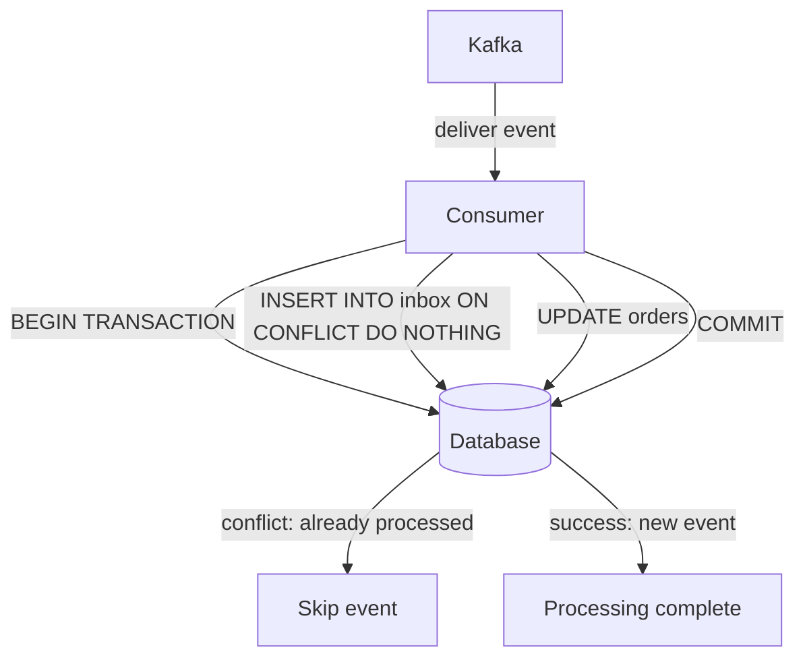

The Inbox Pattern is the **consumer-side equivalent of the Outbox Pattern**. It solves the duplicate processing problem that arises from Kafka's at-least-once delivery guarantee.

When Kafka delivers the same event twice (crash before offset commit, rebalance, etc.), the consumer must detect and skip the duplicate. The inbox table is where it tracks which events have already been processed.

---

## The Problem: At-Least-Once Delivery

Kafka guarantees at-least-once delivery. The same event can arrive multiple times:

```
Consumer receives OrderShipped (evt-456)
Consumer processes it → sends email, updates DB
Consumer crashes before committing offset

Kafka redelivers evt-456 on restart
Consumer processes it again → duplicate email, duplicate DB update
```

---

## The Inbox Table

A simple table that stores processed event IDs:

```sql
CREATE TABLE inbox (
    event_id UUID PRIMARY KEY,
    processed_at TIMESTAMP DEFAULT NOW()
);
```

Before processing any event, the consumer checks the inbox:

```sql
INSERT INTO inbox (event_id) VALUES ('evt-456')
ON CONFLICT (event_id) DO NOTHING
```

- Insert succeeds → first time seeing this event → process it
- Insert skipped (conflict) → already processed → skip

---

## Why Wrap Inbox + Work in One Transaction?

Naive approach — two separate operations:

```
Step 1: INSERT INTO inbox (evt-456)  ← mark as processed
Step 2: UPDATE orders SET status = 'shipped'  ← do the work
```

If crash between step 1 and step 2:
- Inbox says "already processed"
- DB update never happened
- Order stuck in wrong state forever — silent data corruption

**Fix**: wrap both in one transaction:

```sql
BEGIN TRANSACTION
  INSERT INTO inbox (event_id) VALUES ('evt-456')
  ON CONFLICT (event_id) DO NOTHING

  UPDATE orders SET status = 'shipped' WHERE order_id = 123
COMMIT
```

Either both happen or neither. If crash midway → inbox has no record → safe to retry.

---

## Diagram



---

## What the Inbox Pattern Guarantees

- **No duplicate DB writes** — same event applied twice produces same result (idempotent)
- **No lost processing** — if transaction rolls back, event is retried
- **Exactly-once semantics** for DB operations — even with at-least-once Kafka delivery

---

## Inbox Table Cleanup

The inbox table grows forever if not cleaned up. Old entries processed days ago can be safely deleted:

```sql
DELETE FROM inbox WHERE processed_at < NOW() - INTERVAL '7 days'
```

Run this as a periodic cleanup job. You only need to keep entries long enough to cover the maximum redelivery window.

---

## Key Insight

> The inbox pattern gives you exactly-once DB semantics on top of at-least-once Kafka delivery. The cost is an extra table and a slightly more complex consumer. The guarantee is that duplicate events never cause duplicate DB writes.
