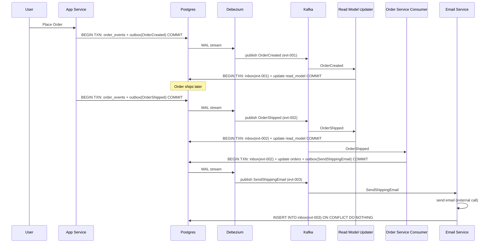

## Scenario

User places an order. The system must:
1. Save the order
2. Update the read model
3. When order ships — update status + send shipping confirmation email

---

## Step 1: User Places Order

App Service receives the HTTP request.

```sql
-- App Service: one atomic transaction
BEGIN TRANSACTION
  INSERT INTO order_events (order_id, event_type)
  VALUES (123, 'OrderCreated')

  INSERT INTO outbox (event_type, payload)
  VALUES ('OrderCreated', '{"order_id": 123, "amount": 49.99}')
COMMIT
```

Order is saved in event store. Outbox row written atomically.

---

## Step 2: Debezium Picks Up Outbox Row

Debezium tails the WAL, sees the new outbox INSERT, publishes to Kafka:

```
Kafka topic: order-events
Message: { event_id: "evt-001", event_type: "OrderCreated", order_id: 123 }
```

Near real-time — milliseconds after commit.

---

## Step 3: Read Model Updater Consumes OrderCreated

```sql
BEGIN TRANSACTION
  -- Inbox: dedup check
  INSERT INTO inbox (event_id) VALUES ('evt-001')
  ON CONFLICT (event_id) DO NOTHING

  -- Update read model
  INSERT INTO order_read_model (order_id, status, amount)
  VALUES (123, 'created', 49.99)
  ON CONFLICT (order_id) DO UPDATE SET status = 'created'
COMMIT
```

Read model now shows order 123 as 'created'. User can see their order immediately.

---

## Step 4: Order Gets Shipped

Warehouse system triggers `OrderShipped`. App Service appends to event store + outbox:

```sql
BEGIN TRANSACTION
  INSERT INTO order_events (order_id, event_type)
  VALUES (123, 'OrderShipped')

  INSERT INTO outbox (event_type, payload)
  VALUES ('OrderShipped', '{"order_id": 123, "tracking": "UPS123"}')
COMMIT
```

---

## Step 5: Debezium Publishes OrderShipped

```
Kafka topic: order-events
Message: { event_id: "evt-002", event_type: "OrderShipped", order_id: 123 }
```

Two consumers are subscribed: Read Model Updater and Order Service.

---

## Step 6: Read Model Updater Consumes OrderShipped

```sql
BEGIN TRANSACTION
  INSERT INTO inbox (event_id) VALUES ('evt-002')
  ON CONFLICT (event_id) DO NOTHING

  UPDATE order_read_model
  SET status = 'shipped', tracking = 'UPS123'
  WHERE order_id = 123
COMMIT
```

Read model updated. User sees "shipped" status.

---

## Step 7: Order Service Consumes OrderShipped

Needs to update DB status AND trigger email. Uses inbox + outbox:

```sql
BEGIN TRANSACTION
  -- Inbox: dedup check
  INSERT INTO inbox (event_id) VALUES ('evt-002')
  ON CONFLICT (event_id) DO NOTHING

  -- Update order status
  UPDATE orders SET status = 'shipped' WHERE order_id = 123

  -- Outbox: queue email event
  INSERT INTO outbox (event_type, payload)
  VALUES ('SendShippingEmail', '{"order_id": 123, "email": "user@gmail.com", "tracking": "UPS123"}')
COMMIT
```

---

## Step 8: Debezium Publishes SendShippingEmail

```
Kafka topic: email-events
Message: { event_id: "evt-003", event_type: "SendShippingEmail", order_id: 123 }
```

---

## Step 9: Email Service Consumes SendShippingEmail

Terminal action — email is an external call. Act first, mark after:

```python
# 1. Send the email first (external call)
email_client.send(
    to="user@gmail.com",
    subject="Your order has shipped!",
    body="Tracking: UPS123"
)

# 2. Mark as processed after
db.execute("""
    INSERT INTO inbox (event_id) VALUES ('evt-003')
    ON CONFLICT (event_id) DO NOTHING
""")
```

If crash after email but before marking → duplicate email on retry. Acceptable.
If crash before email → retry sends email. Correct.

---

## Full Flow Diagram



---

## Summary of Guarantees

| Step | Guarantee | Mechanism |
|---|---|---|
| Order saved + event queued | Atomic | Single DB transaction |
| Event published to Kafka | At-least-once | Outbox + Debezium |
| Read model updated exactly once | Exactly-once DB write | Inbox + transaction |
| Order status updated exactly once | Exactly-once DB write | Inbox + transaction |
| Email sent | At-least-once | Terminal action: act first |

---

## Key Insight

> No single step in this flow is magic. Each step uses the same two tools — transactions for atomicity, idempotency for duplicate safety. The entire reliability of the system comes from consistently applying these two primitives at every boundary.
