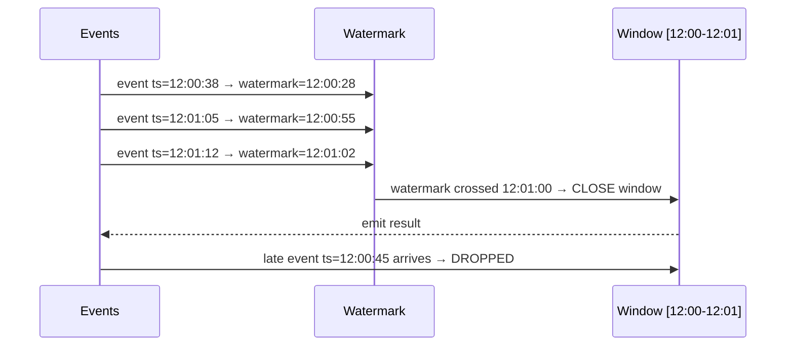

## The Problem: Events Arrive Out of Order

In a perfect world, events arrive in the exact order they happened. In reality:

- Mobile users lose network for 30 seconds
- Distributed systems have variable latency
- Retries cause events to arrive late

Example: a user placed an order at **12:00:38** but their phone was offline. The event arrives at the stream processor at **12:01:45**.

Your tumbling window for `12:00–12:01` has already closed and emitted its result. What do you do with this late event?

---

## Naive Approach: Wait Forever

Keep every window open indefinitely, waiting for late events. 

**Problem:** you never emit results. Useless for real-time use cases.

---

## The Watermark Solution

A **watermark** is the system's best estimate of how far event time has progressed.

```
Watermark = max(event timestamps seen so far) − lag tolerance
```

The framework tracks the **highest event timestamp** it has seen. It assumes that any event with a timestamp older than `watermark` is a late arrival.

### Example

- Lag tolerance = 10 seconds
- Latest event timestamp seen = 12:01:15
- **Watermark = 12:01:05**

The system will keep the `12:00–12:01` window open until the watermark crosses `12:01:00`. Once it does, the window closes and results are emitted.

---

## Window Close Logic

```
Window: 12:00:00 – 12:01:00

Stays open while: watermark < 12:01:00
Closes when:      watermark >= 12:01:00
```



---

## What Happens to Late Events?

Once a window is closed, events that fall inside it are considered **late**. Two options:

1. **Drop them** — simplest, acceptable for metrics/dashboards
2. **Side output** — route to a separate stream for manual handling or reprocessing

```java
stream
  .window(TumblingWindow(1.minute))
  .allowedLateness(30.seconds)   // extend window close by 30s for late arrivals
  .sideOutputLateData(lateTag)   // capture anything still late after that
```

---

## The Tradeoff

| Lag Tolerance | Result Latency | Late Events Dropped |
|---------------|---------------|---------------------|
| Small (1s) | Fast | Many |
| Large (30s) | Slow | Few |
| Very large | Very slow | Almost none |

**Rule of thumb:**
- Dashboards and metrics → small tolerance, fast results, some drops acceptable
- Billing and fraud detection → larger tolerance, correctness matters more than speed

---

## Key Definitions

| Term | Definition |
|------|-----------|
| **Event time** | When the event actually happened (in the source system) |
| **Processing time** | When the event arrived at the stream processor |
| **Watermark** | `max(event timestamp seen) − lag tolerance` — estimate of event time progress |
| **Late event** | An event whose timestamp is behind the current watermark |
| **Side output** | A separate stream for capturing late/rejected events |

---

## One-Line Summary

> A watermark is a time threshold that tells the stream processor "you've seen enough — close this window and emit the result."
