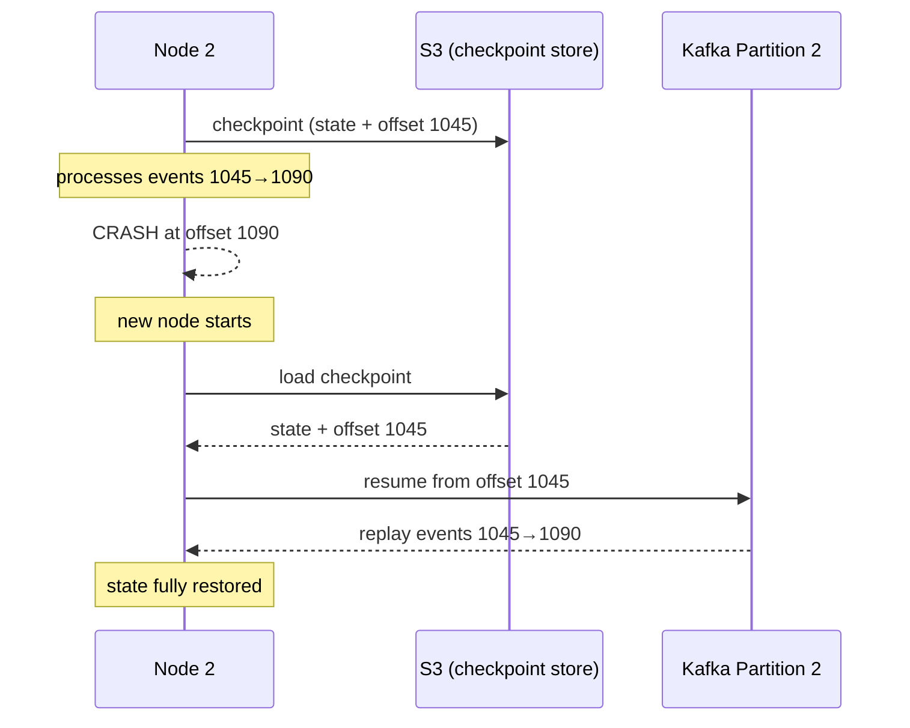

## The Problem

Stateful stream processing keeps state in local memory — fast, but volatile. If the node crashes, all state is lost.

You need a way to recover without reprocessing everything from the beginning of time.

---

## Checkpointing

The processor periodically snapshots its local state **and** its current Kafka offset to durable storage (S3, HDFS).

```
Every 30 seconds → Node 2 writes to S3:
  {
    state:  { card-456: 3, card-789: 1 },
    offset: { partition: 2, offset: 1045 }
  }
```

Both pieces are saved together atomically. You need both to recover correctly.

---

## Crash Recovery: 3 Steps

```
Node 2 crashes
    ↓
New node spins up
    ↓
1. Load state snapshot from S3
   → card-456: 3, card-789: 1

2. Resume Kafka consumption from checkpointed offset
   → partition 2, offset 1045

3. Reprocess events from offset 1045 onwards
   → rebuilds any state changes that happened after the last checkpoint
```

The gap between the last checkpoint and the crash is replayed from Kafka. State is fully restored.

---

## Visualized



---

## Why Kafka Log Retention Matters

Crash recovery replays events from the checkpointed offset. This only works if those events **still exist in Kafka**.

If Kafka has already deleted events older than 1 day, but your checkpoint is 3 days old — recovery fails.

```
Kafka retention: 7 days
Checkpoint interval: 30 seconds
Max replay window: 7 days
```

**Rule:** Kafka retention must be longer than the maximum time between a valid checkpoint and a crash. In practice, keep retention at least 7 days for any stateful job.

---

## Key Properties

| Property | Detail |
|----------|--------|
| Checkpoint stores | State snapshot + Kafka offset |
| Storage target | S3, HDFS, or RocksDB (local disk) |
| Checkpoint interval | Configurable — tradeoff between recovery time and overhead |
| Recovery guarantee | At-least-once (events since last checkpoint are replayed) |
| Exactly-once | Possible with two-phase commit (Flink supports this) |

---

## One-Line Summary

> Checkpointing saves state + offset to durable storage so a crashed node can resume exactly where it left off, replaying only the gap from Kafka.
