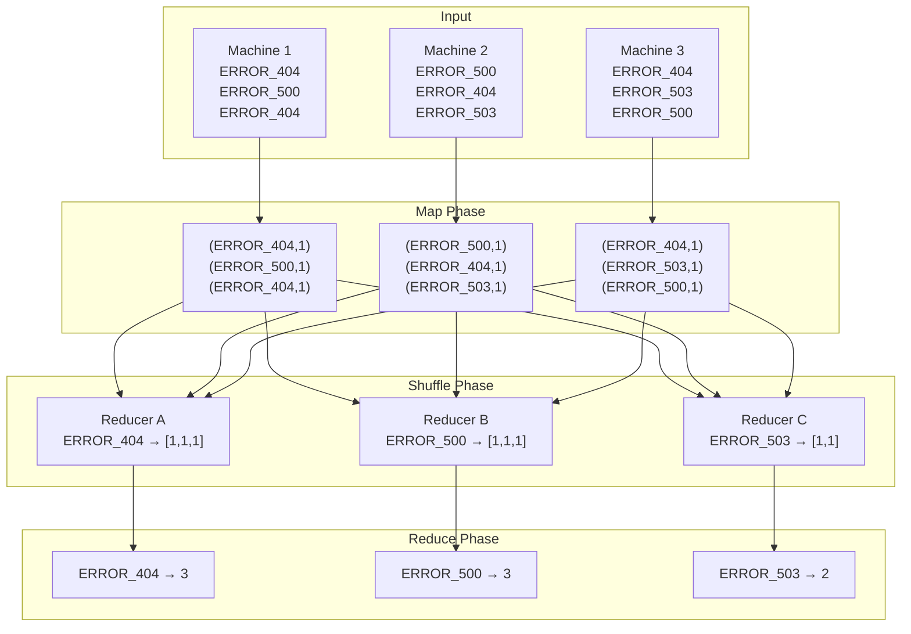

## What Reduce Does

After Shuffle, each reducer machine has all pairs for its assigned keys, grouped into lists:

```
Reducer A:  (ERROR_404, [1, 1, 1, 1, 1, 1, 1])
Reducer B:  (ERROR_500, [1, 1, 1, 1])
Reducer C:  (ERROR_503, [1, 1, 1])
```

Reduce sums each list and writes the final result to HDFS:

```
Reducer A:  ERROR_404 → 7
Reducer B:  ERROR_500 → 4
Reducer C:  ERROR_503 → 3
```

---

## The Reduce Function (Code)

```python
def reduce(key, values):
    emit(key, sum(values))
```

You write this. The framework calls it once per key, passing the full list of values collected during Shuffle.

---

## Full End-to-End Flow



---

## Summary: Each Phase's Job

| Phase | Input | Job | Output |
|-------|-------|-----|--------|
| **Map** | Raw lines | Label each line as `(key, 1)` | `(key, value)` pairs on local disk |
| **Shuffle** | Pairs scattered across machines | Group by key, route to reducer | Grouped lists per reducer |
| **Reduce** | `(key, [1,1,1,...])` per reducer | Sum the list | Final counts written to HDFS |

---

## You Only Write Two Functions

```python
def map(line):
    emit(line.strip(), 1)

def reduce(key, values):
    emit(key, sum(values))
```

The framework handles everything else: parallelism, data transfer, fault tolerance, disk I/O.
