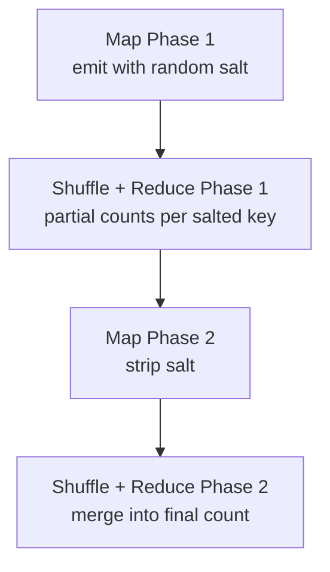

## What Is Data Skew

Data skew happens when the distribution of keys is uneven — some keys appear far more frequently than others.

Example: in an error log dataset, 90% of lines are `ERROR_404` and the remaining 10% are split between `ERROR_500` and `ERROR_503`.

---

## The Hot Key Problem

With 3 reducer machines:
```
hash(ERROR_404) % 3 = 0  →  Reducer A  (gets 900M pairs)
hash(ERROR_500) % 3 = 1  →  Reducer B  (gets 50M pairs)
hash(ERROR_503) % 3 = 2  →  Reducer C  (gets 50M pairs)
```

`ERROR_404` is the **hot key** — it dominates traffic.

Two problems:

**Network bottleneck** — 900M pairs all flood towards Reducer A. The network link to Reducer A is saturated while B and C sit mostly idle.

**Compute bottleneck** — Reducer A takes 10x longer to sum its list. B and C finish in 1 minute. A takes 10 minutes. The entire job is blocked waiting for A.

---

## Solution: Salting

Add a random suffix to the hot key before emitting, so pairs get distributed across multiple reducers:

**Without salting:**
```
ERROR_404  →  (ERROR_404, 1)   →  always Reducer A
```

**With salting (random suffix 1, 2, or 3):**
```
ERROR_404  →  (ERROR_404_1, 1)  →  Reducer A
ERROR_404  →  (ERROR_404_2, 1)  →  Reducer B
ERROR_404  →  (ERROR_404_3, 1)  →  Reducer C
```

```python
def map(line):
    key = line.strip()
    salt = random.randint(1, 3)
    emit(f"{key}_{salt}", 1)
```

Now each reducer gets ~300M pairs instead of one getting 900M.

---

## Two-Phase Aggregation

After Phase 1, ERROR_404's count is split:
```
Reducer A: (ERROR_404_1, 300M)
Reducer B: (ERROR_404_2, 300M)
Reducer C: (ERROR_404_3, 300M)
```

You need a **second MapReduce job** to merge these:

**Phase 2 Map — strip the salt:**
```
ERROR_404_1  →  (ERROR_404, 300M)
ERROR_404_2  →  (ERROR_404, 300M)
ERROR_404_3  →  (ERROR_404, 300M)
```

**Phase 2 Reduce — sum:**
```
ERROR_404  →  900M
```

---

## Full Flow



---

## Tradeoff

| | Without Salting | With Salting |
|---|---|---|
| Reducer load | Skewed — one hot reducer | Even across all reducers |
| Job completion | Blocked by slowest reducer | All reducers finish together |
| Complexity | Single MapReduce job | Two MapReduce jobs |
| Cost | Lower infra cost | Higher — runs two jobs |

**Use salting when:** one or a few keys dominate traffic and cause reducer skew.

---

## Interview Pattern

> "What if one key appears far more frequently than others?"

Answer: **salting + two-phase aggregation** — distribute the hot key across multiple reducers in phase 1, merge results in phase 2.

This pattern applies beyond MapReduce — the same idea appears in distributed databases (shard splitting for hot partitions) and stream processing (salted aggregation for hot keys).
