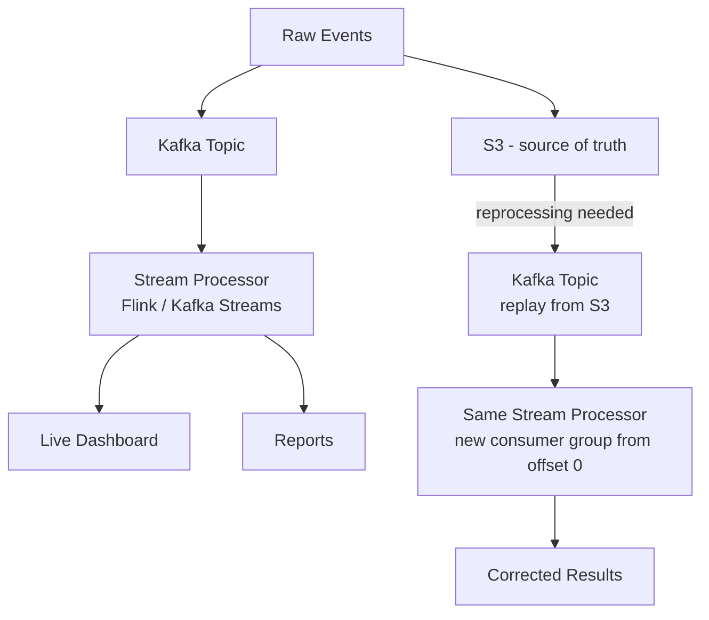

> [!info] Kappa is the response to Lambda's biggest pain point: maintaining two separate codebases (batch + stream) that compute the same thing. 
> Kappa throws away the batch layer and uses only a stream processor. Historical reprocessing happens by replaying Kafka from the beginning with a new consumer group — same code, same logic, no drift.

## The Core Idea

Lambda's pain is two codebases. Kappa's answer: **use one**.

Drop the batch pipeline entirely. Use only a stream processor — for both live events and historical reprocessing.

```
Lambda:  stream pipeline + batch pipeline  (two codebases)
Kappa:   stream pipeline only              (one codebase)
```

---

## How Historical Reprocessing Works

Kafka consumers track their position via offsets. A consumer can seek to **any offset** — including offset 0 (the very beginning of the topic).

To reprocess historical data:
1. Create a new consumer group
2. Set its offset to 0
3. Let it consume all events from the beginning — same stream processor, same code

```
Normal consumer group:   reads from latest offset → processes live events

Reprocessing group:      reads from offset 0      → replays all history
```

Same codebase. Same logic. No drift possible.

---

## The Retention Problem

Kafka default retention is 7 days. 3 years of historical data won't be there.

**Solution: S3 as source of truth**

```
All raw events → written to S3 (cheap, unlimited retention)

When reprocessing needed:
  1. Read raw events from S3
  2. Publish into a Kafka topic
  3. Stream processor consumes from Kafka as normal
```

S3 stores everything forever at low cost. Kafka is just the replay mechanism.

---

## Full Flow



---

## When To Use Kappa

- Operational simplicity matters — one codebase to maintain
- Your stream processor can handle replay throughput at scale
- You have S3 or similar cold storage as source of truth
- Correctness comes from replaying the same logic, not a separate batch job
