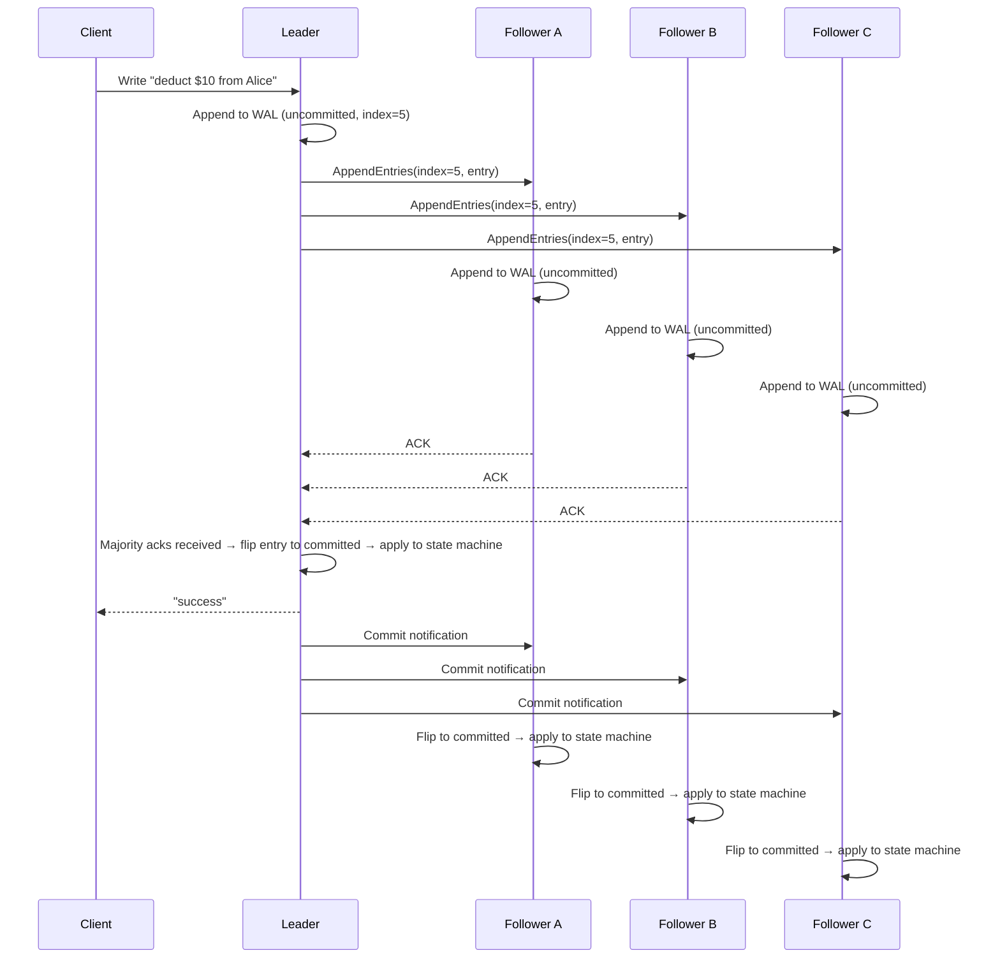

> [!info] The core idea
> The leader doesn't just accept a write and immediately change data. It first writes the instruction to a log, replicates that log to followers, waits for majority acknowledgment, and only then applies the change. Every node applies the same log in the same order — that's how they all end up with identical data.

---

## The log vs the state machine

Every node in a Raft cluster maintains two things:

**The log** — an ordered, append-only sequence of instructions. Each entry has an index and the instruction itself. The log is the source of truth.

**The state machine** — the actual data store. Alice's balance, Bob's balance, the key-value pairs. This is built by replaying the log from the beginning.

```
Log:
Index:  1           2           3           4           5
Entry: [x=1]      [y=5]       [x=10]      [z=3]       [y=99]

State machine (result of applying all entries):
x = 10
y = 99
z = 3
```

The log entry is the instruction — "deduct $10 from Alice." The state machine is the result — Alice's balance changes from $100 to $90. The entry exists in the log before it's applied. It only gets applied to the state machine after it's committed.

As long as every node applies the same log entries in the same order, every node ends up with identical state. This is the entire foundation of Raft's consistency guarantee.

---

## The happy path — how a write flows through Raft



Step by step:

1. Client sends write to leader
2. Leader appends entry to its WAL — marked **uncommitted**
3. Leader sends `AppendEntries` RPC to all followers
4. Followers append the entry to their own WAL — also **uncommitted** — and send ack
5. Leader receives majority acks → flips the entry from uncommitted → committed → applies it to its state machine
6. Leader replies "success" to client
7. Leader sends commit notification to followers
8. Followers flip their entry to committed and apply it to their own state machine

> [!important] The WAL entry is never written twice
> "Uncommitted" and "committed" are states of the same WAL entry — not two separate writes. The leader just flips the flag once majority acks arrive.

---

## Why uncommitted first?

Because if the leader applied the write immediately and then crashed before replicating, no follower would have it. Data would be lost with no trace.

By writing to WAL first (uncommitted), the leader has a durable record of the intent. If it crashes, the new leader can inspect the WAL, see what was in-flight, and decide what to do — commit it if majority has it, discard it if nobody else does.

---

## AppendEntries — how followers stay in sync

When the leader sends `AppendEntries` to a follower, it includes:
- The new entry
- The index of the entry
- The index and term of the **previous** entry

The follower checks — do I have the previous entry? If yes, append and ack. If no, reject and tell the leader the last index it has.

```
Leader sends: AppendEntries(prevIndex=4, index=5, entry)
Follower checks: "do I have index 4?" → yes → appends index 5 → acks

Follower was down, only has up to index 3:
Follower checks: "do I have index 4?" → no → rejects → "I only have up to index 3"
Leader → sends index 4 → follower applies → sends index 5 → follower applies
Follower caught up ✓
```

Followers never skip entries. They always catch up sequentially. No gaps allowed — ever. This is what guarantees every node applies the same log in the same order.

---

## Multiple writes in flight simultaneously

The leader doesn't wait for entry 5 to be committed before accepting entry 6. Both can be in-flight at the same time.

```
Log: [1✓, 2✓, 3✓, 4✓, 5-pending, 6-pending]

Entry 5: "deduct $10 from Alice"  → replicating, waiting for acks
Entry 6: "add $50 to Bob"         → replicating, waiting for acks
```

But entries are **always committed in order**. Even if entry 6 gets its acks before entry 5, entry 6 cannot be committed first.

Why does order matter? Because operations depend on each other. If Alice is sending $100 to Bob:

```
Entry 5: debit $100 from Alice
Entry 6: credit $100 to Bob
```

If entry 6 is applied before entry 5, Bob gets $100 credited before Alice is debited. If the system crashes between the two, $100 has been created out of thin air. Order is everything.

The log enforces this. Append-only, sequential, no reordering, no gaps.

---

## What happens when a follower misses the commit notification?

Say Follower C was slow and the commit notification for entry 5 never arrived. It still has entry 5 as uncommitted.

No problem. The next `AppendEntries` the leader sends (for entry 6, or the next heartbeat) includes the **commit index** — the highest entry the leader has committed. When Follower C receives this, it sees "leader has committed up to index 5" and flips its own entry 5 to committed.

```
Follower C: entry 5 uncommitted
Leader sends next heartbeat: commitIndex=5
Follower C: "leader committed up to 5, I have 5" → flips to committed → applies
```

Followers always catch up — either through explicit commit notifications or through the commit index in the next message from the leader.

---

## The state machine guarantee

Every node that has applied all log entries up to index N has identical state. It doesn't matter that one node applied them 50ms later than another. As long as the same entries are applied in the same order, the result is identical.

```
All nodes after applying entries 1-5:
Leader:     Alice=$90, Bob=$150, x=10
Follower A: Alice=$90, Bob=$150, x=10
Follower B: Alice=$90, Bob=$150, x=10
Follower C: Alice=$90, Bob=$150, x=10  ← caught up eventually
```

This is called the **state machine replication** model. The log is the single source of truth. The state machine is deterministic — same input, same output, always.

> [!important] Reads from followers can be stale
> A follower that hasn't yet received the commit notification for the latest entry will serve stale reads. For strong consistency, reads must go through the leader. For eventual consistency, followers are fine.

---

