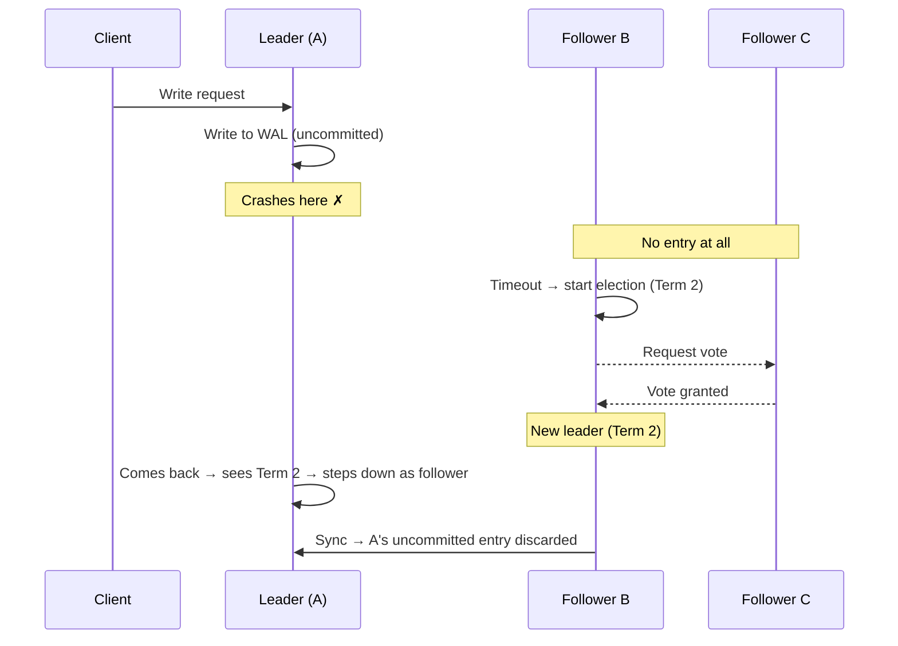
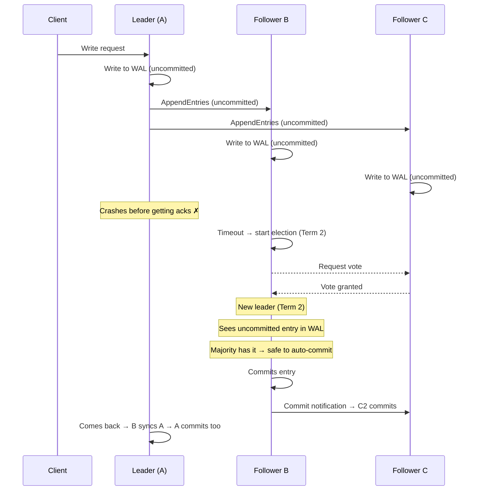
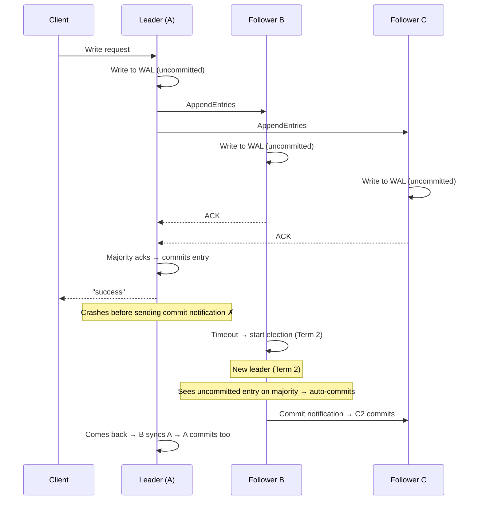

> [!info] The core idea
> Raft only tells the client "success" after a majority of nodes have the write. This single rule is what makes committed data safe across every failure scenario.

---

## How a write works in Raft

Every write goes through exactly these steps before the client gets a response:

```
Step 1 → Leader writes entry to its own WAL (uncommitted)
Step 2 → Leader sends entry to followers via AppendEntries RPC
          Followers write entry to their WAL (uncommitted)
Step 3 → Leader receives majority acks → marks entry committed in its WAL
Step 4 → Leader applies entry to state machine
Step 5 → Leader replies "success" to client
Step 6 → Leader sends commit notification to followers → they commit + apply too
```

The client only hears "success" at Step 5 — after majority has the entry and the leader has committed. This is the guarantee everything else is built on.

---

## Case 1 — Leader crashes before replicating (between Step 1 and Step 2)

Leader wrote to its own WAL but crashed before sending to any follower. No follower has any trace of this entry.



**Result:** Entry discarded. Client got no response, so it retries. Idempotency handles the duplicate.

---

## Case 2 — Leader crashes after replicating but before committing (between Step 2 and Step 3)

Leader sent the entry to followers. Followers wrote it to their WAL as uncommitted. Leader crashes before getting majority acks.



**Result:** Entry is saved. New leader sees the uncommitted entry on majority nodes and auto-commits it. Client retries (got no response) — idempotency handles the duplicate.

> [!important] Why can the new leader auto-commit?
> Because it was elected by majority — meaning majority already has this entry in their WAL. It's safe to commit because the data won't disappear even if another node fails.

---

## Case 3 — Leader crashes after committing but before notifying followers (between Step 5 and Step 6)

Leader committed the entry and replied "success" to the client. Was about to send the commit notification to followers — crashes right here. Followers still have the entry as uncommitted.



**Result:** Identical outcome to Case 2. New leader auto-commits the pending entry. Client already got "success" and does not retry.

---

## The pattern across all three cases

| When leader crashes | Followers have | Outcome |
|---|---|---|
| Before replicating (Step 1→2) | Nothing | Entry discarded. Client retries. |
| After replicating, before commit (Step 2→3) | Uncommitted entry on majority | New leader auto-commits. Client retries harmlessly. |
| After committing, before notifying (Step 5→6) | Uncommitted entry on majority | New leader auto-commits. Client already got success. |

> [!important] Committed data is never lost
> "Committed" in Raft means majority acknowledged the entry. The new leader is always elected from majority — so committed data always survives, even permanent leader failure. The only exception is losing more than ⌊N/2⌋ nodes permanently at the same time.

---

## What if a follower missed some entries?

Say Follower C was down during several writes and just came back. Its log is behind.

```
Leader:     [1, 2, 3, 4, 5, 6]
Follower C: [1, 2, 3, 4]

Follower C rejects index 6 → "I only have up to index 4"
Leader → sends index 5 → C applies → sends index 6 → C applies
Follower C: [1, 2, 3, 4, 5, 6] ✓
```

Followers never skip entries. They always catch up sequentially. No gaps allowed — ever.
