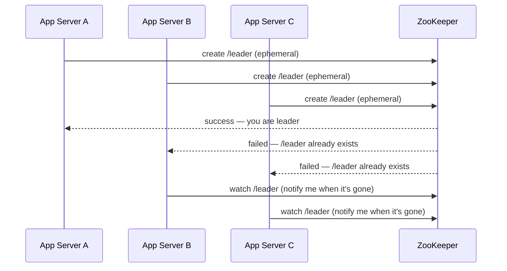
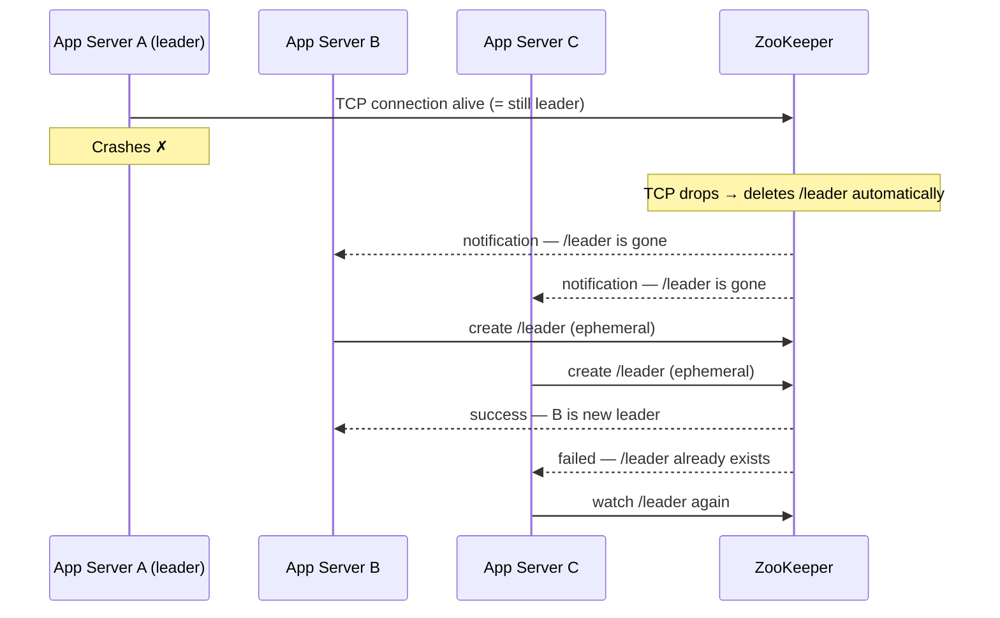
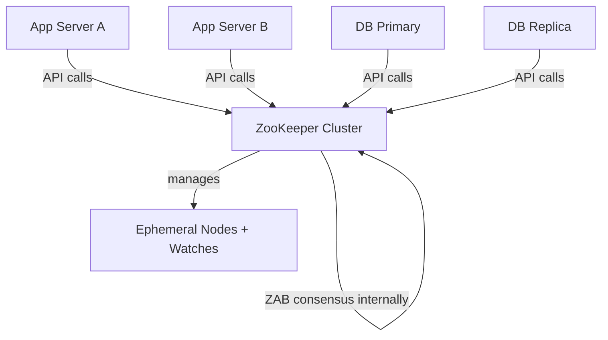

> [!info] The core idea
> ZooKeeper is a highly available, consensus-based coordination service. App servers and databases use it to elect leaders and acquire locks — without needing to implement consensus themselves.

---

## The problem — who gives out the lock?

In the fencing token discussion, we said "the lock service hands out the token." But we never asked — what IS that lock service?

If it's a single server, it's a single point of failure. It dies, nobody can get a lock, the entire system stalls.

You need the lock service to be highly available. Which means it needs to be a cluster. Which means the cluster nodes need to agree on who holds the lock — which brings you right back to needing consensus among the lock service nodes.

```
App Servers need a lock
→ Lock service must be highly available
→ Lock service must be a cluster
→ Cluster nodes must agree on state
→ You need consensus
```

**ZooKeeper is that consensus-based lock service.** It's a small cluster — usually 3 or 5 nodes — that runs consensus internally and exposes a simple coordination API to the outside world.

---

## ZooKeeper doesn't care who is calling it

App servers, databases, Kafka brokers — anyone can call ZooKeeper's API. ZooKeeper has no idea what type of machine is calling. It just manages nodes and notifies watchers.

The intelligence lives entirely in the caller's code. ZooKeeper is dumb on purpose.

Think of ZooKeeper like a traffic light. It just shows red or green. It has no idea if a truck or a bicycle is waiting. The vehicles decide what to do when they see the signal.

---

## Ephemeral nodes — the key primitive

ZooKeeper stores data as a tree of nodes — like a filesystem. You can create a node at a path like `/leader`.

The special type is an **ephemeral node** — a node that **automatically disappears** the moment the process that created it loses its connection to ZooKeeper.

This is the entire mechanism that ties leadership to liveness. No manual cleanup needed. Leader dies → connection drops → node disappears → ZooKeeper notifies watchers → new election starts.

---

## How leader election works

Say 3 app servers start up fresh. All of them want to become the leader.

Every one of them tries to create the **same ephemeral node** at `/leader`. ZooKeeper only allows one process to create a node at a given path. First one wins.



B and C don't poll. They register a **watch** — a one-time push notification. ZooKeeper will tap them on the shoulder the moment `/leader` disappears. Until then, they sit idle.

---

## What happens when the leader dies

A keeps its TCP connection to ZooKeeper open. That connection IS the heartbeat — ZooKeeper watches it. No explicit ping needed.

A crashes → TCP connection drops → ZooKeeper automatically deletes the `/leader` ephemeral node → pushes notification to B and C.



No timers. No voting rounds. No term number exchange. Whoever creates the node first becomes the new leader.

---

## DB primary vs app server — same mechanism, different usage

ZooKeeper doesn't treat databases differently from app servers. The difference in behavior is entirely in how you write your application code.

**Database primary election** — stability matters. Switching primaries is expensive (log sync, connection redirect, cache warmup). So the primary holds the lock indefinitely, keeps its TCP connection alive, and only releases leadership when it crashes. You want the same node to stay primary as long as it's healthy.

**App server worker** — app servers are stateless. After processing a job, the lock can be released and anyone can pick up the next task. If the server dies mid-job, the lock expires and someone else takes over. Rotation is fine.

```
DB primary:      hold /leader as long as healthy → expensive to switch
App server lock: acquire → process job → release → anyone picks up next
```

Same ZooKeeper API. Same ephemeral node mechanism. The intention lives in the caller's code.

---

## What ZooKeeper uses internally

ZooKeeper is itself a cluster of 3 or 5 nodes. Those nodes need to agree on state — which ephemeral nodes exist, which watches are registered, who holds which lock.

ZooKeeper uses its own consensus protocol called **ZAB** (ZooKeeper Atomic Broadcast) — conceptually similar to Raft, designed for the same goal (all nodes agree on the same sequence of state changes).



For SDE-2 interviews: ZooKeeper uses ZAB internally, conceptually similar to Raft. You don't need to know ZAB internals — just that ZooKeeper itself is a highly available consensus cluster, not a single server.

---

## The full picture

| Layer | Who runs it | What it does |
|---|---|---|
| Your app / DB | You | calls ZooKeeper API, holds lock, keeps connection alive |
| ZooKeeper | ZooKeeper cluster | manages ephemeral nodes, watches, push notifications |
| ZAB | Inside ZooKeeper | keeps ZooKeeper nodes consistent with each other |

> [!important] ZooKeeper in production
> etcd (Kubernetes control plane) is the modern alternative to ZooKeeper — simpler API, Raft-based. But ZooKeeper is still widely used in Kafka, Hadoop, and HBase. In interviews, both are valid answers for "how do you do distributed leader election."
