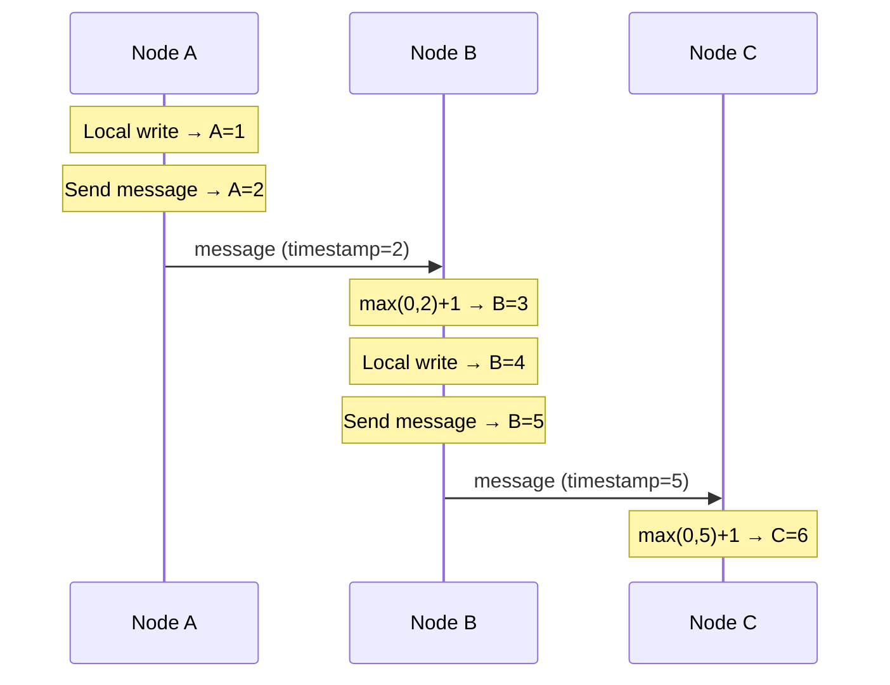

> [!info] The core idea
> Lamport Clocks throw away wall clock time completely. Instead of asking "what time did this happen?" they ask "did this event happen before or after that event?" Every node keeps a simple counter. Three rules govern how the counter updates. No clocks involved at all.

---

## The problem Lamport Clocks solve

Even with NTP, two servers can be a few milliseconds apart. In a fast distributed system processing thousands of events per second, a few milliseconds is enough to get the ordering of events completely wrong. You need an approach that does not rely on wall clock time at all.

Lamport Clocks solve this by replacing wall clock timestamps with a **logical counter**. The counter does not tell you what time something happened — it only tells you the order in which events happened.

---

## The three rules

Every node starts with a counter at 0. Three rules govern every event.

**Rule 1 — Local event**
Whenever anything happens on a node locally — a write, a read, any operation — that node increments its counter by 1.

```
Node A counter = 0
Node A does a write → counter becomes 1
Node A does another write → counter becomes 2
```

**Rule 2 — Sending a message**
Whenever a node sends a message to another node, it first increments its own counter by 1, then attaches the current counter value to the message.

```
Node A counter = 2
Node A sends message to Node B → counter becomes 3 → message carries timestamp 3
```

**Rule 3 — Receiving a message**
Whenever a node receives a message, it takes the maximum of its own counter and the incoming counter, then adds 1. The +1 is because receiving a message is itself an event.

```
new counter = max(own counter, incoming counter) + 1
```

The max is needed because if the incoming message has a higher counter than you, more events have happened in the system than you were aware of — you need to jump ahead to stay consistent. Then +1 accounts for the receive event itself.

```
Node B own counter  = 1
Incoming timestamp  = 5
max(1, 5) + 1       = 6
Node B counter now  = 6
```

---

## A full example

Three nodes A, B, C. All counters start at 0.



Final counters: A=2, B=5, C=6

You can tell C's event happened after B's, which happened after A's. That ordering was established without a single wall clock involved.

---

## The limitation — order is not the same as causality

Lamport clocks guarantee:

```
If A caused B → then timestamp(A) < timestamp(B)
```

But the reverse is NOT true:

```
timestamp(A) < timestamp(B) does NOT mean A caused B
```

Two completely independent events on different nodes — with no communication between them — will still get different counter values. A lower counter does not mean one caused the other.

Say Node A does a local write and gets counter 3. Node C independently does a local write and gets counter 4. They never communicated.

```
A=3, C=4  → Lamport says A came before C
            But they are completely independent — neither caused the other
```

Lamport clocks force a **total ordering** on all events — even concurrent ones that have no relationship. They can tell you order but they cannot tell you whether two events are causally related or just concurrent and independent.

> [!danger] Lamport clocks cannot detect concurrent writes
> If two nodes write to the same key independently at the same time, Lamport clocks will assign one a lower timestamp and one a higher timestamp — and blindly say the lower one came first. But they were actually concurrent. This is a conflict and should be treated as one — not silently resolved by picking the lower timestamp.

