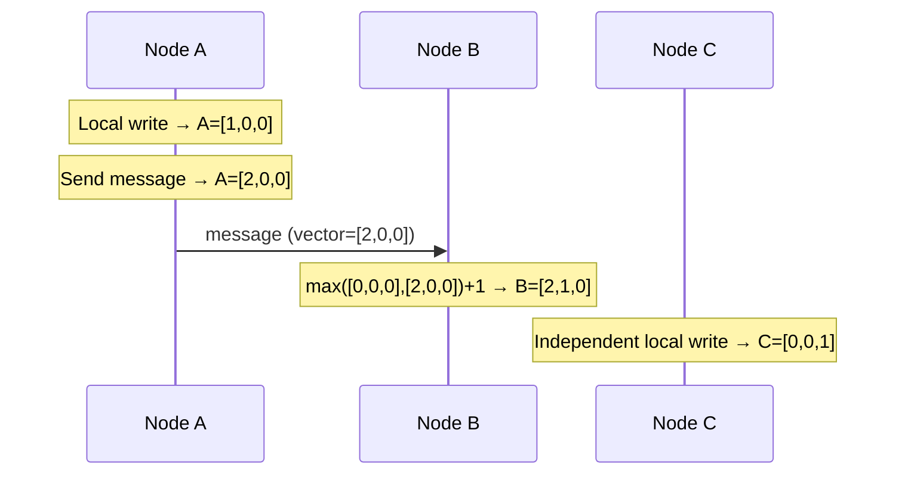

> [!info] The core idea
> Lamport clocks can order events but cannot detect when two events are concurrent and independent. Vector clocks fix this by giving every node a counter for every node in the system — not just one counter. By comparing these vectors, you can tell whether one event caused another, or whether they happened independently at the same time.

---

## The structure

Instead of one single counter per node, each node keeps a **vector** — one counter slot per node in the system.

If you have 3 nodes — A, B, C — every node maintains a vector of 3 counters:

```
Node A keeps: [A=0, B=0, C=0]
Node B keeps: [A=0, B=0, C=0]
Node C keeps: [A=0, B=0, C=0]
```

Think of it as each node tracking — "how many events do I know have happened on each node in the system?" Node A's slot in its own vector tracks events on A. Node B's slot tracks events on B. And so on.

---

## The three rules

**Rule 1 — Local event**
When a node does something locally, it only increments its own position in its vector. It does not touch any other slot.

```
Node A does a write:
Before: [A=0, B=0, C=0]
After:  [A=1, B=0, C=0]
```

**Rule 2 — Sending a message**
When a node sends a message, it increments its own position and attaches the **entire vector** to the message. Not just one number like Lamport — the whole vector travels with the message.

```
Node A vector = [A=1, B=0, C=0]
Node A sends message to B → increments own slot → [A=2, B=0, C=0]
Message carries: [A=2, B=0, C=0]
```

**Rule 3 — Receiving a message**
When a node receives a message, it does two things in order:
1. For every position — take the **max** of its own value and the incoming value
2. Then increment its own position by 1

```
Node B own vector = [A=0, B=0, C=0]
Incoming vector   = [A=2, B=0, C=0]

Step 1 — take max of each position:
max(0,2)=2, max(0,0)=0, max(0,0)=0 → [A=2, B=0, C=0]

Step 2 — increment own position:
[A=2, B=1, C=0]
```

Node B now knows — 2 events happened on A, 1 event on B (this receive), 0 on C.

---

## How to detect causality vs concurrency

This is where vector clocks beat Lamport clocks. To compare two events, compare their vectors position by position.

**Event X caused Event Y** if every position in X's vector is less than or equal to the corresponding position in Y's vector — and at least one position is strictly less:

```
X = [2, 1, 0]
Y = [3, 2, 1]

2 <= 3 ✓
1 <= 2 ✓
0 <= 1 ✓

All positions satisfy <= → X caused Y
```

**Events are concurrent** if neither vector dominates the other — at least one position breaks the rule in each direction:

```
A = [2, 0, 0]
C = [0, 0, 1]

2 > 0  → A does not dominate C at position A
0 < 1  → C does not dominate A at position C

Neither dominates → A and C are concurrent — this is a conflict
```

---

## A full example

Three nodes A, B, C. All vectors start at [A=0, B=0, C=0].



Now compare B and C:

```
B = [A=2, B=1, C=0]
C = [A=0, B=0, C=1]

2 > 0  → B does not dominate C at position A
1 > 0  → B does not dominate C at position B
0 < 1  → C does not dominate B at position C

Neither dominates → B and C are concurrent → conflict detected ✓
```

Vector clocks correctly identified that B and C had no causal relationship — they were independent events happening at the same time. Lamport clocks would have blindly ordered them and missed the conflict entirely.

---

> [!important] What happens when a conflict is detected?
> Vector clocks detect the conflict — but they do not resolve it. Resolution is the application's job. Some systems show both conflicting versions to the user (like Amazon's shopping cart). Others use CRDTs to merge automatically. But the first step is always detection — and that's what vector clocks give you.
