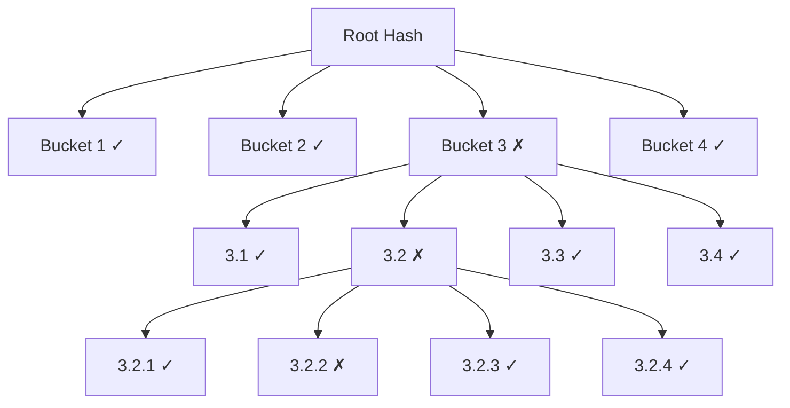

> [!info] The core idea
> When a bucket hash differs, you don't compare all the rows inside it — you split it into sub-buckets and hash those. Keep splitting recursively until the differing section is small enough to sync directly. This tree of hashes is the Merkle Tree. You find the exact differing rows by exchanging a handful of hashes at each level.

---

## Recursive splitting

You know Bucket 3 is different. But it still has 250 million rows — too many to compare directly. So you split Bucket 3 into 4 sub-buckets and hash each one:

```
Bucket 3 splits into:
  Bucket 3.1: rows 500M – 562M  → hash e721
  Bucket 3.2: rows 562M – 625M  → hash 9a43
  Bucket 3.3: rows 625M – 687M  → hash c819
  Bucket 3.4: rows 687M – 750M  → hash 4f02
```

Compare again:

```
            Replica1   Replica2
Bucket 3.1:  e721   ==  e721  ✓ same
Bucket 3.2:  9a43   ≠   1b77  ✗ different
Bucket 3.3:  c819   ==  c819  ✓ same
Bucket 3.4:  4f02   ==  4f02  ✓ same
```

Narrowed from 250 million rows down to 62 million — by exchanging 4 more hashes.

Keep splitting the differing bucket at each level until the bucket is small enough to sync directly.

---

## The full tree structure



Each node is a hash of its children. The root hash is a hash of all four top-level bucket hashes. If the root hash matches between two replicas — the entire dataset is identical. If it differs — you drill down level by level to find exactly where.

---

## How efficient is this?

Starting from 1 billion rows, splitting into 4 buckets at each level:

```
Level 1:  1,000,000,000 rows  → 4 hash comparisons
Level 2:    250,000,000 rows  → 4 hash comparisons
Level 3:     62,500,000 rows  → 4 hash comparisons
Level 4:     15,625,000 rows  → 4 hash comparisons
Level 5:      3,906,250 rows  → 4 hash comparisons
Level 6:        976,562 rows  → 4 hash comparisons
Level 7:        244,140 rows  → 4 hash comparisons
Level 8:         61,035 rows  → 4 hash comparisons
Level 9:         15,258 rows  → 4 hash comparisons
Level 10:         3,814 rows  → sync directly ✓
```

**40 hash comparisons** to locate the differing rows out of 1 billion. You only transfer actual row data for the final small bucket — everything else is tiny hash exchanges.

Compare that to the naive approach of sending all 1 billion rows over the network.
