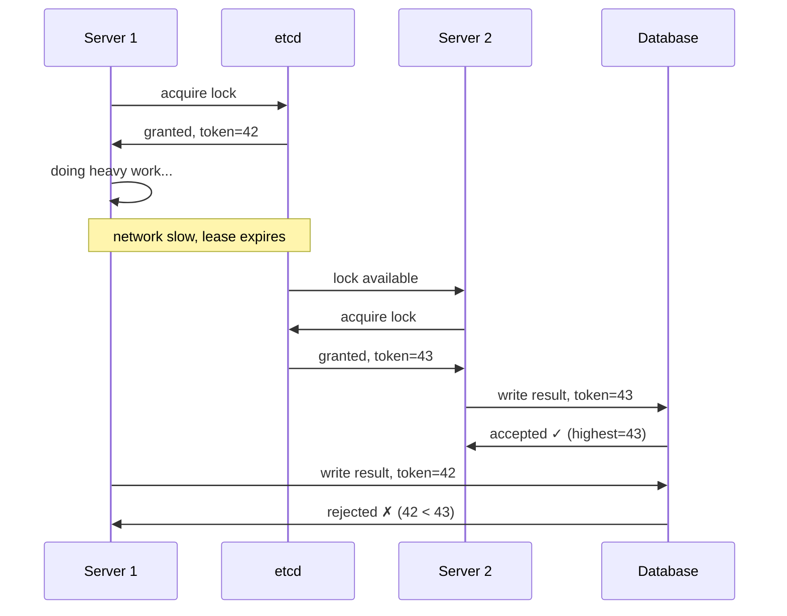

> [!info] The core idea
> When a lease expires due to a slow network — not a crash — two servers can simultaneously think they hold the lock. The lock expiry does not stop the original server's process. Fencing tokens solve this by making the database the enforcer — only the latest token holder's write is accepted. Old token = rejected, regardless of what the server thinks.

---

## The false expiry problem

```
T=0s  → Server 1 acquires lock → token 42 → starts heavy work
T=6s  → Server 1 tries to renew → network congestion → renewal delayed
T=10s → TTL expires → etcd deletes the lock
T=10s → Server 2 acquires lock → token 43 → starts same work
T=12s → Server 1's renewal finally arrives → network recovered
         Server 1 still thinks it holds the lock → keeps running
```

Now both Server 1 and Server 2 are executing the same job simultaneously. The lock was supposed to prevent exactly this.

---

## The lock cannot stop a running process

Once Server 1 is inside the critical section, there is no way to forcibly stop it. The lease expiry in etcd is just a key being deleted — it does not send a kill signal to Server 1's process. Server 1 has no idea its lock expired. It keeps executing.

This is the fundamental limitation of distributed locks — **the lock only controls who can enter the critical section, not who can exit it**.

---

## Fencing tokens — make the database the enforcer

Every time etcd grants a lease, it issues a **monotonically increasing fencing token** — a number that only ever goes up.

```
Server 1 acquires lock → gets token 42
Server 1's lease expires
Server 2 acquires lock → gets token 43
```

Every write to the database must include the token:

```
Server 2 writes result with token 43 → DB accepts, records highest seen = 43
Server 1 finishes work → tries to write result with token 42
DB sees 42 < 43 → rejects Server 1's write ✗
```

The database only accepts writes from the **highest token it has seen so far**. Server 1's work is silently discarded — it wasted CPU and time, but its write never lands.



---

> [!danger] The lock is a suggestion — the database is the enforcer
> You cannot stop a process that is already inside a critical section. Lease expiry does not terminate the process. Fencing tokens ensure that even if two servers execute simultaneously, only the latest token holder's write lands in the database. Always enforce fencing tokens at the storage layer, not in application logic.
