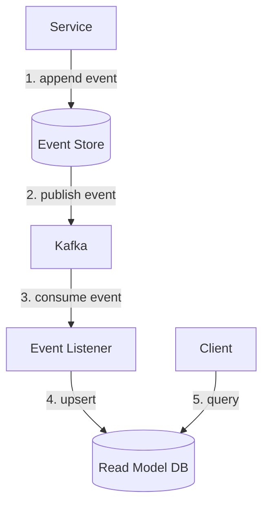

## What is a Read Model in CQRS?

A read model (also called a **projection**) is a pre-computed, denormalized table maintained specifically for fast reads. It is built by listening to events from the write side and updating accordingly.

---

## Structure

```
Write side (event store):
| order_id | event            | data                       | ts 
| 123      | OrderCreated     | { user: u1, amount: 49.99 }| 10:00 |

| 123      | PaymentConfirmed | { txn_id: txn_456 }        | 10:02 |

| 123      | OrderShipped     | { tracking: UPS123 }       | 10:05 |

Read model (projection):
| order_id | current_status | amount | user_id | user_state  | tracking |

| 123      | shipped        | $49.99 | u1      | California  | UPS123   |
```

The read model is **denormalized** — it pulls together data from multiple events into one flat row optimized for the query pattern.

---

## Keeping Read Models in Sync

Every time a new event is appended to the event store, an **event listener** updates the read model.



The listener is a Kafka consumer. It reads events and applies them to the read model.

### Example listener logic

```python
def handle_event(event):
    if event.type == "OrderCreated":
        insert_into_read_model(event.order_id, status="created", amount=event.amount)

    elif event.type == "OrderShipped":
        update_read_model(event.order_id, status="shipped", tracking=event.tracking)

    elif event.type == "OrderDelivered":
        update_read_model(event.order_id, status="delivered")
```

---

## Multiple Read Models for Different Query Patterns

One set of events can power **multiple read models**, each optimized for a different use case:

```
OrderShipped event
    ↓
    ├── order_read_model (PostgreSQL)
    │   → for order listing, status queries
    │
    ├── search_index (Elasticsearch)
    │   → for full-text search on order history
    │
    └── user_order_cache (Redis)
        → for fast "my orders" lookup by user_id
```

Each read model is independently maintained by its own listener. The write side doesn't care — it just appends events.

---

## Crash Recovery

If the listener crashes mid-update:
- It restarts and re-reads from the last committed Kafka offset
- It may replay the same event twice
- The read model update must be **idempotent**

```sql
-- Safe: applying the same OrderShipped event twice produces the same result
INSERT INTO order_read_model (order_id, status, amount, user_state)
VALUES (123, 'shipped', 49.99, 'California')
ON CONFLICT (order_id)
DO UPDATE SET status = EXCLUDED.status, tracking = EXCLUDED.tracking
```

---

## Rebuilding Read Models

A powerful property of CQRS + Event Sourcing: you can **rebuild any read model from scratch** by replaying all events.

Use cases:
- Bug in listener wrote wrong data → replay to fix
- New query requirement → create new read model by replaying history
- Migration to new DB → replay events into new schema

```
Replay all events → empty read model → fully rebuilt read model
```

This is only possible because the event store is the **source of truth**, not the read model.

---

## Key Insight

> Read models are disposable. The event store is permanent. If a read model gets corrupted or needs to change, you can always rebuild it from events. This makes CQRS systems surprisingly resilient to schema changes and bugs.
