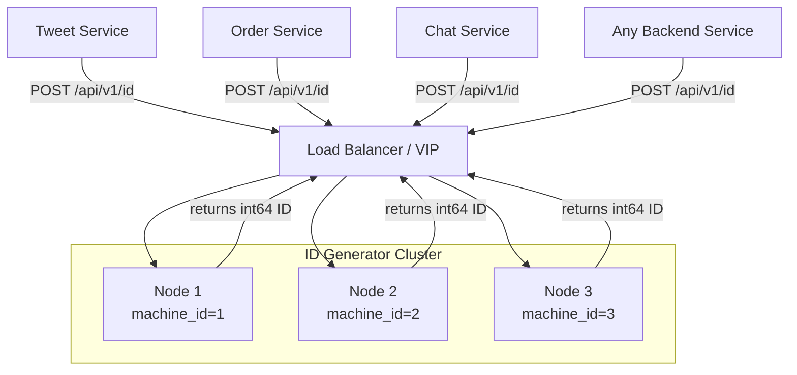
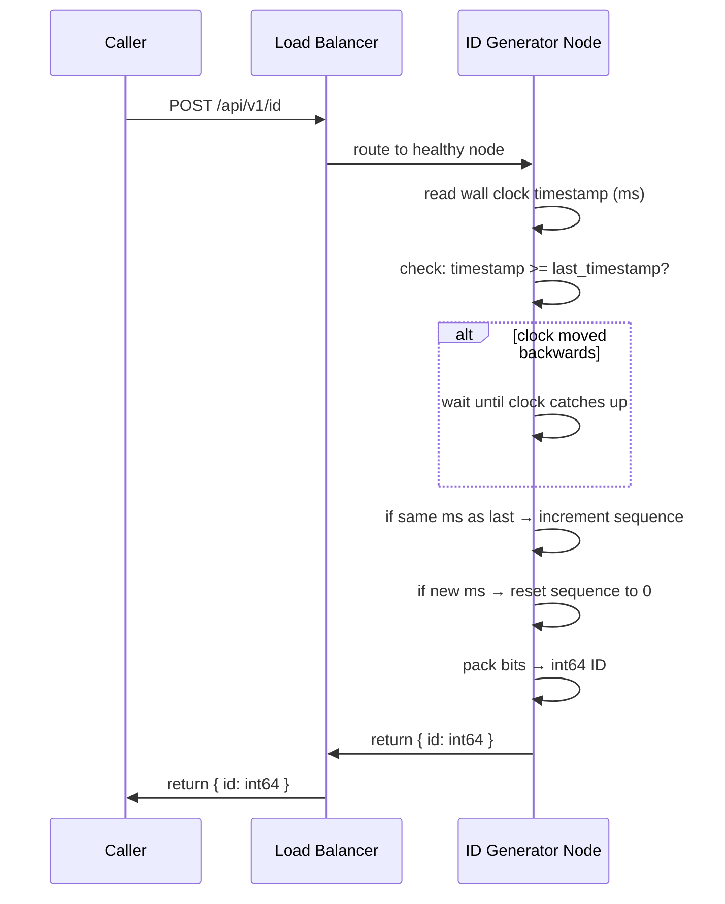

# Final Architecture

## Complete architecture



---

## ID generation flow



---

## Snowflake bit layout

```
| 1 bit  | 41 bits           | 10 bits      | 12 bits          |
| sign=0 | timestamp (ms)    | machine ID   | sequence counter |

Total: 64 bits = 8 bytes = BIGINT
```

- **Sign bit** — always 0, ensures positive integers
- **41-bit timestamp** — milliseconds since custom epoch, covers ~69 years
- **10-bit machine ID** — up to 1024 unique nodes (5 bits datacenter + 5 bits worker)
- **12-bit sequence** — up to 4096 IDs per millisecond per node

---

## Write path — end to end

1. Caller sends `POST /api/v1/id` to the VIP
2. Load balancer routes to a healthy ID generator node
3. Node reads current wall clock timestamp in milliseconds
4. If clock has moved backwards → **wait** until it catches up (clock skew protection)
5. If same millisecond as last ID → increment sequence counter
6. If new millisecond → reset sequence counter to 0
7. Pack `sign(1) + timestamp(41) + machine_id(10) + sequence(12)` into a 64-bit integer
8. Return `{ "id": int64 }` to caller
9. Caller uses the ID as primary key when writing to its own database

---

## Fault tolerance

| Failure | Behaviour |
|---|---|
| Node crashes before returning ID | Caller times out → retries → new ID from another node. Gap in ID space — acceptable |
| Node crashes with queued requests | LB detects via health check, stops routing to dead node |
| Load balancer failure | VIP fails over to standby LB automatically |
| Clock skew (NTP correction) | Node waits 1–10ms until clock catches up, then resumes |

---

## Key design decisions

| Decision | Choice | Why |
|---|---|---|
| ID algorithm | Snowflake | Unique, time-sortable, 64-bit, no coordination needed |
| ID size | 64 bits (int64) | Fits in BIGINT, sequential writes → no B+ tree page splits |
| Coordination | None at request time | Each node generates independently using its machine ID |
| Clock correction | Wait strategy | Prevents duplicates and broken sortability during NTP corrections |
| Availability | Multiple nodes + VIP LB | No SPOF at any layer |
| API | POST /api/v1/id, no body | Caller has nothing to provide — node owns its own machine ID |
