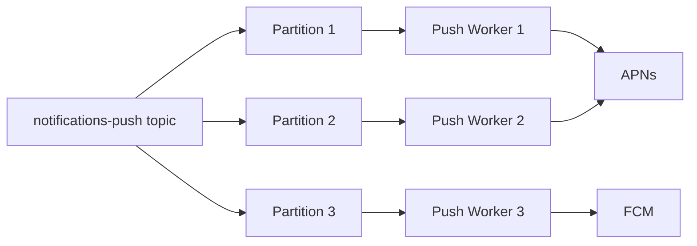

# Kafka Design — Notification System

## Per-Channel Topics

The first design decision is how many Kafka topics to create. The naive approach is one topic for all notifications — one giant stream that workers consume and route to the right channel.

The problem is that push, SMS, and email have fundamentally different delivery speeds and constraints:

- **Push** — delivers in milliseconds, free, high volume
- **SMS** — delivers in seconds, costs money per message, carrier rate limits (Twilio caps at a few hundred messages/sec per account)
- **Email** — delivers in minutes, cheapest, lowest priority

A single worker consuming a mixed topic hits the SMS rate limit and starts throttling. Every push notification in the same batch — which should deliver in milliseconds — is now stuck waiting behind slow SMS jobs. The slowest channel poisons the fastest one.

The fix is **one topic per channel**:

```
notifications-push   → Push Worker Consumer Group   → APNs / FCM
notifications-sms    → SMS Worker Consumer Group    → Twilio
notifications-email  → Email Worker Consumer Group  → SendGrid
```

Each channel gets its own topic, its own consumer group, its own scaling policy, and its own rate limiting logic. Push workers scale horizontally for throughput. SMS workers throttle to respect carrier limits. Email workers batch for efficiency. They never interfere with each other.

---

## Partition Key — Why user_id

Within each topic, messages are distributed across partitions. The partition key determines which partition a message lands on — and all messages with the same key go to the same partition, processed in order by the same consumer.

The key question is: **do you need ordering for notifications?**

Yes — in some cases ordering matters. If Kylie Jenner posts on Instagram and someone immediately comments on it, you should not receive "John commented on Kylie's post" before "Kylie posted." The comment notification without the post context is confusing.

So `user_id` (the receiver) is the right partition key. All notifications destined for the same user land on the same partition and are processed in order. The ordering guarantee is per-user, which is exactly what you need.

```
Notification for user_123 → hash(user_123) % num_partitions → Partition 7
All of user_123's notifications → always Partition 7 → processed in order
```

> [!danger] Wrong partition key: sender_id
> If you partition by sender_id instead of receiver_id, all 400M notifications triggered by Kylie Jenner's post land on the same partition. In Kafka, one partition is assigned to exactly one consumer instance within a consumer group — that's the unit of parallelism. So one consumer instance (one service pod) is now responsible for processing 400M messages sequentially. It doesn't matter if you have 100 consumer instances in the group — the other 99 are processing their own partitions and cannot help. You cannot rebalance load within a partition. Always partition by receiver (user_id), not sender — each of Kylie's 400M followers has a different user_id, spreading the load evenly across all partitions.

---

## How Many Partitions?

Partitions are the unit of parallelism in Kafka — one consumer instance per partition at most. The partition count for each topic is derived from how many worker instances each channel actually needs, which in turn comes from the external provider's throughput characteristics.

**Push (APNs/FCM — HTTP/2, 200K/sec per worker):**
```
3.5M push/sec ÷ 200K per worker = 18 workers → 18 partitions
```

**SMS (Twilio — 1K/sec rate limit per account):**
```
Bounded by Twilio account pool, not worker throughput
Number of partitions = number of active Twilio account workers
```

**Email (SendGrid — 100 emails/sec per IP):**
```
8,333 emails/sec sustained ÷ 100 per IP = 84 IPs → 84 workers → 84 partitions
```

The partition count always equals the desired worker instance count — no point having more partitions than consumers (idle partitions) or more consumers than partitions (idle workers).

---

## Consumer Groups

Each channel has its own consumer group. Within a consumer group, each partition is assigned to exactly one consumer — no two consumers in the same group read the same partition simultaneously. This gives ordered, parallel processing.



If a push worker crashes, Kafka reassigns its partitions to the remaining workers in the consumer group — no messages are lost, the new worker rewinds to the last committed offset and re-processes.

---

## At-Least-Once Delivery

Kafka's at-least-once guarantee comes from the offset commit mechanism — not the partition key. The consumer commits its offset only after successfully processing a batch. If it crashes mid-batch, it rewinds to the last committed offset and re-processes the batch.

This means a notification may be processed twice on crash recovery. That's acceptable — we said in the NFR that duplicates are tolerable but misses are not. The `notification_id` idempotency key on the external provider call (APNs, Twilio) prevents double delivery to the user even if the worker processes the same message twice.

> [!info] Summary
> One topic per channel (push / SMS / email) — prevents slow channels from poisoning fast ones.
> Partition key = receiver user_id — guarantees per-user ordering, spreads load evenly across partitions.
> One consumer group per channel — independent scaling, isolated failure domains.
> Offset commit after processing — at-least-once delivery, rewind on crash.
