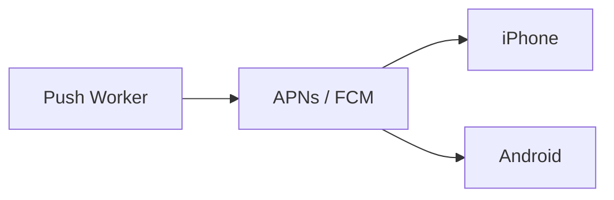
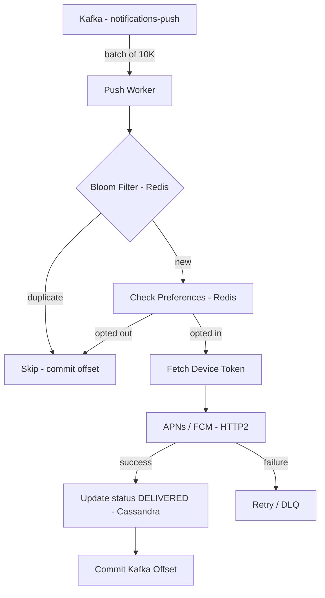

# Push Worker — Per-Channel Workers

## What Is a Push Notification?

A push notification is a message delivered to a user's device by the operating system — not by your app directly. Your server never talks to the user's phone. Instead, you send the notification payload to an intermediary: **Apple Push Notification Service (APNs)** for iOS devices, and **Firebase Cloud Messaging (FCM)** for Android devices. These platforms maintain a persistent connection to every registered device and deliver the message on your behalf.



This means your worker's job is simple: take a notification from Kafka, look up the device token for the user, and make an HTTP call to APNs or FCM. The hard part is doing this at 5M/sec.

---

## Deriving the Numbers from APNs

The bottleneck in the push worker is the network round trip to APNs. Let's derive how many workers and partitions we actually need from first principles.

**APNs round trip latency: ~50ms**

APNs supports **HTTP/2**, which allows multiplexing — multiple requests sent over a single connection simultaneously without waiting for previous responses. This is the key to high throughput without needing thousands of threads.

**Concurrent requests per connection:**
HTTP/2 supports up to 1000 concurrent streams per connection. So one connection to APNs can have 1000 in-flight requests at the same time.

```
1000 concurrent requests ÷ 0.05s latency = 20,000 push/sec per connection
```

**Connections per worker instance:**
A single worker instance can maintain 10 parallel connections to APNs:

```
10 connections × 20,000 = 200,000 push notifications/sec per worker instance
```

**Push volume — 70% of 5M/sec:**
```
5M × 70% = 3.5M push notifications/sec
```

**Worker instances needed at 3.5M/sec:**

```
3,500,000 ÷ 200,000 = 18 worker instances
```

**Partitions needed:**
Since one Kafka partition maps to one consumer instance, and we need 18 consumer instances:

```
18 partitions for the notifications-push topic
```

---

## Batch Size

18 workers consuming 18 partitions need to drain 3.5M messages/sec total. Each worker handles:

```
3,500,000 ÷ 18 = ~195,000 messages/sec per worker ≈ 200,000 ✓
```

Each worker reads in batches from Kafka. With 10 connections × 1000 concurrent requests = 10,000 in-flight APNs calls at any moment per worker. So the natural batch size is **10,000 messages per poll**.

At 50ms per batch round trip:
```
10,000 messages ÷ 0.05s = 200,000 messages/sec per worker ✓
```

This confirms the batch size of 10K matches the throughput target. No need for 10K threads — async I/O over HTTP/2 handles 10K concurrent in-flight requests with a small thread pool (200-500 threads), because threads spend most of their time waiting on network responses, not doing CPU work.

> [!info] Async I/O vs Threads
> You don't need 10K threads to process 10K concurrent requests. With async I/O and HTTP/2 multiplexing, one thread can have hundreds of in-flight requests simultaneously — it sends a request, registers a callback, and immediately picks up the next message instead of blocking. A thread pool of 200-500 threads per worker instance is sufficient to keep 10K requests in-flight at all times.

---

## Deduplication — Bloom Filter

The worker must deduplicate notifications before sending. At-least-once delivery from Kafka means the same message can be consumed twice on crash recovery. Sending a duplicate push notification is annoying but tolerable — but we should make a best-effort attempt to avoid it.

The naive approach is a DB lookup: "has `notification_id` been processed before?" At 5M/sec that's 5M DB reads/sec — same problem we've seen before.

The fix is a **Bloom filter in Redis**:

- Before sending, check if `notification_id` exists in the bloom filter
- If yes — likely a duplicate, skip it
- If no — send the notification, then add `notification_id` to the bloom filter

Bloom filters have no false negatives (a processed notification is never missed) but can have false positives (occasionally a fresh notification is incorrectly flagged as duplicate). The false positive rate is tunable — at 1% false positive rate, 1 in 100 notifications might be skipped on a false flag. Acceptable for push notifications.

> [!important] Why not Redis SET for deduplication?
> A Redis SET storing every notification_id would grow unbounded — 5M entries/sec × 90 day retention = billions of keys. A bloom filter uses a fixed-size bit array regardless of how many items are added. Memory-efficient and O(1) lookups.

---

## Full Push Worker Flow



**Step by step:**
1. Worker polls Kafka for a batch of 10K messages
2. For each message, check bloom filter — skip if likely duplicate
3. Check Redis for user preferences — skip if user opted out of push
4. Fetch device token for the user (from a device registry, covered in deep dive)
5. Send async HTTP/2 request to APNs or FCM
6. On success — write `DELIVERED` status to Cassandra
7. On failure — send to retry queue / DLQ (covered in retry deep dive)
8. After full batch processed — commit Kafka offset

---

## Summary

| Property | Value |
|---|---|
| APNs latency | ~50ms |
| Concurrent requests per connection | 1000 |
| Throughput per connection | 20K/sec |
| Connections per worker | 10 |
| Throughput per worker | 200K/sec |
| Worker instances needed | 18 |
| Kafka partitions | 18 |
| Batch size | 10K messages |
| Deduplication | Bloom filter in Redis |
