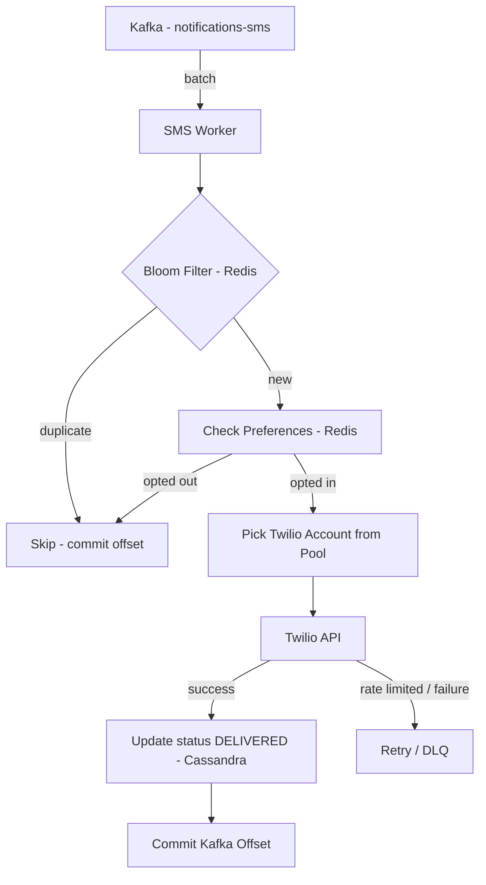

# SMS Worker — Per-Channel Workers

## What Is SMS Delivery?

Unlike push notifications, SMS does not go through the device OS. Your worker sends the message to an SMS gateway — **Twilio** being the most common — and Twilio handles routing through telecom carriers to deliver to the phone. You never talk to the carrier directly. The carrier delivers it to the SIM card, no internet connection required on the receiver's end.


---

## Deriving the Numbers from Twilio

**Twilio API response latency: ~300-500ms**

This is how long it takes Twilio to acknowledge your request — not the time for the message to reach the phone (that's 1-3 seconds via carrier). Your worker only waits for the Twilio ack.

**Twilio rate limit: ~1,000 messages/sec per account** (enterprise accounts go up to 3,000-5,000/sec, but this is the default hard ceiling).

Unlike APNs where you control parallelism through HTTP/2 connections, with Twilio the **external rate limit is your ceiling** — not your connection count. You cannot send faster than Twilio allows regardless of how many worker instances you spin up.

---

## The 500K/sec Problem

Not every notification is SMS. SMS costs money (~$0.0075 per message) so companies use it sparingly. A realistic channel split:

- Push: ~70% of notifications (free, fast)
- Email: ~20% (cheap, low priority)
- SMS: ~10% (expensive, high priority only)

```
5M/sec × 10% = 500K SMS/sec
```

But Twilio caps at 1K/sec per account. One account handles 0.2% of the required throughput. You need:

```
500,000 ÷ 1,000 = 500 Twilio accounts
```

---

## Account Pooling

Using multiple Twilio accounts (or multiple SMS gateway providers) in parallel is called **account pooling**. The SMS worker maintains a pool of Twilio credentials and round-robins requests across accounts to stay under each account's rate limit while achieving aggregate throughput.

```
500 Twilio accounts × 1,000/sec each = 500,000 SMS/sec aggregate
```

This is standard practice at large companies. The tradeoffs:

- Higher throughput — yes
- Higher cost — significant. At 500K SMS/sec: 500,000 × $0.0075 = **$3,750/sec**. This is why SMS is strictly reserved for high-priority notifications.
- Operational complexity — managing 500 accounts, credential rotation, per-account rate tracking

---

## Rate Limiting at Intake

The real fix is not just account pooling — it's **never letting low-priority notifications reach the SMS topic in the first place**.

At the app server, before publishing to Kafka, notifications are filtered by type:

- OTPs, banking alerts, emergency messages → allowed on SMS
- Marketing, social (likes, comments, follows) → blocked from SMS, rerouted to push or email

This way the SMS Kafka topic only ever receives notifications that genuinely need SMS. The volume drops dramatically — real SMS-worthy notifications are a fraction of the 500K/sec estimate.

> [!important] Kafka is not an infinite buffer
> If the SMS topic accumulates messages at 500K/sec and the worker drains at 1K/sec, Kafka fills up at 499K messages/sec. At that rate you either hit Kafka's retention limit and start losing messages, or you apply backpressure to the producer. Neither is acceptable. The fix is filtering at intake — keep the SMS topic volume within what your account pool can drain.

---

## Kafka as Buffer

Even with intake filtering, SMS volume spikes during peak events (new year's midnight OTPs, bank fraud alerts during a breach). Kafka absorbs these short-lived spikes — messages accumulate in the topic and the worker drains them at a steady rate. As long as spikes are short and the average volume stays within account pool capacity, Kafka smooths out the burst without dropping messages.

---

## Deduplication

Same as the push worker — bloom filter in Redis on `notification_id`. See push worker notes for full reasoning.

---

## Full SMS Worker Flow



---

## Summary

| Property | Value |
|---|---|
| Gateway | Twilio |
| Twilio API latency | ~300-500ms |
| Rate limit per account | ~1,000 msg/sec |
| SMS volume (10% of 5M) | 500K/sec |
| Twilio accounts needed | ~500 |
| Cost at peak | ~$3,750/sec |
| Intake filter | High-priority only (OTP, alerts) |
| Deduplication | Bloom filter in Redis |
