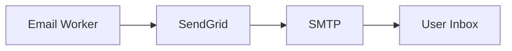
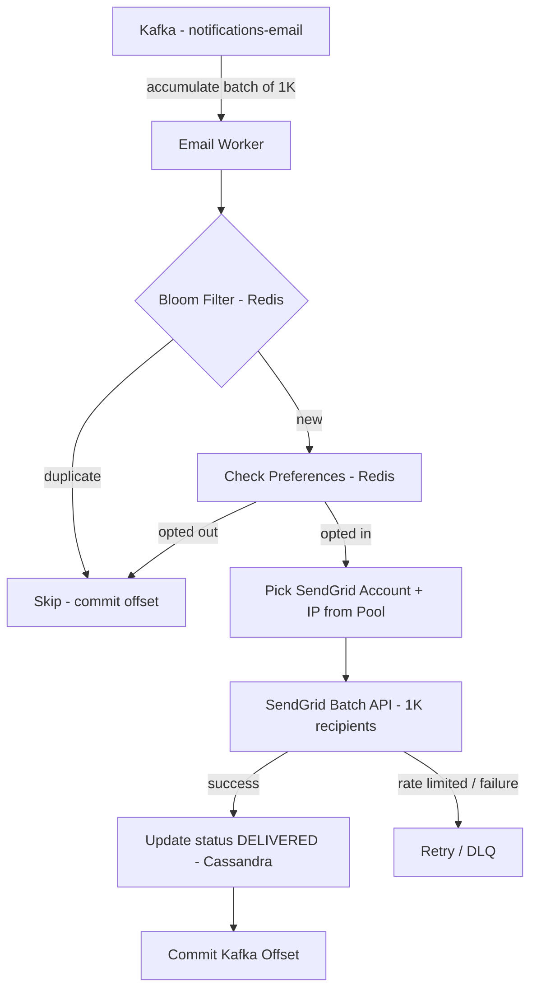

# Email Worker — Per-Channel Workers

## What Is Email Delivery?

Email does not go through the device OS like push notifications. Your worker sends the message to an email gateway — **SendGrid** being the most common — over HTTP, and SendGrid handles routing through SMTP to deliver to the user's inbox. No internet connection model like push, no carrier dependency like SMS — just HTTP to SendGrid, then SMTP to the inbox provider (Gmail, Outlook, etc.).



Your worker's latency concern is the **SendGrid API response time (~100-200ms)**, not the full delivery time to inbox (~1-2 minutes).

---

## Deriving the Numbers from SendGrid

**SendGrid API response latency: ~100-200ms**

**SendGrid rate limit: ~100 emails/sec per dedicated IP**

**SendGrid batch API: up to 1,000 recipients per API call**

Unlike APNs where you control parallelism via HTTP/2 connections, SendGrid's per-IP rate limit is your throughput ceiling per IP address.

**Email volume — 20% of 5M/sec:**
```
5M × 20% = 1M emails/sec intake
```

**With 2-minute delivery SLO, spread the load:**
```
1,000,000 / 120 seconds = ~8,333 emails/sec sustained
```

**IPs needed:**
```
8,333 / 100 emails/sec per IP = ~84 IPs
```

**SendGrid batch API calls needed:**
```
8,333 / 1,000 recipients per call = ~9 API calls/sec
```

9 API calls/sec is trivially easy. The 2-minute SLO is doing all the heavy lifting — it collapses a 1M/sec problem into a 8,333/sec problem.

> [!info] The Power of Relaxed SLOs
> Push needs p95 < 5 seconds — you must process messages almost as fast as they arrive. Email needs p95 < 2 minutes — you can spread 1M messages over 120 seconds. Relaxed latency SLOs enable batching, and batching collapses the throughput problem dramatically.

---

## The Intake Problem — Why 1M/sec Floods Kafka

The 2-minute window math only works if Kafka isn't overflowing. But the producer is still publishing at 1M emails/sec intake while the worker drains at 8,333/sec. That's a backlog growing at ~992K messages/sec. Kafka fills up fast and you either lose messages or apply backpressure to producers.

The fix is not more workers or more IPs — it's **never letting low-priority email into the topic in the first place**.

---

## Rate Limiting at Intake

At the app server, before publishing to the email Kafka topic, notifications are filtered by type:

**Allowed on email (transactional, high-priority):**
- Password resets
- OTPs / verification codes
- Purchase receipts
- Account security alerts

**Blocked from real-time email:**
- Marketing campaigns
- Social notifications (likes, comments, follows)
- Weekly digests
- Promotional offers

Marketing and digest emails go through a separate **batch pipeline** — a scheduled job runs them overnight, not through the real-time notification system. This is standard practice at every large company.

With intake filtering, real-time email volume drops to a small fraction of 1M/sec — maybe 50-100K/sec at peak (a security breach triggering mass password reset emails). Kafka never overflows.

> [!danger] Kafka is not an infinite buffer
> Producing at 1M/sec and consuming at 8,333/sec means Kafka accumulates 992K messages/sec. At that rate you hit retention limits fast. Rate limiting at intake is the only real fix — keep the email topic volume within what the worker pool can sustainably drain.

---

## Batching — 2-Minute SLO Enables Bulk Sending

Instead of sending each email as it arrives (1 API call per email), the worker accumulates messages and sends in bulk batches using SendGrid's v3 batch API (up to 1,000 recipients per call).

```
Worker accumulates 1,000 emails → single SendGrid API call → 1,000 emails dispatched
```

This is far more efficient than individual sends — fewer API calls, lower overhead, better throughput per IP.

---

## Consumer Workers — How Many to Drain Kafka

More consumer workers = faster Kafka consumption. But workers are still bounded by the SendGrid IP rate limit — more workers without more IPs just means workers sitting idle waiting for their IP's rate limit to reset.

The right balance: one worker per IP, each worker sends at ~100 emails/sec via its dedicated IP, batching 1,000 emails per API call.

```
84 IPs → 84 worker instances → 84 Kafka partitions
84 workers × 100 emails/sec each = 8,400 emails/sec ≈ 8,333/sec target ✓
```

---

## IP Pooling

84 dedicated IPs distributed across worker instances. In cloud environments (AWS, GCP), multiple Elastic IPs can be assigned per instance. Each IP maintains its own SendGrid sending reputation and rate limit allowance.

If one IP gets flagged for spam or hits its limit, the worker pool continues with remaining IPs — no single point of failure.

---

## SendGrid Account Pooling

Same strategy as Twilio account pooling for SMS. Multiple SendGrid accounts provide additional throughput headroom beyond what a single account's IP pool allows. The worker maintains a pool of SendGrid credentials and distributes API calls across accounts.

Useful for handling unexpected spikes — a security incident triggers millions of password reset emails simultaneously. Account pooling provides the burst capacity to drain the spike within the 2-minute SLO.

---

## Deduplication

Bloom filter in Redis on `notification_id` — same as push and SMS workers. See push worker notes for full reasoning.

---

## Full Email Worker Flow



---

## Summary

| Property | Value |
|---|---|
| Gateway | SendGrid |
| SendGrid API latency | ~100-200ms |
| Rate limit per IP | ~100 emails/sec |
| Batch API limit | 1,000 recipients per call |
| Email volume (20% of 5M) | 1M/sec intake |
| Sustained rate (2-min SLO) | ~8,333 emails/sec |
| IPs needed | ~84 |
| Worker instances | ~84 (one per IP) |
| Kafka partitions | ~84 |
| API calls/sec | ~9 |
| Intake filter | Transactional only |
| Deduplication | Bloom filter in Redis |
