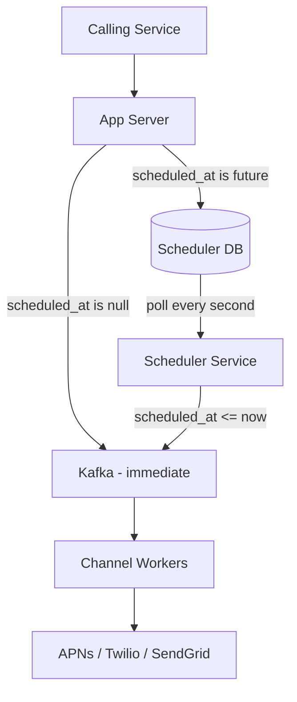

# Problem and Naive Approach — Scheduling

## The Problem

The API accepts a `scheduled_at` field — a future timestamp for when a notification should be delivered. A calling service might say "send this birthday notification to user_123 at 9:00am tomorrow" or "send this flash sale alert to 10M users at exactly 8:00pm on Friday."

Kafka cannot handle this natively. Kafka is a log — you publish a message and consumers pick it up immediately. There is no concept of "hold this message until a specific time." The moment a message lands in a Kafka topic, workers start consuming it.

So you need something outside Kafka to hold scheduled notifications until their time arrives.

---

## The Naive Approach — Scheduler Component

The fix is a dedicated **scheduler component** that sits between the app server and Kafka for scheduled notifications. Immediate notifications flow directly to Kafka as before. Scheduled notifications take a detour:

```
Immediate notification → App Server → Kafka → Workers (as normal)

Scheduled notification → App Server → Scheduler DB (hold until due)
                                            ↓
                               Scheduler Service (polls every second)
                                            ↓
                               Kafka → Workers (normal pipeline from here)
```

**How it works:**

1. App server receives a notification with `scheduled_at` set to a future time
2. Instead of publishing to Kafka, it writes the notification to the **Scheduler DB** with the delivery time
3. A **Scheduler Service** runs continuously, polling the Scheduler DB every second for notifications where `scheduled_at <= now`
4. When due notifications are found, the scheduler publishes them to the appropriate Kafka topic
5. From Kafka onwards, the flow is identical to immediate notifications — workers consume, check preferences, dispatch to APNs/Twilio/SendGrid

> [!info] Scheduled notifications rejoin the normal pipeline at Kafka
> The scheduler's only job is to hold notifications and release them at the right time. Once published to Kafka, a scheduled notification is indistinguishable from an immediate one — same workers, same preference checks, same delivery flow.

---

## How Scheduled Notifications Bypass Kafka Intake



The app server checks `scheduled_at` on every incoming request:
- `null` or `<= now` → publish directly to Kafka
- Future timestamp → write to Scheduler DB, let the scheduler handle it
