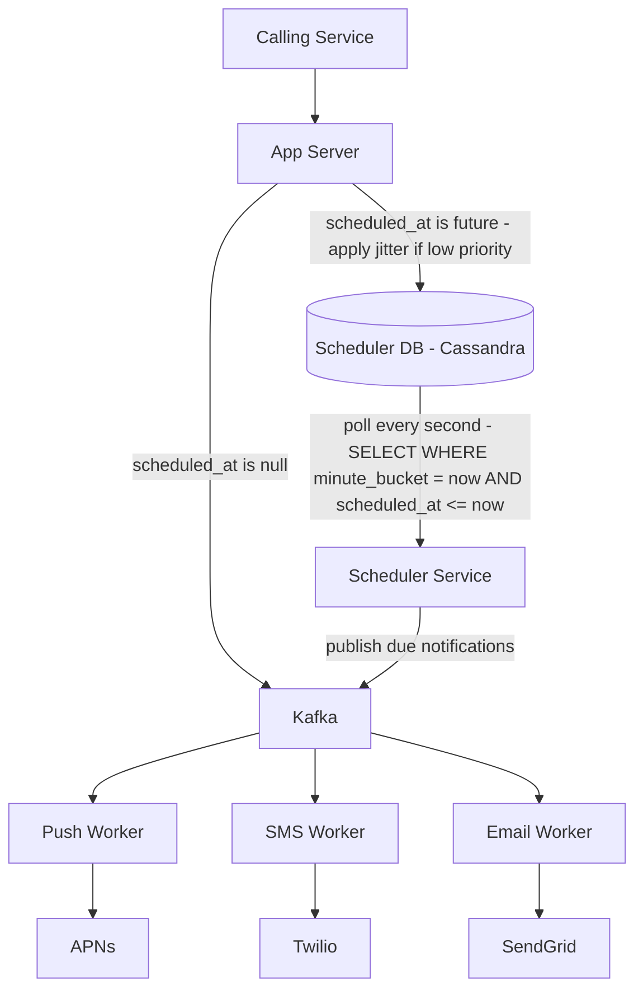

# Dispatch Flow — Scheduling

## Full End-to-End Scheduling Flow



---

## Scheduler Polling Interval

The scheduler polls the Scheduler DB every **1 second**. This means a notification can be up to 1 second late — acceptable for all notification types including high-priority ones.

Polling more frequently (every 100ms) reduces latency but increases DB load — 10× more queries for marginal improvement. 1 second is the right balance.

**What the scheduler does each second:**
```
1. Compute current minute bucket: '2026-04-19-09-00'
2. Query: SELECT * FROM scheduled_notifications 
          WHERE minute_bucket = '2026-04-19-09-00' 
          AND scheduled_at <= now()
3. For each due notification → publish to appropriate Kafka topic
4. Delete processed rows from Scheduler DB
5. Sleep 1 second, repeat
```

---

## Scheduler Service — Avoiding Double Dispatch

If two scheduler service instances are running (for fault tolerance), both might find the same due notifications and publish them twice — resulting in duplicate notifications.

The fix is a **distributed lock** — only one scheduler instance runs the poll-and-publish loop at a time. Redis `SET NX` (set if not exists) with a short TTL works well:

```
Redis SET scheduler_lock <instance_id> NX EX 5
→ only the instance that wins the lock runs the dispatch
→ lock expires after 5 seconds, next instance can take over if leader crashes
```

> [!important] Scheduler is a single-leader service
> Only one scheduler instance dispatches at a time. Others are on standby. If the leader crashes, the Redis lock expires and a standby takes over within 5 seconds. At most 5 seconds of missed dispatches — acceptable given the 1-second polling resolution anyway.

---

## After Dispatch — Normal Pipeline

Once the scheduler publishes a notification to Kafka, it is indistinguishable from an immediate notification. The channel workers consume it, check preferences in Redis, deduplicate via bloom filter, dispatch to the external provider, and update status in Cassandra. No special handling needed downstream.

```
Scheduled notification lifecycle:

App Server → Scheduler DB (hold)
                  ↓ (at scheduled_at)
           Scheduler Service → Kafka
                                  ↓
                           Channel Worker
                                  ↓
                        APNs / Twilio / SendGrid
                                  ↓
                           User's Device
                                  ↓
                        Status → DELIVERED in Cassandra
```

---

## Summary

| Component | Detail |
|---|---|
| Scheduler DB | Cassandra |
| Partition key | minute_bucket |
| Clustering key | scheduled_at ASC |
| Polling interval | 1 second |
| Jitter | Intake jitter for low-priority, none for OTPs/alerts |
| Duplicate prevention | Redis distributed lock on scheduler leader |
| After dispatch | Rejoins normal Kafka pipeline |
