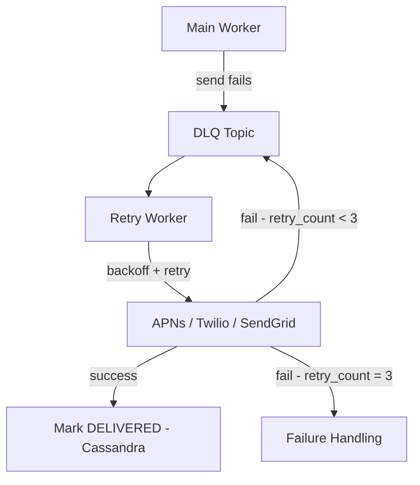

# Dead Letter Queue — Retry and DLQ

## What Is a DLQ?

A Dead Letter Queue (DLQ) is a separate queue where messages go when they have failed processing and cannot be immediately retried in the main pipeline. Instead of blocking the main flow or losing the message, you park it in the DLQ and process it separately — with its own retry logic, its own timing, and its own failure handling.

Think of it as a quarantine zone for sick messages. The main pipeline stays healthy and keeps processing. The sick messages get treated separately.

---

## SQS and RabbitMQ Have Built-In DLQ

In SQS, you configure a `maxReceiveCount` on a queue. After a message has been received and not acked N times, SQS automatically moves it to a configured DLQ. You don't write any code — it's infrastructure-level.

```
SQS: message fails 3 times → SQS automatically moves to DLQ ✓
RabbitMQ: message rejected N times → RabbitMQ routes to dead-letter exchange ✓
```

This is one area where SQS and RabbitMQ are genuinely simpler than Kafka. You configure the DLQ once and the broker handles the rest.

---

## Kafka Has No Built-In DLQ

Kafka knows nothing about whether a message was successfully processed. It only tracks offsets — which messages have been consumed. Whether the consumer processed them correctly or crashed mid-way is entirely the consumer's responsibility.

This means **you must implement the DLQ yourself**. The worker explicitly publishes failed messages to a DLQ topic — Kafka does not do this automatically.

```
Kafka: message fails → nothing happens automatically
       worker must explicitly publish to DLQ topic ← your code
```

---

## Worker Explicitly Publishes Failures

When a notification fails after the initial attempt, the worker publishes it to the channel-specific DLQ topic and then commits the Kafka offset normally. The main pipeline moves on.

```python
for notification in batch:
    try:
        send_to_apns(notification)
        mark_delivered(notification)
    except Exception:
        publish_to_dlq(notification)   # ← explicit, your code

commit_kafka_offset()  # ← batch is done from Kafka's perspective
```

DLQ topics per channel:
```
notifications-push-dlq
notifications-sms-dlq
notifications-email-dlq
```

---

## Retry Worker — Consumes from DLQ

A separate **retry worker** consumes from the DLQ topics. Unlike the main workers which process as fast as possible, the retry worker applies exponential backoff between attempts — it is intentionally slow.

The retry worker:
1. Consumes a failed notification from the DLQ
2. Waits for the backoff window (1s, 2s, 4s)
3. Retries the send to APNs/Twilio/SendGrid
4. On success → marks `DELIVERED` in Cassandra, commits DLQ offset
5. On failure → republishes back to DLQ with an incremented `retry_count`
6. After 3 retries → sends to failure handling (covered in next file)



> [!danger] Common Trap — Kafka auto-DLQ assumption
> Candidates coming from SQS/RabbitMQ backgrounds assume Kafka automatically moves failed messages to a DLQ after N failures. It does not. If you don't explicitly publish to a DLQ topic in your worker code, failed messages are silently lost when you commit the offset. Always implement DLQ explicitly in Kafka-based systems.
