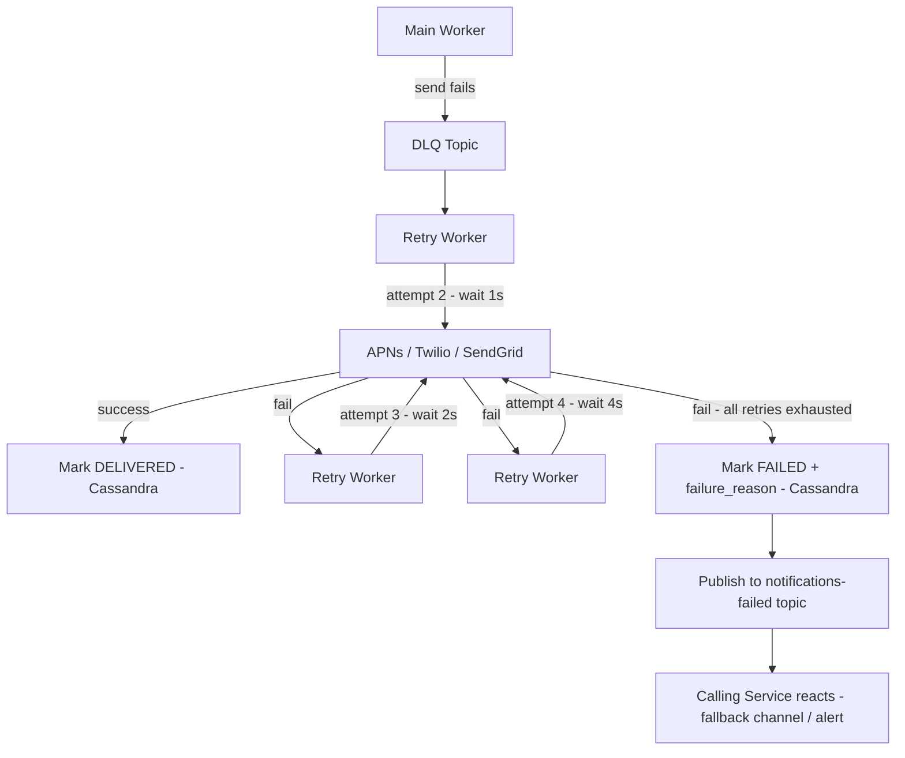

# Failure Handling — Retry and DLQ

## After All Retries Exhausted

A notification has failed 4 times — 1 original attempt + 3 retries with exponential backoff. The external provider keeps rejecting it. At this point you have two responsibilities:

1. **Record the failure** — persist what happened so it can be queried and audited
2. **Notify the caller** — the calling service needs to know so it can react

---

## Mark FAILED in Cassandra

The worker updates the notification's status in the notifications table to `FAILED` with a `failure_reason`:

```
channel_status = {PUSH: FAILED}
failure_reason = "APNs: invalid device token"
failed_at      = <timestamp>
retry_count    = 4
```

Common failure reasons:
- `APNs: invalid_device_token` — user uninstalled the app, token is stale
- `APNs: service_unavailable` — APNs is down, exhausted all retries
- `Twilio: 21211` — invalid phone number
- `Twilio: 30008` — carrier rate limit exceeded
- `SendGrid: 400` — malformed email address

The calling service can query notification status by `notification_id` and see exactly what failed and why.

---

## Publish to notifications-failed Topic

Persisting the failure in Cassandra is the audit trail. But the calling service needs to react in real-time — not poll every few minutes hoping to catch failures. The fix is publishing a failure event to a dedicated Kafka topic:

```
notifications-failed topic:
{
  notification_id: "uuid",
  user_id: "uuid",
  channel: "PUSH",
  failure_reason: "APNs: invalid_device_token",
  retry_count: 4,
  failed_at: "2026-04-19T09:00:44Z"
}
```

The calling service subscribes to this topic and reacts however it wants:
- Instagram's like service receives a push failure → falls back to in-app notification
- Bank's fraud service receives a push failure → immediately retries via SMS
- Marketing service receives an email failure → logs it, removes user from campaign list

Your notification system stays decoupled — it publishes the failure event and moves on. It doesn't need to know what each caller wants to do on failure.

---

## Why Event-Driven Beats Polling for Failure Notification

The alternative is the calling service polling for failed notifications:

```
Calling service → GET /notifications?status=FAILED&after=<last_check> → every 60 seconds
```

This works but has two problems:

**Latency** — the caller checks every 60 seconds, so a failure can sit unactioned for up to 60 seconds. For a bank fraud alert that failed push delivery, 60 seconds before falling back to SMS is too long.

**Load** — thousands of calling services polling every 60 seconds = constant read load on Cassandra even when there are no failures. Wasteful.

Event-driven via Kafka gives instant notification the moment a failure is recorded — zero polling lag, zero wasted reads.

> [!info] The Pattern
> Persist failures to DB for audit and queryability.
> Publish failure events to Kafka for real-time reaction.
> Both serve different purposes — you need both.

---

## Full Retry and Failure Flow


