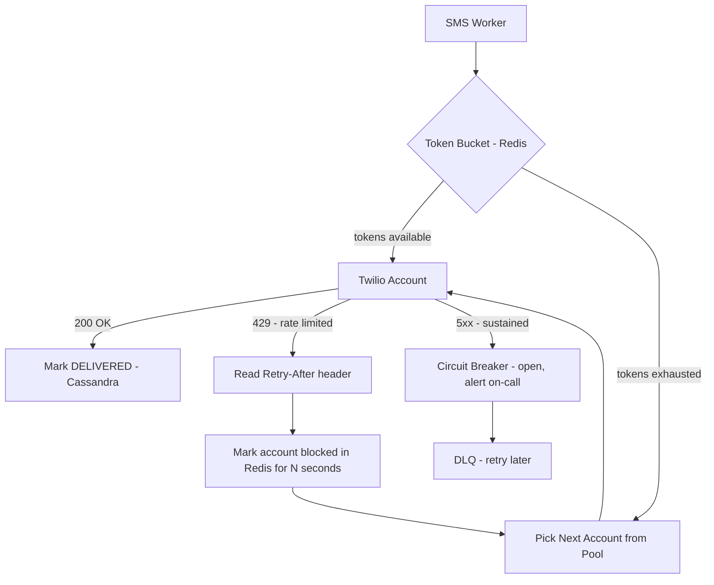

# Rate Limiting — Notification System

## The Problem

External providers have hard rate limits. Twilio caps at 1,000 SMS/sec per account. SendGrid caps at 100 emails/sec per IP. APNs has soft limits that trigger throttling under sustained overload. Exceeding these limits results in `429 Too Many Requests` responses — the provider rejects your request and you've wasted the send attempt.

The challenge is twofold:
1. Never exceed the provider's rate limit in steady state
2. Handle 429s gracefully when they happen anyway (transient spikes, miscounting)

---

## Kafka as the First Line of Defense

Before any rate limiting logic in the worker, Kafka itself acts as a natural buffer. Bursts of incoming notifications accumulate in the Kafka topic. Workers consume at a steady, controlled pace — they don't speed up just because the topic has more messages. The burst is absorbed by Kafka, not passed through to the external provider.

```
50,000 SMS arrive in 1 second → Kafka topic accumulates
SMS workers consume at 1,000/sec per account → Twilio never sees the spike
```

This alone handles most burst scenarios. Rate limiting in the worker is the second layer — for when the steady-state consumption rate itself approaches the provider's limit.

---

## Per-Account Rate Tracking — Token Bucket

Each Twilio account has a token bucket in Redis — a counter that refills at 1,000 tokens/sec (the account's rate limit). Before sending a request to a Twilio account, the worker checks if that account has tokens available:

- **Tokens available** → decrement token count, send the request
- **Tokens exhausted** → skip this account, pick another from the pool

```
Redis key: rate_limit:twilio:{account_id}
Value: current token count (max 1000)
TTL: refills 1000 tokens every second
```

Each worker instance checks the token bucket before dispatching. Since Redis is shared across all worker instances, the rate limit is enforced globally — not per-worker-instance. 10 worker instances sharing one Twilio account collectively stay under 1,000/sec, not 10,000/sec.

> [!info] Why Redis for token buckets?
> Token buckets need atomic read-and-decrement operations across all worker instances simultaneously. Redis DECR is atomic — no race conditions. A worker can't decrement the counter and find it was already at zero by the time it checks.

---

## 429 Handling — Retry-After Header

Even with token buckets, a 429 can slip through — miscounting, clock drift between worker instances, or the provider lowering its limit temporarily. When a worker receives a 429:

1. Read the `Retry-After` header — Twilio tells you exactly how many seconds to wait
2. Mark that account as unavailable in Redis for the specified duration
3. Route the failed notification to the next available account in the pool
4. If no accounts available → send to DLQ for retry later

```
429 response from Twilio account_42:
  Retry-After: 5

Worker:
  Redis SET rate_limit:twilio:account_42:blocked true EX 5
  Pick account_43 from pool instead
```

No idle waiting. No guessing the backoff window. The provider tells you exactly when to retry.

---

## Account Pool Routing — Skip Rate-Limited, Pick Next Available

The SMS worker maintains a pool of 500 Twilio accounts. On each send, it picks an available account using round-robin, skipping any accounts marked as blocked in Redis.

```
accounts = [account_1, account_2, ..., account_500]
blocked  = {account_42: blocked for 5s, account_107: blocked for 2s}

worker picks → first non-blocked account in round-robin order
```

If all accounts are simultaneously rate-limited (unlikely but possible during a massive spike), the worker pauses and sends notifications to the DLQ. The retry worker picks them up once accounts become available again.

---

## Cascading Rate Limiting — The Hidden Trap

When one Twilio account gets rate limited, the naive fix is to route its traffic to the remaining accounts. But if those accounts were already near their 1K/sec limit, the extra load tips them into 429s as well. Now more accounts get blocked, more traffic gets redistributed, more 429s — the entire account pool cascades into failure.

```
Account_42 rate limited → route its 1K/sec to remaining 499 accounts
Each remaining account: 1000/sec + (1000/499) = ~1002/sec → over limit
→ more 429s → more redistribution → full cascade
```

The fix is **load shedding** — when accounts start getting blocked, deliberately reduce total throughput instead of trying to maintain 100% output with fewer accounts:

```
10% of accounts blocked → reduce total SMS throughput by 10%
Excess notifications → DLQ → retried when accounts recover
```

Never overload healthy accounts to compensate for blocked ones. Accept that during a spike, some notifications are delayed rather than risking the entire pool going down.

> [!danger] Cascading Rate Limiting
> Routing blocked account traffic to healthy accounts is intuitive but dangerous. If healthy accounts are near capacity, the extra load tips them over — the cascade begins. Always shed load proportionally when accounts get blocked. A 10% capacity reduction is far better than a 100% pool failure.

---

## Circuit Breaker — Sustained Failures vs Transient 429s

A 429 is a transient rate limit — wait and retry. But if an account starts returning 500s or connection timeouts consistently, that's a different problem — the account may be suspended, credentials rotated, or Twilio having an outage.

The circuit breaker distinguishes between the two:

- **429** → transient, respect Retry-After, route to another account
- **5xx / timeout > threshold** → open circuit breaker, remove account from pool entirely, alert on-call

```
Circuit breaker states:
CLOSED  → account healthy, normal routing
OPEN    → account unhealthy, removed from pool, alert triggered
HALF-OPEN → after cooldown, send 1 test request → success closes, failure keeps open
```

---

## Push and Email Rate Limiting — How It Differs from SMS

**Push (APNs/FCM):**
APNs doesn't publish hard rate limits — it throttles silently by increasing response latency under sustained overload. The worker detects this via p99 latency monitoring. If APNs response time spikes above threshold, the worker reduces its concurrent connection count to back off. No token bucket needed — throughput is self-regulated via HTTP/2 connection count.

**Email (SendGrid):**
SendGrid enforces rate limits per IP (100/sec). The same token bucket approach applies — one token bucket per IP in Redis, workers check before sending. 429s from SendGrid include `Retry-After` headers, same handling as Twilio.

---

## Flow Diagram



---

## Summary

| Scenario | Handling |
|---|---|
| Burst of incoming SMS | Kafka absorbs, workers drain at steady rate |
| Approaching rate limit | Token bucket per account in Redis |
| 429 received | Read Retry-After, mark account blocked, route to next account |
| All accounts rate-limited | Send to DLQ, retry when accounts recover |
| Sustained 5xx from account | Circuit breaker opens, account removed from pool, alert |
| APNs throttling | Detect via latency spike, reduce HTTP/2 connection count |
| SendGrid 429 | Token bucket per IP, same pattern as Twilio |
